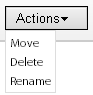
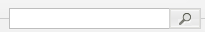

# Informazioni sui banner {#about-banners}

Puoi utilizzare i banner per gestire gli annunci banner presenti sul tuo sito web.

## Utilizzo dei banner {#concept_5BBE01FEC6134393B43CC917C8CC64DA}

<!-- 

c_about_banners.xml

 -->

Esistono due metodi per aggiungere annunci banner al sito web.

Il primo metodo è quello di aggiungere banner tramite Target, Search&amp;Promote. I banner sono frammenti di codice HTML visualizzati nel momento in cui un cliente esegue la ricerca nel sito web. Il banner può includere testo o immagine in formato GIF, JPEG o PNG o una combinazione di entrambi. Puoi scegliere tra dimensioni predefinite o definire dimensioni personalizzate per adattarle alla pagina. Il codice HTML utilizzato per visualizzare il banner può inoltre specificare elementi quali lo stile del font da utilizzare e il bordo. Questo metodo di aggiunta di un banner offre funzionalità di base e non richiede software aggiuntivo.

Il secondo metodo consiste nell’utilizzare Adobe Dynamic Media Classic, un servizio di gestione e pubblicazione di contenuti multimediali dinamici. Un account Dynamic Media Classic di Adobe valido consente di gestire e distribuire il contenuto del banner direttamente a Target, tramite Dynamic Media Classic. In ricerca/merchandising del sito, configuri l’accesso al tuo account Dynamic Media Classic. Quindi apri il browser Dynamic Media Classic Media e scegli una risorsa multimediale dinamica da usare come banner.

>[!NOTE]
>
>Prima di poter utilizzare le risorse multimediali dinamiche come banner nella ricerca/merchandising del sito, le risorse vengono caricate e preparate per la pubblicazione in Scene7 Publishing System. Puoi caricare le risorse dall’interno di ricerca/merchandising del sito e prepararle automaticamente per la pubblicazione da parte di Scene7 Publishing System. In alternativa, puoi caricare e pubblicare tutte le risorse da Scene7 Publishing System.

## Integrazione dei banner con Adobe Scene7 Publishing System {#section_D4D7ADEA6A6348E68EDA138E184FE579}

Puoi utilizzare i tipi di risorse Dynamic Media Classic come banner nella ricerca/merchandising del sito, incluse immagini, banner dinamici e modelli, come modelli di immagini o modelli di Flash.

I modelli vengono creati in modo dinamico e indirizzabili con file immagine a livelli, come file a livelli in applicazioni di modifica delle immagini come Adobe Photoshop®. A differenza di un file immagine statico, un modello può includere parametri. Attraverso i parametri, puoi personalizzare le proprietà variabili dell’immagine e il contenuto dell’immagine.

>[!NOTE]
>
>Puoi anche creare modelli da progettazioni basate su layout utilizzando la funzione Pubblicazione modelli in Scene7 Publishing System e i file da Adobe Illustrator e Adobe InDesign.

Consulta [Pubblicazione modelli](https://help.adobe.com/en_US/scene7/using/WSFBFBAD30-2694-4b18-B7CE-894F9FC5CDDF.html) nella Guida utente di Dynamic Media Classic (Scene7).

Un modello può contenere un numero qualsiasi di livelli immagine e testo. È possibile convertire un file statico contenente livelli, ad esempio un file PSD a livelli, in un modello oppure creare modelli in Dynamic Media Classic. È possibile creare livelli di testo nei modelli utilizzando i font caricati in Scene7 Publishing System. Dopo aver aggiunto il testo a un modello, è possibile formattarlo cambiandone la giustificazione, i font, le dimensioni del font e il colore.

Utilizzando la schermata Parametri di Dynamic Media Classic, puoi convertire qualsiasi aspetto di un modello in un parametro indirizzabile. In questo modo, è possibile modificare l&#39;immagine a livelli da utilizzare o il valore di testo da utilizzare nel modello. I parametri vengono passati con la stringa URL, che consente di modificare qualsiasi parametro per personalizzare dinamicamente l&#39;immagine di risposta generata dal server di immagini.

Per ulteriori informazioni su come utilizzare Dynamic Media Classic per creare modelli e parametrizzare le proprietà sui livelli in modo da poterle utilizzare nei banner.

Consulta [Nozioni di base sui modelli](https://help.adobe.com/en_US/scene7/using/WS60B68844-9054-4099-BF69-3DC998A04D3C.html) nella Guida utente di Dynamic Media Classic (Scene7).

**Caricamento e pubblicazione delle risorse**

È necessario caricare e pubblicare le risorse in Dynamic Media Classic prima di utilizzarle per i banner nella ricerca/merchandising del sito. Questo prerequisito include anche tutte le risorse utilizzate da un modello di immagine o di Flash. Utilizza il tuo account Dynamic Media Classic per caricare e pubblicare risorse digitali. In alternativa, puoi utilizzare la funzione di ricerca/merchandising del sito per caricare una risorsa digitale e poi far sì che Dynamic Media Classic la pubblichi automaticamente in base alle impostazioni di caricamento. Se tenti di scegliere una risorsa non ancora caricata e pubblicata, riceverai una notifica nell’interfaccia utente e avrai la possibilità di caricarla prima di procedere.

Per ulteriori informazioni sul caricamento e la pubblicazione di risorse digitali tramite Scene7 Publishing System.

Consulta [Caricare e pubblicare risorse](https://help.adobe.com/en_US/scene7/using/WS3673AD39-098B-4f08-8A24-CA51261B7366.html) nella Guida utente di Dynamic Media Classic (Scene7).

>[!NOTE]
>
>Per utilizzare la funzionalità di caricamento nel visualizzatore di risorse di Dynamic Media Classic, accertati che l’account Dynamic Media Classic utilizzato abbia già il ruolo di &quot;Amministratore società SPS&quot;.

Consulta [Configurazione amministrazione](https://help.adobe.com/en_US/scene7/using/WS662101DF-D697-47a7-A7D8-B52FD8E94438.html) nella Guida utente di Dynamic Media Classic (Scene7).

**Modifica dei parametri dei modelli di Dynamic Media Classic in un banner tramite le regole aziendali**

Se hai aggiunto una risorsa Dynamic Media Classic come banner, puoi utilizzare [!DNL Visual Rule Builder] in [!DNL Business Rules] per aggiungerla a qualsiasi area banner del sito web. Ad esempio, è possibile aggiungere il banner alle pagine dei risultati di ricerca, proprio come per qualsiasi altro banner. È inoltre possibile modificare i valori dei parametri predefiniti nei modelli di Dynamic Media Classic personalizzandoli in base alle esigenze specifiche. Questo tipo di funzionalità ti consente di personalizzare modelli di Dynamic Media Classic con diversi messaggi di marketing e collegamenti ipertestuali a diversi endpoint.

Vedere anche [Aggiunta di una nuova regola business](../c-about-rules-menu/c-about-business-rules.md#task_BD3B31ED48BB4B1B8F1DCD3BFA2528E7).

Vedere anche [Modifica di una regola business](../c-about-rules-menu/c-about-business-rules.md#task_375CFA75D1D94D9E92A35DE1228E5087).

## Aggiunta di un banner {#task_549D02B5F73B4158B105A94E39D937B7}

Puoi utilizzare [!DNL Banners] per gestire gli annunci banner e la posizione in cui vengono inseriti sul tuo sito web. Quando aggiungi un banner, fai riferimento esternamente all’immagine tramite frammenti di codice HTML visualizzati in fase di ricerca.

<!-- 

t_adding_a_new_banner.xml

 -->

Se disponi di un account Adobe Dynamic Media Classic valido, puoi aggiungere banner pubblicitari tramite Scene7 Publishing System.

Consulta [Aggiunta di un banner con Adobe Dynamic Media Classic](../c-about-design-menu/c-about-banners.md#task_AD1E0C00A9E04B1FA819EB93288786B3).

Consulta [Configurazione dell&#39;accesso al tuo account Adobe Dynamic Media Classic](../c-about-settings-menu/c-about-account-options-menu.md#task_CEFF88C2033D41D0B2FE86C435EDAC6D).

**Per aggiungere un banner**

1. Scegliere **[!UICONTROL Design]** > **[!UICONTROL Banners]** dal menu del prodotto.
1. Nella pagina [!DNL Banners], seleziona **[!UICONTROL HTML code]** dall’elenco a discesa **[!UICONTROL Add Banner]**.
1. Nella finestra di dialogo [!DNL Add Banner], impostare le opzioni desiderate.

   <table> 
    <thead> 
      <tr> 
      <th colname="col1" class="entry"> 
Opzione 
 </th> 
      <th colname="col2" class="entry"> 
Descrizione 
 </th> 
      </tr> 
    </thead>
    <tbody> 
      <tr> 
      <td colname="col1"> 
Nome 
 </td> 
      <td colname="col2"> 
Obbligatorio. Identifica il nome del banner. Il nome viene utilizzato per fare riferimento al banner quando lo si aggiunge nel Generatore di regole di visualizzazione in Regole aziendali. Il nome non viene visualizzato nel banner stesso. 
 
Vedere <a href="../c-about-rules-menu/c-about-business-rules.md#task_BD3B31ED48BB4B1B8F1DCD3BFA2528E7" type="task" format="dita" scope="local"> Aggiunta di una nuova regola business.</a> 
 </td> 
      </tr> 
      <tr> 
      <td colname="col1"> 
HTML banner 
 </td> 
      <td colname="col2"> 
 Consente di incollare il codice HTML associato al banner. 
 
Qualsiasi codice HTML è accettabile, incluso il codice CSS circondato da 
        Tag <code>
          &lt;style&gt; 
        </code> o codice JavaScript circondato da 
        Tag <code>
          &lt;script&gt; 
        </code> . Ad esempio, il seguente blocco di codice è per un banner di testo del tipo Orizzontale superiore : <code> &lt;div&nbsp;style="width:&nbsp;684px;&nbsp;background-image:&nbsp;url('https://www.brough.com/blackb.gif');&nbsp; 
          padding-top:&nbsp;10px;&nbsp;padding-bottom:&nbsp;10px;&nbsp;color:&nbsp;white;&nbsp;font-family:&nbsp;verdana;&nbsp; 
          text-align:&nbsp;center;&nbsp;font-size:&nbsp;20px;"&gt;&nbsp;Sound&nbsp;Study&nbsp;ships&nbsp;free!&nbsp;&lt;/div&gt; </code>Nell'esempio seguente, il blocco di codice è per un'immagine a forma di schizzo completo: <code> &lt;img&amp;nbsp;src='https://geometrixx.com/images/GEOAds/geometrixx-beauty-home-01.jpg'&amp;nbsp;border="0"&amp;nbsp;/&gt; </code> 
 </td> 
      </tr> 
      <tr> 
      <td colname="col1"> 
Tipo 
 </td> 
      <td colname="col2"> 
Specifica i seguenti tipi di banner: 
        <ul id="ul_6423AEDB9E664049989EB529D63C4A62"> 
          <li id="li_BF6CD60B3ED748D49CFFB9C5D607661C">  [nuovo tipo]   
Consente di specificare il tipo di banner desiderato, incluse le dimensioni e il nome. 
 </li> 
          <li id="li_1A29AB22AD644E60A12298187B5E898E">  Spruzzo completo   
La dimensione impostata di questo tipo di banner è larga 680 pixel e alta 650 pixel. Facoltativamente, puoi specificare il nome del tipo oppure accettare il nome predefinito corrispondente al nome del tipo di banner stesso. 
 </li> 
          <li id="li_2BE06D013CB54DDE851051BFC038BB57">  Piano orizzontale   
 Il banner si trova nell’area superiore del sito web. Questo tipo è utile se si desidera aggiungere collegamenti ipertestuali a sinistra o a destra del banner. La dimensione impostata di questo tipo di banner è larga 468 pixel e alta 60 pixel. Facoltativamente, puoi specificare il nome del tipo oppure accettare il nome predefinito corrispondente al nome del tipo di banner stesso. 
 </li> 
          <li id="li_EC35AB92234749F08AA8A9BD26D0EA8D">  Piano orizzontale - Larghezza intera   
Questo tipo è l’impostazione predefinita quando si aggiunge un nuovo banner. Il banner si trova nell’area superiore del sito web e occupa l’intera larghezza della pagina. La dimensione impostata di questo tipo di banner è larga 670 pixel e alta 150 pixel. Facoltativamente, puoi specificare il nome del tipo oppure accettare il nome predefinito corrispondente al nome del tipo di banner stesso. 
 </li> 
        </ul> 
 </td> 
      </tr> 
      <tr> 
      <td colname="col1"> 
Tag 
 </td> 
      <td colname="col2"> 
Aggiunge tag o "parole chiave" da associare al banner. Se utilizzi molti banner, l’aggiunta di tag può aiutarti a perfezionare la ricerca dei banner in modo da individuare rapidamente solo il banner giusto per le tue esigenze. È inoltre possibile eliminare i tag aggiunti. 
 </td> 
      </tr> 
    </tbody> 
    </table>

1. Clic **[!UICONTROL Save]**.
1. (Facoltativo) Effettua una delle seguenti operazioni:

   * Fai clic su **[!UICONTROL History]** per ripristinare le modifiche apportate.

      Vedere [Uso dell&#39;opzione Cronologia](../t-using-the-history-option.md#task_70DD3F87A67242BBBD2CB27156F43002).

   * Clic **[!UICONTROL Live]**.

      Consulta [Visualizzazione delle impostazioni live](../c-about-staging.md#task_401A0EBDB5DB4D4CA933CBA7BECDC10F).

   * Clic **[!UICONTROL Push Live]**.

      Consulta [Pushing stage settings live](../c-about-staging.md#task_44306783B4C0408AAA58B471DAF2D9A4).

## Modifica di un banner {#task_D4081083BE7B40F5A003D1A2F1435AEA}

Utilizza [!DNL Edit Banner] per modificare elementi quali il nome del banner, il codice HTML del banner, il tipo di banner ed eventuali tag associati.

<!-- 

t_editing_a_banner.xml

 -->

Se hai aggiunto un banner utilizzando la ricerca nel sito/merchandising, devi anche modificare il banner utilizzando Adobe Dynamic Media Classic.

Consulta anche [Modifica di un banner con Adobe Dynamic Media Classic](../c-about-design-menu/c-about-banners.md#task_C3E782477FBF428ABEA220751781ACA9).

**Per modificare un banner**

1. Scegliere **[!UICONTROL Design]** > **[!UICONTROL Banners]** dal menu del prodotto.
1. Nella pagina [!DNL Banners], fai clic su .

   sopra una miniatura del banner da modificare.
1. Nella pagina [!DNL Edit Banner] , imposta le opzioni desiderate.

   Vedi la tabella delle opzioni in [Aggiunta di un banner](../c-about-design-menu/c-about-banners.md#task_549D02B5F73B4158B105A94E39D937B7).
1. Al termine della modifica del banner, fai clic su **[!UICONTROL Save]**.
1. (Facoltativo) Effettua una delle seguenti operazioni:

   * Fai clic su **[!UICONTROL History]** per ripristinare le modifiche apportate.

      Vedere [Uso dell&#39;opzione Cronologia](../t-using-the-history-option.md#task_70DD3F87A67242BBBD2CB27156F43002).

   * Clic **[!UICONTROL Live]**.

      Consulta [Visualizzazione delle impostazioni live](../c-about-staging.md#task_401A0EBDB5DB4D4CA933CBA7BECDC10F).

   * Clic **[!UICONTROL Push Live]**.

      Consulta [Pushing stage settings live](../c-about-staging.md#task_44306783B4C0408AAA58B471DAF2D9A4).

## Aggiunta di un banner con Adobe Dynamic Media Classic {#task_AD1E0C00A9E04B1FA819EB93288786B3}

Puoi utilizzare [!DNL Banners] per gestire gli annunci banner sul tuo sito web. Quando aggiungi un banner utilizzando Adobe Dynamic Media Classic, puoi scegliere tra le risorse digitali caricate in Scene7 Publishing System.

<!-- 

t_adding_a_banner_using_adobe_scene7.xml

 -->

Per aggiungere un banner utilizzando Adobe Dynamic Media Classic, assicurati di aver configurato l’accesso al tuo account Dynamic Media Classic valido.

Consulta [Configurazione dell&#39;accesso al tuo account Adobe Dynamic Media Classic](../c-about-settings-menu/c-about-account-options-menu.md#task_CEFF88C2033D41D0B2FE86C435EDAC6D).

**Per aggiungere un banner con Adobe Dynamic Media Classic**

1. Nel menu del prodotto, fai clic su **[!UICONTROL Design]** > **[!UICONTROL Banners.]**
1. Nella pagina [!DNL Banners], nell’elenco a discesa **[!UICONTROL Add Banner]** fai clic su **[!UICONTROL Adobe Scene7]**.
1. Nella finestra di dialogo [!DNL Pick an Asset], nel riquadro a sinistra, utilizza le opzioni di navigazione nell’interfaccia utente per individuare la cartella contenente la risorsa digitale che desideri utilizzare per un banner.

   Ad eccezione delle opzioni di navigazione delle risorse, tutte le altre opzioni dipendono dalla risorsa digitale selezionata per l’aggiunta o la modifica.

   Utilizza le opzioni di navigazione delle risorse per individuare una risorsa da utilizzare per un nuovo banner in ricerca/merchandising del sito. Le opzioni di navigazione sono applicabili a tutti i tipi di risorse digitali selezionate.

   >[!NOTE]
   >
   >Le opzioni di navigazione delle risorse non vengono visualizzate quando si modifica il banner nella finestra di dialogo [!DNL Change Parameters] .

   Consulta [Modifica di un banner con Adobe Dynamic Media Classic](../c-about-design-menu/c-about-banners.md#task_C3E782477FBF428ABEA220751781ACA9).

   **Opzioni di navigazione delle risorse**

   <table> 
    <thead> 
      <tr> 
      <th colname="col1" class="entry"> 
Opzione di navigazione 
 </th> 
      <th colname="col2" class="entry"> 
Descrizione 
 </th> 
      </tr> 
    </thead>
    <tbody> 
      <tr> 
      <td colname="col1"> 
  
 </td> 
      <td colname="col2"> 
Consente di selezionare l’account Dynamic Media Classic per la società in questione dall’elenco a discesa e di navigare tra le cartelle di risorse digitali all’interno di tale account. 
 
Quando selezioni una cartella, il riquadro a destra della finestra di dialogo  Scegli una risorsa  mostra tutte le risorse digitali disponibili contenute all’interno della cartella. 
 </td> 
      </tr> 
      <tr> 
      <td colname="col1"> 
  
 </td> 
      <td colname="col2"> 
Consente di spostarsi avanti o indietro nella cronologia di navigazione delle cartelle. 
 </td> 
      </tr> 
      <tr> 
      <td colname="col1"> 
  
 </td> 
      <td colname="col2"> 
Aggiorna l’elenco delle risorse digitali visualizzate per una cartella selezionata. 
 
Se si sposta, elimina o rinomina una risorsa selezionata utilizzando l’elenco a discesa  Azioni  , potrebbe essere necessario fare clic su questo controllo. 
 </td> 
      </tr> 
      <tr> 
      <td colname="col1"> 
  
 </td> 
      <td colname="col2"> 
Visualizza le risorse digitali in una vista a elenco. Nell’elenco sono visualizzate l’icona o l’immagine miniatura associata di ciascuna risorsa, il nome del file, il tipo di risorsa digitale, le dimensioni (se applicabile) e la data dell’ultima modifica. 
 
Nella vista a griglia le risorse digitali nella cartella selezionata vengono visualizzate come icone, miniature o entrambi. 
 </td> 
      </tr> 
      <tr> 
      <td colname="col1"> 
  
 </td> 
      <td colname="col2"> 
Nella vista a elenco puoi spostare, eliminare o rinominare una risorsa digitale selezionata. 
 
Nella vista Griglia, puoi spostare o eliminare una o più risorse digitali selezionate. 
 </td> 
      </tr> 
      <tr> 
      <td colname="col1"> 
  
 </td> 
      <td colname="col2"> 
Apre la finestra di dialogo  Carica  in cui è possibile caricare una risorsa digitale selezionata dal desktop o da un server esterno in modo da poterla utilizzare come banner. 
 
Dopo aver caricato la risorsa, in Scene7 Publishing System viene automaticamente pianificato un processo di pubblicazione. 
 
Vedi la tabella delle opzioni in <a href="../c-about-design-menu/c-about-banners.md#task_AD1E0C00A9E04B1FA819EB93288786B3" type="reference" format="dita" scope="local"> Aggiunta di un banner con Adobe Dynamic Media Classic </a>. 
 
Per ulteriori informazioni sul caricamento e la pubblicazione di risorse digitali tramite Scene7 Publishing System. 
 
Consulta <a href="https://help.adobe.com/en_US/scene7/using/WS3673AD39-098B-4f08-8A24-CA51261B7366.html" scope="external" format="html"> Caricare e pubblicare risorse </a> nella Guida utente di Scene7 Publishing System. 
 </td> 
      </tr> 
      <tr> 
      <td colname="col1"> 
  
 </td> 
      <td colname="col2"> 
Consente di cercare una risorsa digitale per parola chiave o per posizione del file all’interno della cartella selezionata e delle relative sottocartelle associate. 
 
Quando fai clic sul campo di ricerca, viene aggiunto automaticamente un campo di filtro facoltativo. 
 </td> 
      </tr> 
      <tr> 
      <td colname="col1"> 
  
 </td> 
      <td colname="col2"> 
Aggiunge un altro filtro risorse per perfezionare ulteriormente l’elenco delle risorse digitali visualizzate per tipo o per data specifica. 
 </td> 
      </tr> 
      <tr> 
      <td colname="col1"> 
  
 </td> 
      <td colname="col2"> 
Perfeziona l’elenco delle risorse digitali visualizzate per visualizzarle solo in base a un determinato tipo di Flash, immagine, modello o qualsiasi. 
 
Fai clic su  per eliminare il filtro dalla ricerca. 
 </td> 
      </tr> 
      <tr> 
      <td colname="col1"> 
  
 </td> 
      <td colname="col2"> 
Perfeziona l’elenco delle risorse digitali visualizzate per mostrare solo quelle create o modificate prima di una data specifica o dopo una data specifica. 
 
Fai clic su  per eliminare il filtro dalla ricerca. 
 </td> 
      </tr> 
      <tr> 
      <td colname="col1"> 
  
 </td> 
      <td colname="col2"> 
Consente di trascinare il cursore a sinistra o a destra per ridurre o ingrandire l’intera visualizzazione del riquadro delle risorse digitali, rispettivamente. 
 </td> 
      </tr> 
    </tbody> 
    </table>

   **Opzioni proprietà**

   Le opzioni Proprietà vengono visualizzate se si sceglie un modello di Flash, un modello di immagine o un&#39;immagine. A seconda della risorsa digitale scelta, non tutte le opzioni sono disponibili.

   <table> 
    <thead> 
      <tr> 
      <th colname="col1" class="entry"> 
Opzione Proprietà 
 </th> 
      <th colname="col2" class="entry"> 
Descrizione 
 </th> 
      </tr> 
    </thead>
    <tbody> 
      <tr> 
      <td colname="col1"> 
Nome 
 </td> 
      <td colname="col2"> 
Nome descrittivo del modello o dell'immagine, senza spazi vuoti. Facoltativamente, puoi includere nel nome la specifica delle dimensioni dell’immagine per aiutare gli utenti a identificare ulteriormente la risorsa. 
 </td> 
      </tr> 
      <tr> 
      <td colname="col1"> 
Formato 
 </td> 
      <td colname="col2"> 
Identifica il formato dell'immagine o del modello di immagine. 
 
È possibile scegliere tra i seguenti formati: 
 
        <ul id="ul_9A19421BCC424CF585645049DCB87F10"> 
        <li id="li_A4913D783BD547F9AFA1A259C56EC2B3">jpeg </li> 
        <li id="li_66237D7BE8754FB0B0088CE5A02C0214">png </li> 
        <li id="li_4EDDFD7C8AB04677BEC20EFC9AEBBF1F">png-alfa </li> 
        <li id="li_4FCB03C29AE647ACBAF5105016DF7579">gif </li> 
        <li id="li_B884BD7DFF1845FAA9C58EF09B888A77">gif-alpha </li> 
        </ul> 
Questa opzione non si applica ai modelli di Flash. 
 </td> 
      </tr> 
      <tr> 
      <td colname="col1"> 
Qualità 
 </td> 
      <td colname="col2"> 
Controlla il livello di compressione delle immagini in formato JPEG o GIF. Questa impostazione influisce sia sulle dimensioni del file che sulla qualità dell'immagine. La scala di qualità è 1-100. 
 
Quando si trascina il cursore a sinistra o a destra, l’immagine nella finestra di anteprima viene aggiornata per riflettere la modifica della qualità. 
 
Questa opzione non si applica ai modelli di Flash. 
 </td> 
      </tr> 
      <tr> 
      <td colname="col1"> 
Larghezza 
 </td> 
      <td colname="col2"> 
Specifica la larghezza in pixel della risorsa digitale. Questa dimensione è la larghezza in cui la risorsa viene visualizzata dai clienti che visitano il tuo sito web. 
 
Questa opzione non si applica ai modelli di Flash. 
 </td> 
      </tr> 
      <tr> 
      <td colname="col1"> 
Altezza 
 </td> 
      <td colname="col2"> 
Specifica l’altezza in pixel della risorsa digitale. Questa dimensione è l’altezza a cui la risorsa viene visualizzata dai clienti che visitano il tuo sito web. 
 
Questa opzione non si applica ai modelli di Flash. 
 </td> 
      </tr> 
    </tbody> 
    </table>

   **Opzioni di collegamento banner**

   Le opzioni Collegamento banner vengono visualizzate solo se si è scelto un’immagine o un modello di immagine per il banner.

   <table> 
    <thead> 
      <tr> 
      <th colname="col1" class="entry"> 
Opzione Collegamento banner 
 </th> 
      <th colname="col2" class="entry"> 
Descrizione 
 </th> 
      </tr> 
    </thead>
    <tbody> 
      <tr> 
      <td colname="col1"> 
Collegamento URL 
 </td> 
      <td colname="col2"> 
Specifica l'indirizzo URL a cui si desidera collegare il banner quando un cliente fa clic sull'immagine. 
 
Se non desideri che il banner si colleghi a nulla, lascia vuoto il campo URL collegamento . 
 </td> 
      </tr> 
      <tr> 
      <td colname="col1"> 
Target 
 </td> 
      <td colname="col2"> 
Specifica dove aprire il banner collegato, ad esempio una nuova finestra del browser o una nuova scheda. 
 </td> 
      </tr> 
    </tbody> 
    </table>

   **Opzione Modifica collegamenti**

   L’opzione Modifica collegamenti viene visualizzata solo se si sceglie un modello di Flash per il banner.

   <table> 
    <thead> 
      <tr> 
      <th colname="col1" class="entry"> 
Opzione Modifica collegamenti 
 </th> 
      <th colname="col2" class="entry"> 
Descrizione 
 </th> 
      </tr> 
    </thead>
    <tbody> 
      <tr> 
      <td colname="col1"> 
  
 </td> 
      <td colname="col2"> 
Consente di modificare il campo del collegamento URL utilizzato nel modello di Flash. 
 </td> 
      </tr> 
    </tbody> 
    </table>

   **Opzioni Sostituisci testo**

   Le opzioni Sostituisci testo vengono visualizzate solo se si sceglie un modello di Flash per il banner con livelli di testo modificabili.

   Tutte le modifiche apportate al testo nel modello di Flash vengono riportate nella finestra Anteprima.

   >[!NOTE]
   >
   >Se si aggiunge un comando di ricerca e sostituzione per sostituire &quot;vacca&quot; con &quot;mela&quot; e poi si crea un secondo comando per sostituire &quot;mela&quot; con &quot;arancione&quot;, il secondo comando non ha effetto.

   <table> 
    <thead> 
      <tr> 
      <th colname="col1" class="entry"> 
Opzione Sostituisci testo 
 </th> 
      <th colname="col2" class="entry"> 
Descrizione 
 </th> 
      </tr> 
    </thead>
    <tbody> 
      <tr> 
      <td colname="col1"> 
  
 </td> 
      <td colname="col2"> 
Aggiunge un campo di ricerca e sostituzione. 
 </td> 
      </tr> 
      <tr> 
      <td colname="col1"> 
  
 </td> 
      <td colname="col2"> 
Elimina un campo Ricerca e sostituisci e ripristina il testo utilizzato in precedenza. 
 </td> 
      </tr> 
      <tr> 
      <td colname="col1"> 
Ricerca 
 </td> 
      <td colname="col2"> 
Consente di inserire un termine di ricerca per il testo non collegato all’interno dei livelli del modello di Flash. 
 </td> 
      </tr> 
      <tr> 
      <td colname="col1"> 
Sostituisci 
 </td> 
      <td colname="col2"> 
Consente di specificare il testo da inserire al posto del testo ricercato. 
 
Quando si preme  Invio  in questo campo, la finestra di anteprima viene aggiornata con il testo sostitutivo. 
 </td> 
      </tr> 
    </tbody> 
    </table>

   **Opzioni dei parametri**

   Le opzioni relative ai parametri vengono visualizzate solo se si sceglie un modello di immagine o un modello di Flash per il banner. Le opzioni effettive del parametro variano a seconda della modalità di creazione e parametrizzazione del modello in Scene7 Publishing System. Ad esempio, i campi parametrizzati del modello possono consentire di modificare elementi quali testo, stile del font, prezzo, codici speciali utilizzati per la spedizione gratuita, le dimensioni dell’immagine all’interno del banner o persino cercare un’immagine diversa da utilizzare.

   >[!NOTE]
   >
   >Tieni presente che qualsiasi modifica apportata ai parametri può essere ignorata dalle regole aziendali. I parametri fungono da valori predefiniti solo quando non vengono create regole business che altrimenti modificherebbero i parametri.

   Consulta [Aggiunta di una nuova regola business](../c-about-rules-menu/c-about-business-rules.md#task_BD3B31ED48BB4B1B8F1DCD3BFA2528E7).

   Consulta [Modifica di una regola business](../c-about-rules-menu/c-about-business-rules.md#task_375CFA75D1D94D9E92A35DE1228E5087).

   **Opzioni Attiva/Disattiva visibilità livello**

   L’opzione Attiva/Disattiva visibilità livello si applica solo se si sceglie un modello di Flash per il banner.

   <table> 
    <thead> 
      <tr> 
      <th colname="col1" class="entry"> 
Opzione Attiva/Disattiva visibilità livello 
 </th> 
      <th colname="col2" class="entry"> 
Descrizione 
 </th> 
      </tr> 
    </thead>
    <tbody> 
      <tr> 
      <td colname="col1"> 
  
 </td> 
      <td colname="col2"> 
Consente di attivare o disattivare la visibilità dei vari livelli che compongono il file modello di Flash. 
 
Ogni volta che si attiva o disattiva la visibilità di un livello, la finestra di anteprima viene aggiornata per aggiornare la visualizzazione. 
 </td> 
      </tr> 
    </tbody> 
    </table>

   (Facoltativo) Se la risorsa digitale che desideri utilizzare per un banner non è disponibile nella cartella selezionata, potrebbe essere necessario caricarla. Fare clic su **[!UICONTROL Upload]**, quindi selezionare il file e le opzioni desiderate. Il file viene caricato nella cartella selezionata.

   >[!NOTE]
   >
   >Se desideri utilizzare la funzionalità di caricamento nel visualizzatore di risorse di Scene7, assicurati che l’account Scene7 utilizzato abbia già il ruolo di &quot;Amministratore società SPS&quot;.

   Consulta [Configurazione amministrazione](https://help.adobe.com/en_US/scene7/using/WS662101DF-D697-47a7-A7D8-B52FD8E94438.html) nella Guida utente di Scene7 Publishing System.

   **Opzioni di base**

   <table> 
    <thead> 
      <tr> 
      <th colname="col1" class="entry"> 
Opzione 
 </th> 
      <th colname="col2" class="entry"> 
Descrizione 
 </th> 
      </tr> 
    </thead>
    <tbody> 
      <tr> 
      <td colname="col1"> 
Sfoglia 
 </td> 
      <td colname="col2"> 
 Consente di individuare il file da caricare, pubblicare e quindi selezionare per l’utilizzo come banner. 
 </td> 
      </tr> 
      <tr> 
      <td colname="col1"> 
 Sovrascrittura 
 </td> 
      <td colname="col2"> 
I file caricati sostituiscono i file esistenti con lo stesso nome file, all’interno della cartella selezionata. 
 </td> 
      </tr> 
      <tr> 
      <td colname="col1"> 
Preferenze e-mail 
 </td> 
      <td colname="col2"> 
 Consente di scegliere la notifica e-mail ricevuta per il caricamento, oppure di scegliere di non ricevere alcuna notifica relativa al processo di caricamento. 
 </td> 
      </tr> 
    </tbody> 
    </table>

   **Opzioni avanzate**

   Quando carichi i file immagine PostScript (EPS) o Illustrator (AI), puoi formattarli in vari modi. È possibile rasterizzare i file, convertirli in FXG per la pubblicazione di modelli, mantenere lo sfondo trasparente, scegliere una risoluzione e scegliere uno spazio colore.

   I file PSD (Photoshop Document Files) sono utilizzati più spesso in Dynamic Media Classic per creare i modelli. Quando carichi un file PSD, puoi creare automaticamente un modello Dynamic Media Classic dal file (seleziona l&#39;opzione **[!UICONTROL Create Template]** ).

   Scene7 Publishing System crea più immagini da un file PSD con livelli se si utilizza il file per creare un modello; crea un&#39;immagine per ogni livello.

   <table> 
    <thead> 
      <tr> 
      <th colname="col1" class="entry"> 
Nome del gruppo di opzioni 
 </th> 
      <th colname="col02" class="entry"> 
Opzione 
 </th> 
      <th colname="col2" class="entry"> 
Descrizione 
 </th> 
      </tr> 
    </thead>
    <tbody> 
      <tr> 
      <td colname="col1"> 
Opzioni del profilo colore 
 </td> 
      <td colname="col02"> 
Profilo colore 
 </td> 
      <td colname="col2"> 
 Consente di scegliere tra le seguenti opzioni: 
 
        <ul id="ul_6927BC08CA2647EDB2C85DAD2B82AE31"> 
        <li id="li_CA3F44FF9C0F4CE987DCB0AF9303C2E4">  Converti in SRGB   
Converte in SRGB (rosso standard verde blu). SRGB è lo spazio colore consigliato per la visualizzazione di immagini su pagine web. 
 </li> 
        <li id="li_FCCEE6B14CCD4246ADA152932010ABF1">  Mantieni spazio colore originale   
Mantiene lo spazio colore originale. 
 </li> 
        </ul> </td> 
      </tr> 
      <tr> 
      <td colname="col1"> 
Opzioni di modifica delle immagini 
 </td> 
      <td colname="col02"> 
Crea maschera dal tracciato di ritaglio 
 </td> 
      <td colname="col2"> 
Crea una maschera per l'immagine in base alle informazioni del relativo tracciato di ritaglio. Questa opzione si applica alle immagini create con applicazioni di modifica delle immagini in cui è stato creato un tracciato di ritaglio. 
 </td> 
      </tr> 
      <tr> 
      <td colname="col1"> 
Opzioni PostScript 
 
Opzioni Illustrator 
 </td> 
      <td colname="col02"> 
Processing (Completa elaborazione) 
 </td> 
      <td colname="col2"> 
  L’  opzione Rasterizza converte la grafica vettoriale nel file in formato bitmap. 
 </td> 
      </tr> 
      <tr> 
      <td colname="col1"> 
 Opzioni Postscript 
 
Opzioni Illustrator 
 </td> 
      <td colname="col02"> 
 Risoluzione 
 </td> 
      <td colname="col2"> 
 Determina l'impostazione della risoluzione. Questa impostazione determina quanti pixel vengono visualizzati per pollice nel file. Il valore predefinito è 150. 
 </td> 
      </tr> 
      <tr> 
      <td colname="col1"> 
 Opzioni PostScript 
 
Opzioni Illustrator 
 </td> 
      <td colname="col02"> 
 Spazio colore 
 </td> 
      <td colname="col2"> 
Consente di scegliere uno spazio colore per il file Illustrator. Lo spazio colore RGB è preferibile per la visualizzazione online. 
 
È possibile scegliere tra le seguenti opzioni di spazio colore: 
 
        <ul id="ul_0E83E2762A574480B243F963A7FB2ACD"> 
        <li id="li_B9FEC7D220D04CCABACD30839051DAE4">  Rileva automaticamente   
 Mantiene lo spazio colore del file PDF. 
 </li> 
        <li id="li_ED0EB3B12BCF41C7AFC435447010B6FF">  Forza come RGB   
 Converte nello spazio colore RGB. 
 </li> 
        <li id="li_3FB5DD8887C540BC97148A4D63B38F72">  Forza come CMYK   
 Si converte nello spazio colore CMYK. 
 </li> 
        <li id="li_6C018D3A4B254880AD41896E9F4AF3D9">  Forza come scala di grigi   
 Converte lo spazio colore in scala di grigi. 
 </li> 
        </ul> </td> 
      </tr> 
      <tr> 
      <td colname="col1"> 
 Opzioni PostScript 
 
Opzioni Illustrator 
 </td> 
      <td colname="col02"> 
 Gestisci sfondo trasparente 
 </td> 
      <td colname="col2"> 
Mantiene la trasparenza in background del file. 
 </td> 
      </tr> 
      <tr> 
      <td colname="col1"> 
Opzioni Photoshop 
 </td> 
      <td colname="col02"> 
 Gestisci livelli 
 </td> 
      <td colname="col2"> 
Racchiude gli eventuali livelli della PSD in singole risorse. I livelli delle risorse rimangono associati alla PSD. 
 </td> 
      </tr> 
      <tr> 
      <td colname="col1"> 
 Opzioni Photoshop 
 </td> 
      <td colname="col02"> 
Crea modello 
 </td> 
      <td colname="col2"> 
 Crea un modello dai livelli nel file PSD. 
 </td> 
      </tr> 
      <tr> 
      <td colname="col1"> 
 Opzioni Photoshop 
 </td> 
      <td colname="col02"> 
 Estrai testo 
 </td> 
      <td colname="col2"> 
 Estrae il testo in modo che i clienti possano cercare parole chiave all’interno di un banner. 
 </td> 
      </tr> 
      <tr> 
      <td colname="col1"> 
Opzioni Photoshop 
 </td> 
      <td colname="col02"> 
 Estendi livelli 
 </td> 
      <td colname="col2"> 
Estende le dimensioni dei livelli immagine ritagliati alle dimensioni del livello di sfondo. 
 </td> 
      </tr> 
      <tr> 
      <td colname="col1"> 
Opzioni Photoshop 
 </td> 
      <td colname="col02"> 
 Denominazione dei livelli 
 </td> 
      <td colname="col2"> 
I livelli nel file PSD vengono caricati come immagini separate. Puoi scegliere tra le seguenti opzioni per decidere come assegnare un nome a queste immagini in Scene7 Publishing System: 
 
        <ul id="ul_C2A25177A07740CA90B32C638304D39F"> 
        <li id="li_477D5BFF7238454BBF0E04B22DE378F7">  Usa nome livello dal file PSD   
Assegna un nome alle immagini dopo i loro nomi di livello nel file PSD. Ad esempio, un livello denominato  Tag prezzo  nel file PSD originale diventa un'immagine denominata  Tag prezzo . Tuttavia, se i nomi dei livelli nel file PSD sono nomi di livello Photoshop predefiniti (Sfondo, Livello 1, Livello 2 e così via), le immagini vengono denominate in base ai numeri dei rispettivi livelli nel file PSD, non in base ai nomi dei livelli predefiniti. 
 </li> 
        <li id="li_EB4173B884FC41328CFBDE27DA6D43AA">  Usa nome file PSD e numero di aggiunta   
Assegna un nome alle immagini dopo i loro numeri di livello nel file PSD, ignorando i nomi dei livelli originali. Le immagini vengono denominate con il nome del file Photoshop e un numero di livello aggiunto. Ad esempio, il secondo livello di un file denominato  Spring Ad.psd  viene denominato  Spring Ad_2  anche se in Photoshop era presente un nome non predefinito. 
 </li> 
        <li id="li_10B2D2DE2FD24BD08DB56D1D95ABA53D">  Usa nome file PSD e nome o numero del livello   
Assegna un nome alle immagini dopo il file PSD seguito dal nome del livello o dal numero del livello. Il numero del livello viene utilizzato se i nomi dei livelli nel file PSD sono nomi di livello Photoshop predefiniti. Ad esempio, un livello denominato  Tag prezzo  in un file PSD denominato  SpringAd  è denominato  Tag Ad_Price di primavera . Un livello con il nome predefinito  Livello 2  viene denominato  Spring Ad_2 . 
 </li> 
        <li id="li_5E57AC0719D4484B9C9BD14DB42B4455">  Crea una cartella in base al nome del file PSD   
Crea una cartella per le immagini di livello utilizzando il nome del file PSD. 
 </li> 
        </ul> </td> 
      </tr> 
      <tr> 
      <td colname="col1"> 
Opzioni Photoshop 
 </td> 
      <td colname="col02"> 
Ancoraggio 
 </td> 
      <td colname="col2"> 
Specifica come le immagini vengono ancorate nei modelli generati dalla composizione a livelli prodotta dal file PSD. 
 
Per impostazione predefinita, l’ancoraggio è al centro. Un ancoraggio centrale consente alle immagini sostitutive di riempire al meglio lo stesso spazio, indipendentemente dalle proporzioni dell'immagine sostitutiva. Le immagini con un aspetto diverso che sostituiscono questa immagine, quando fanno riferimento al modello e utilizzano la sostituzione di parametri, occupano effettivamente lo stesso spazio. Passa a un’impostazione diversa se l’applicazione richiede le immagini sostitutive per riempire lo spazio allocato nel modello. 
 </td> 
      </tr> 
      <tr> 
      <td colname="col1"> 
Opzioni PDF 
 </td> 
      <td colname="col02"> 
Processing (Completa elaborazione) 
 </td> 
      <td colname="col2"> 
  L’  opzione Rasterizza consente di estrarre le pagine nel file PDF e di convertire la grafica vettoriale in immagini bitmap.  
        <!--Choose this option to create an eCatalog. (This option is thedefault.)--> 
 </td> 
      </tr> 
      <tr> 
      <td colname="col1"> 
Opzioni PDF 
 </td> 
      <td colname="col02"> 
 Risoluzione 
 </td> 
      <td colname="col2"> 
Determina l'impostazione della risoluzione. Questa impostazione determina quanti pixel vengono visualizzati per pollice nel file PDF. Il valore predefinito è 150. 
 </td> 
      </tr> 
      <tr> 
      <td colname="col1"> 
Opzioni PDF 
 </td> 
      <td colname="col02"> 
 Spazio colore 
 </td> 
      <td colname="col2"> 
Consente di scegliere uno spazio colore per il file PDF. La maggior parte dei file PDF ha sia immagini a colori RGB che CMYK. Lo spazio colore RGB è preferibile per la visualizzazione online. 
 
È possibile scegliere tra le seguenti opzioni di spazio colore: 
 
        <ul id="ul_44A8C39DEB21473F9375E3962F14D3C6"> 
        <li id="li_1046FA0017934C5EB7C0100F8F78507D">  Rileva automaticamente   
 Mantiene lo spazio colore del file PDF. 
 </li> 
        <li id="li_561CCF705EDD451993D2DA2EB33F05F7">  Forza come RGB   
 Converte nello spazio colore RGB. 
 </li> 
        <li id="li_D9E8CF61C40140979484EDEF7DAD2C44">  Forza come CMYK   
 Si converte nello spazio colore CMYK. 
 </li> 
        <li id="li_F3606B45C0F84BA594263EA12243F67A">  Forza come scala di grigi   
 Converte lo spazio colore in scala di grigi. 
 </li> 
        </ul> </td> 
      </tr> 
      <tr> 
      <td colname="col1"> 
Opzioni PDF 
 </td> 
      <td colname="col02"> 
Genera automaticamente eCatalog da PDF a più pagine 
 </td> 
      <td colname="col2"> 
 Crea automaticamente un eCatalog dal file PDF. L’eCatalog prende il nome dal file PDF caricato. 
 </td> 
      </tr> 
      <tr> 
      <td colname="col1"> 
 Opzioni PDF 
 </td> 
      <td colname="col02"> 
Estrai parole chiave 
 </td> 
      <td colname="col2"> 
Estrae le parole dal file PDF in modo che il file possa essere ricercato tramite parole chiave. 
 </td> 
      </tr> 
    </tbody> 
    </table>

1. Nel riquadro a destra, fare clic sull&#39;immagine, sul modello o sul file di Flash desiderato.

   Viene visualizzata la finestra a comparsa [!DNL Pick An Asset].
1. (Facoltativo) Nella finestra a comparsa [!DNL Pick An Asset], nell&#39;elenco a discesa [!DNL Actions] eseguire una delle operazioni seguenti:

   * Clic **[!UICONTROL Move]**. Nella finestra di dialogo [!DNL Select a folder to move to] , seleziona la cartella in cui vuoi spostare la risorsa digitale. Clic **[!UICONTROL Move]**.

      È inoltre possibile selezionare più risorse digitali da spostare in un’altra cartella.

   * Clic **[!UICONTROL Delete]**. Nella finestra di dialogo [!DNL Delete Selected Assets] fare clic su **[!UICONTROL Delete]**.

      Puoi anche selezionare più risorse digitali da eliminare dalla cartella.

   * Clic **[!UICONTROL Rename]**. Nella finestra di dialogo [!DNL Enter a new name for], digita un nuovo nome per la risorsa digitale nel campo di testo. Clic **[!UICONTROL Rename]**.

1. (Facoltativo) A seconda della risorsa digitale selezionata, imposta le opzioni desiderate nel riquadro a sinistra della finestra a comparsa [!DNL Pick an Asset] .
1. Fai clic sulla risorsa per selezionarla da utilizzare come banner.
1. (Facoltativo) Effettua una delle seguenti operazioni:

   * Fai clic su **[!UICONTROL History]** per ripristinare le modifiche apportate.

      Vedere [Uso dell&#39;opzione Cronologia](../t-using-the-history-option.md#task_70DD3F87A67242BBBD2CB27156F43002).

   * Clic **[!UICONTROL Live]**.

      Consulta [Visualizzazione delle impostazioni live](../c-about-staging.md#task_401A0EBDB5DB4D4CA933CBA7BECDC10F).

   * Clic **[!UICONTROL Push Live]**.

      Consulta [Pushing stage settings live](../c-about-staging.md#task_44306783B4C0408AAA58B471DAF2D9A4).

## Modifica di un banner con Adobe Dynamic Media Classic {#task_C3E782477FBF428ABEA220751781ACA9}

Utilizza [!DNL Edit Banner] per modificare le proprietà e i parametri di un banner aggiunto utilizzando Adobe Dynamic Media Classic.

<!-- 

t_editing_a_banner_using_adobe_scene7.xml

 -->

Se hai aggiunto un banner aggiungendo codice HTML, devi modificare il banner utilizzando invece la funzione di ricerca/merchandising del sito.

Vedere anche [Modifica di un banner](../c-about-design-menu/c-about-banners.md#task_D4081083BE7B40F5A003D1A2F1435AEA).

**Per modificare un banner con Adobe Dynamic Media Classic**

1. Scegliere **[!UICONTROL Design]** > **[!UICONTROL Banners]** dal menu del prodotto.
1. Nella pagina [!DNL Banners] , fai clic su  sopra una miniatura del banner con icona S7 nell’angolo in basso a sinistra della finestra del banner.
1. Nella pagina [!DNL Change Parameter] , imposta le opzioni desiderate.
1. Al termine della modifica del banner, fai clic su **[!UICONTROL Save]**.
1. (Facoltativo) Effettua una delle seguenti operazioni:

   * Fai clic su **[!UICONTROL History]** per ripristinare le modifiche apportate.

      Vedere [Uso dell&#39;opzione Cronologia](../t-using-the-history-option.md#task_70DD3F87A67242BBBD2CB27156F43002).

   * Clic **[!UICONTROL Live]**.

      Consulta [Visualizzazione delle impostazioni live](../c-about-staging.md#task_401A0EBDB5DB4D4CA933CBA7BECDC10F).

   * Clic **[!UICONTROL Push Live]**.

      Consulta [Pushing stage settings live](../c-about-staging.md#task_44306783B4C0408AAA58B471DAF2D9A4).

## Eliminazione dei banner {#task_32F3BADC481E4E8984B2AA04B96052EB}

È possibile eliminare i banner di staging che non sono più necessari o che si desidera utilizzare uno alla volta o come gruppo.

<!-- 

t_deleting_banners.xml

 -->

**Per eliminare i banner**

1. Scegliere **[!UICONTROL Design]** > **[!UICONTROL Banners]** dal menu del prodotto.
1. (Facoltativo) Effettua una o più delle seguenti operazioni:

   * Nella pagina [!DNL Banners] , seleziona il tipo di banner che desideri trovare dall’elenco a discesa **[!UICONTROL Find banner of type]** . Se lo desideri, specifica un nome di tag nel campo di testo **[!UICONTROL with tag]** o un nome di tipo banner nel campo di testo **[!UICONTROL with name]**. Clic **[!UICONTROL Find.]**

   * Nell’elenco a discesa **[!UICONTROL Sort]** , seleziona la modalità di ordine dell’elenco dei banner.
   * Nell’elenco a discesa **[!UICONTROL Show]** , seleziona il numero di banner da caricare nella pagina corrente che stai visualizzando.

1. Esegui una delle operazioni seguenti:

   * Nell’angolo in alto a sinistra di qualsiasi casella banner, fai clic sulla casella di controllo di ciascun banner da eliminare.
   * Nella barra superiore della pagina [!DNL Banners], seleziona **[!UICONTROL Select all]** per selezionare tutti i banner caricati nella pagina attualmente visualizzata.

1. Nell’elenco a discesa **[!UICONTROL Bulk Actions]** , fai clic su **[!UICONTROL Delete]**.
1. Nella finestra di dialogo [!DNL Confirmation Action] fare clic su **[!UICONTROL OK]**.
1. (Facoltativo) Effettua una delle seguenti operazioni:

   * Fai clic su **[!UICONTROL History]** per ripristinare le modifiche apportate.

      Vedere [Uso dell&#39;opzione Cronologia](../t-using-the-history-option.md#task_70DD3F87A67242BBBD2CB27156F43002).

   * Clic **[!UICONTROL Live]**.

      Consulta [Visualizzazione delle impostazioni live](../c-about-staging.md#task_401A0EBDB5DB4D4CA933CBA7BECDC10F).

   * Clic **[!UICONTROL Push Live]**.

      Consulta [Pushing stage settings live](../c-about-staging.md#task_44306783B4C0408AAA58B471DAF2D9A4).

## Anteprima dei banner {#task_6AB1F81A984A4DC2ACACD1FE030545E2}

Puoi sfogliare i banner aggiunti alla pagina [!DNL Banners] per visualizzarne le dimensioni complete. Eventuali CSS nel modello che influiscono sul banner non vengono visualizzati.

<!-- 

t_previewing_banners.xml

 -->

**Per visualizzare in anteprima i banner**

1. Scegliere **[!UICONTROL Design]** > **[!UICONTROL Banners]** dal menu del prodotto.
1. (Facoltativo) Effettua una o più delle seguenti operazioni:

   * Nella pagina [!DNL Banners] , seleziona il tipo di banner che desideri trovare dall’elenco a discesa **[!UICONTROL Find banner of type]** . Se lo desideri, specifica un nome di tag nel campo di testo **[!UICONTROL with tag]** o un nome di tipo banner nel campo di testo **[!UICONTROL with name]**. Clic **[!UICONTROL Find.]**

   * Nell’elenco a discesa **[!UICONTROL Sort]** , seleziona la modalità di ordine dell’elenco dei banner.
   * Nell’elenco a discesa **[!UICONTROL Show]** , seleziona il numero di banner da caricare nella pagina corrente che stai visualizzando.

1. Nella pagina [!DNL Banners] , fai clic sulla miniatura di un banner per visualizzarne le dimensioni intere.
1. Esegui una delle operazioni seguenti:

   * Nella finestra di dialogo di anteprima banner, fai clic sulla freccia sinistra o destra per navigare e visualizzare i banner a dimensione intera aggiunti.
   * Fai clic sul pulsante Chiudi per chiudere la finestra di dialogo di anteprima banner e tornare alla pagina [!DNL Banners].

## Banner live {#task_161F4FEC8362474296A566E64BF05B97}

Puoi inviare sul sito web uno o più banner selezionati in tempo reale.

<!-- 

t_pushing_banners_live.xml

 -->

Oppure, se lo preferisci, puoi inviare in diretta tutte le modifiche a qualsiasi banner utilizzando l’opzione **[!UICONTROL Push Live]** posta nella parte inferiore della pagina [!DNL Banners].

Consulta [Pushing stage settings live](../c-about-staging.md#task_44306783B4C0408AAA58B471DAF2D9A4).

**Per inviare i banner in diretta**

1. Scegliere **[!UICONTROL Design]** > **[!UICONTROL Banners]** dal menu del prodotto.
1. (Facoltativo) Effettua una o più delle seguenti operazioni:

   * Nella pagina [!DNL Banners] , seleziona il tipo di banner che desideri trovare dall’elenco a discesa **[!UICONTROL Find banner of type]** . Se lo desideri, specifica un nome di tag nel campo di testo **[!UICONTROL with tag]** o un nome di tipo banner nel campo di testo **[!UICONTROL with name]**. Clic **[!UICONTROL Find]**.

   * Nell’elenco a discesa **[!UICONTROL Sort]** , seleziona la modalità di ordine dell’elenco dei banner.
   * Nell’elenco a discesa **[!UICONTROL Show]** , seleziona il numero di banner da caricare nella pagina corrente che stai visualizzando.

1. Esegui una delle operazioni seguenti:

   * Nell’angolo in alto a sinistra di qualsiasi casella banner, fai clic sulla casella di controllo di ciascun banner da eliminare.
   * Nella barra superiore della pagina [!DNL Banner], seleziona **[!UICONTROL Select all]** per selezionare tutti i banner caricati nella pagina attualmente visualizzata.

1. Nell’elenco a discesa **[!UICONTROL Bulk Actions]** , fai clic su **[!UICONTROL Push live]**.
1. Nella finestra di dialogo [!DNL Confirmation Action] fare clic su **[!UICONTROL OK]**.
1. (Facoltativo) Nella pagina [!DNL Banners] , fai clic su **[!UICONTROL History]** per ripristinare le modifiche apportate.

   Vedere [Uso dell&#39;opzione Cronologia](../t-using-the-history-option.md#task_70DD3F87A67242BBBD2CB27156F43002).
