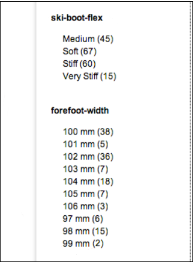
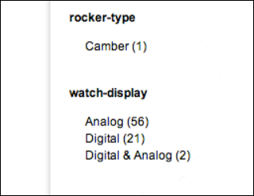
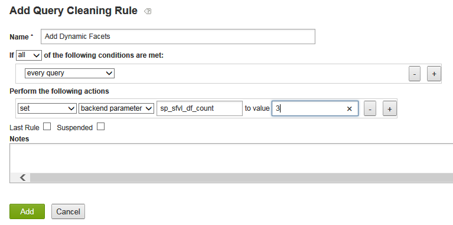
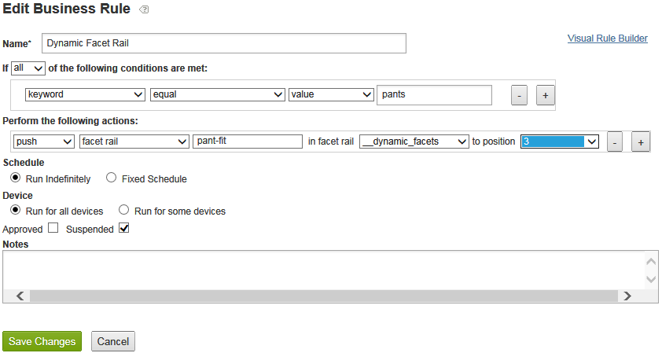

# I facet dinamici{#about-dynamic-facets}

Utilizzate Facet dinamici per creare automaticamente nuove selezioni di intervalli al momento della ricerca. Facoltativamente potete associare ciascun campo facet dinamico con un massimo di un nome di tabella nell’account Adobe Search&amp;Promote. Le relazioni di tabella vengono applicate in fase di ricerca per qualsiasi campo facet dinamico coinvolto nella ricerca.

## Utilizzo di facet dinamici {#concept_E65A70C9C2E04804BF24FBE1B3CAD899}

>[!NOTE]
>
>Per impostazione predefinita, questa funzione non è abilitata in [!DNL Adobe Search&Promote]. Contattate il supporto tecnico per attivare la funzione per l’utilizzo.

Senza l&#39;uso di Facet dinamici, era necessario unire gli attributi correlati in &quot;slot&quot;, e visualizzare solo gli slot che erano omogenei per una determinata ricerca. Ovvero, potevano contenere solo valori di un attributo logico, come &quot;dimensione scarpa&quot; o &quot;dimensione anello&quot;. Questo metodo ha fornito prestazioni adeguate in fase di ricerca con un ampio set di attributi univoci.

Tuttavia, se si utilizza la Facet dinamica, non viene posto un limite al numero di facet che la ricerca di base può monitorare in modo efficiente. Potete definire centinaia di facet dinamici, dai quali la ricerca di base può restituire i &quot;facet dinamici superiori&quot; per una determinata ricerca, dove in genere `N` `N` è un valore più modesto pari o inferiore a 10-20. Questo metodo elimina la necessità di inserire gli attributi. È ora possibile creare un facet dinamico univoco per gli attributi nel sito Web.

## Quali facet rendere dinamico? {#section_254EE034BCAD4250A5D09FBF6158C4A5}

I facet scarsamente popolati nel sito Web e visualizzati solo per un sottoinsieme di ricerche sono buoni candidati per rendere dinamici. Ad esempio, un facet denominato &quot;larghezza fronte&quot; può essere popolato solo quando si ricercano scarpe o stivali. Mentre un altro facet denominato &quot;Stile numerico volto&quot;, con possibili valori di &quot;Roman&quot; e &quot;Arabic&quot;, può essere visualizzato solo quando si ricercano orologi o orologi.

Se l’account dispone di un numero elevato di facet di questo tipo, le prestazioni di ricerca vengono migliorate con facet dinamici, invece di selezionare sempre l’intero set di facet possibile per ogni ricerca. I facet generici, come &quot;SKU&quot; o &quot;brand&quot;, normalmente adatti alla visualizzazione con i risultati di ogni ricerca, non sono generalmente adatti come facet dinamici.

## Relazione tra facet e campi tag meta {#section_2869E5FCDA8B431A87BC6E5573F2B0A0}

I facet sono composti sopra i campi dei tag meta. Un campo di tag meta è una funzionalità di livello inferiore del livello di ricerca principale di [!DNL Adobe Search&Promote]. I facet fanno invece parte di GS (Guided Search), il livello di presentazione di alto livello di Adobe Search&amp;Promote. I facet dispongono di campi di tag meta, tuttavia, i campi di tag meta non conoscono i facet. Quando configurate i facet dinamici, potete innanzitutto aggiungere facet e quindi campi tag meta con l’opzione Facet dinamico selezionata per impostare il facet identificato come dinamico.

>[!NOTE]
>
>Non esiste un&#39;impostazione &quot;Facet dinamico&quot; in **[!UICONTROL Design > Navigation > Facets]**. Ciò che rende un facet &quot;dinamico&quot; è il fatto che il relativo &quot;campo meta tag&quot; sottostante è dinamico come impostato in **[!UICONTROL Settings > Metadata > Definitions]**.

## Esempi di facet dinamici in azione {#section_BC699A05E2E742EF94D41679163ACE84}

Esempio di facet dinamici visualizzati dopo la ricerca di &quot;avvii&quot;:



Un altro esempio di facet dinamici visualizzati dopo una ricerca di &quot;orologi&quot;:



Vedi anche

* [Parametri CGI per la ricerca di back-end](../c-appendices/c-cgiparameters.md#reference_582E85C3886740C98FE88CA9DF7918E8)
* [Tag del modello di presentazione](../c-appendices/c-templates.md#reference_F1BBF616BCEC4AD7B2548ECD3CA74C64)
* [Tag modello di trasporto](../c-appendices/c-templates.md#reference_227D199F5A7248049BE1D405C0584751)

## Configurazione di facet dinamici {#task_D17F484130E448258100BAC1EEC53F39}

Impostazione di facet dinamici in Search&amp;Promotoe.

<!-- 

t_configuring_dynamic_facets.xml

 -->

>[!NOTE]
>
>Per impostazione predefinita, questa funzione non è abilitata in Adobe Search&amp;Promote. Contattate il supporto tecnico per attivare la funzione per l’utilizzo.

Prima che gli effetti dei facet dinamici siano visibili ai clienti, dovete ricreare l&#39;indice del sito.

Vedi anche

* [Parametri CGI per la ricerca di back-end](../c-appendices/c-cgiparameters.md#reference_582E85C3886740C98FE88CA9DF7918E8)
* [Tag del modello di presentazione](../c-appendices/c-templates.md#reference_F1BBF616BCEC4AD7B2548ECD3CA74C64)
* [Tag modello di trasporto](../c-appendices/c-templates.md#reference_227D199F5A7248049BE1D405C0584751)

**Per configurare facet dinamici**

1. Accertatevi di avere già aggiunto dei facet.

   Consultate [Aggiunta di un nuovo facet](../c-about-design-menu/c-about-facets.md#task_FC07BFFA62CA4B718D6CBF4F2855C89B).
1. Dopo aver aggiunto i facet, accertatevi di aver aggiunto i facet ai nuovi campi tag meta definiti dall’utente.

   Consultate [Aggiunta di un nuovo campo](../c-about-settings-menu/c-about-metadata-menu.md#task_6DF188C0FC7F4831A4444CA9AFA615E5)tag meta.
1. Nel menu del prodotto, fate clic su **[!UICONTROL Settings]** > **[!UICONTROL Metadata]** > **[!UICONTROL Definitions.]**
1. Nella [!DNL Definitions] pagina, nella [!DNL User-defined fields] tabella, nella [!DNL Actions] colonna, fare clic sull’icona a forma di matita (Modifica) nella riga del nome del campo del tag meta associato al facet che si desidera rendere dinamico.
1. Sulla [!DNL Edit Field] pagina, selezionare **[!UICONTROL Dynamic Facet]**.

   Consultate la tabella delle opzioni in [Aggiunta di un nuovo campo](../c-about-settings-menu/c-about-metadata-menu.md#task_6DF188C0FC7F4831A4444CA9AFA615E5)tag meta.
1. Clic **[!UICONTROL Save Changes]**.
1. Fate clic su **Rigenera l’indice** del sito nella casella blu per ricreare rapidamente l’indice del sito Web in fase di creazione.

   Consultate anche [Rigenerazione dell’indice di un sito Web](../c-about-index-menu/c-about-regenerate-index.md#task_B28DE40C0E9A475ABCBCBC4FF993AACD)in diretta o in stage.
1. Determinare il numero di facet dinamici da selezionare per una determinata ricerca. A questo scopo, effettuate una delle seguenti operazioni:

   * Create una regola di pulizia query con le condizioni desiderate, che esegue l&#39;azione `set`, `backend parameter`, `sp_sfvl_df_count` al valore `X`, dove `X` è il numero desiderato di facet dinamici da richiedere al momento della ricerca, quindi fate clic **[!UICONTROL Add]**.
   

   Consultate [Aggiunta di una regola](../c-about-rules-menu/c-about-query-cleaning-rules.md#task_47F43988D3D9485F8AE1DFDA7E00BF54)di pulizia query.

   Consultate anche i parametri [CGI di ricerca](../c-appendices/c-cgiparameters.md#reference_582E85C3886740C98FE88CA9DF7918E8)back-end, riga 40 nella tabella per ulteriori spiegazioni di `sp_sfvl_df_count`.

   * Aggiungete una ricerca e impostate il `sp_sfvl_df_count` parametro &quot;personalizzato&quot; sul valore desiderato, quindi fate clic **[!UICONTROL Add]**.
   

   Consultate [Aggiunta di una nuova definizione](../c-about-settings-menu/c-about-searching-menu.md#task_98D3A168AB5D4F30A1ADB6E0D48AB648)di ricerca.

   Consultate anche i parametri [CGI di ricerca](../c-appendices/c-cgiparameters.md#reference_582E85C3886740C98FE88CA9DF7918E8)back-end, riga 40 nella tabella per ulteriori spiegazioni di `sp_sfvl_df_count`.

1. Modificate il modello di trasporto appropriato per ottenere i facet dinamici restituiti dalla ricerca di base.

   Consultate [Modifica di una presentazione o di un modello](../c-about-design-menu/c-about-templates.md#task_800E0E2265C34C028C92FEB5A1243EC3)di trasporto.

   Ad esempio, supponete che il modello di trasporto sia denominato `guided.tpl`. In tal caso, scegliere **[!UICONTROL Design > Templates]** dal menu prodotto. Nella [!DNL Templates] pagina, individuare `guided.tpl` nella tabella. quindi fate clic **[!UICONTROL Edit]** all&#39;estrema destra del nome. Nella pagina Modifica, aggiungi il seguente blocco di codice alla fine di `</facets>`: Uscita JSON:

   ```
   ... 
   }<search-dynamic-facet-fields>, 
           { 
               "name" : "<search-dynamic-facet-field-name>", 
               "dynamic-facet" : 1, 
               "values" : [<search-field-value-list quotes="yes" commas="yes" data="values" sortby="values" encoding="json" />], 
               "counts" : [<search-field-value-list quotes="yes" commas="yes" data="results" sortby="values" />] 
   
           }</search-dynamic-facet-fields> 
   ...
   ```

1. Modificate il modello o i modelli di presentazione appropriati per produrre i facet dinamici.

   Consultate [Modifica di una presentazione o di un modello](../c-about-design-menu/c-about-templates.md#task_800E0E2265C34C028C92FEB5A1243EC3)di trasporto.

   Ad esempio, supponete di disporre di un modello denominato `sim.tmpl` che verrà utilizzato per l&#39;output del contenuto nel simulatore. Per modificare tale modello, scegliere **[!UICONTROL Design > Templates]** dal menu del prodotto. Nella [!DNL Templates] pagina, individuare `sim.tmpl` nella tabella. quindi fate clic **[!UICONTROL Edit]** all&#39;estrema destra del nome. Nella pagina Modifica, aggiungete quanto segue all’interno dell’area di visualizzazione dei facet del modello:

   ```
   <h6>DF RAIL</h6> 
   <guided-facet-rail gsname="__dynamic_facets"> 
               <guided-facet ><!-- behavior=Normal --> 
               <div class="facet-block" id="facet"> 
               <p><b><guided-facet-display-name /></b></p> 
               <ul> 
                   <guided-facet-values> 
                       <guided-if-facet-value-equals-length-threshold> 
               </ul> 
               <ul id="brand" style="display:none"> 
                       </guided-if-facet-value-equals-length-threshold> 
                       <guided-if-facet-value-selected> 
                           <li><guided-facet-value> [<guided-lt>a href="<guided-facet-value-undo-path />"<guided-gt>X</a>]</li> 
                       <guided-else-facet-value-selected> 
                           <li><guided-facet-link><guided-facet-value></guided-facet-link> (<guided-facet-count>) </li> 
                       </guided-if-facet-value-selected> 
                   </guided-facet-values> 
               </ul> 
               <guided-if-facet-long> 
                 <br /><guided-lt />a href="#" onclick="moreless(this,'brand');return false;" <guided-gt /><button style="font-size:10px;">VIEW MORE</button></a> 
               </guided-if-facet-long> 
               </div> 
               </guided-facet> 
   </guided-facet-rail> 
   <h6>/DF RAIL</h6>
   ```

   Apportate anche una modifica simile ad altri modelli di presentazione, in base alle esigenze, ad esempio `json.tmpl`.

   Accertatevi di specificare `__dynamic_facets` l’elemento `gsname` nel `guided-facet-rail` tag . Questo tag è una barra laterale predefinita riservata all’output di eventuali facet dinamici restituiti per una determinata ricerca.

   Facoltativamente potete anche modificare questa barra facet speciale tramite **[!UICONTROL Rules > Business Rules]** e utilizzando la **[!UICONTROL Advanced Rule Builder]** vista qui sotto.

   

   Vedere anche [Aggiunta di una nuova regola business](../c-about-rules-menu/c-about-business-rules.md#task_BD3B31ED48BB4B1B8F1DCD3BFA2528E7)
