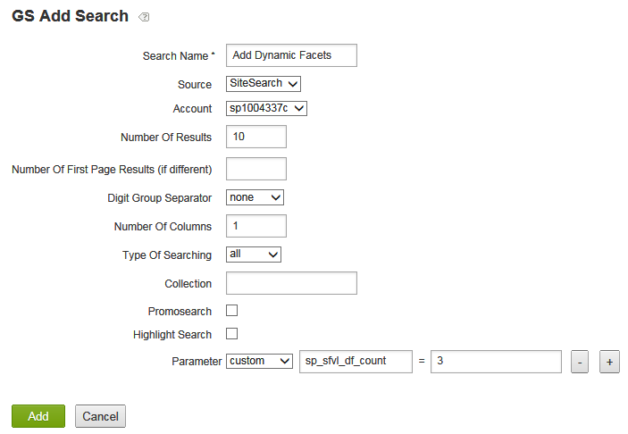

# Informazioni sui facet dinamici{#about-dynamic-facets}

Utilizza Facet dinamici per creare automaticamente nuove selezioni dell’intervallo al momento della ricerca. Facoltativamente, puoi associare ogni campo facet dinamico con un massimo di un nome di tabella nell’account di Search&amp;Promote di Adobe. È possibile applicare le relazioni della tabella in fase di ricerca per tutti i campi dei facet dinamici interessati dalla ricerca.

## Utilizzo dei facet dinamici {#concept_E65A70C9C2E04804BF24FBE1B3CAD899}

>[!NOTE]
>
>Per impostazione predefinita, questa funzione non è abilitata in [!DNL Adobe Search&Promote]. Contatta il supporto tecnico per attivare la funzione.

Senza l’utilizzo di Facet dinamici, era necessario unire gli attributi correlati in &quot;slot&quot; e visualizzare solo gli slot omogenei per una determinata ricerca. In altre parole, potrebbero contenere solo i valori di un attributo logico, ad esempio &quot;dimensione scarpa&quot; o &quot;dimensione anello&quot;. Questo metodo forniva adeguate prestazioni in fase di ricerca con un ampio set di attributi univoci.

Tuttavia, quando si utilizza l’facet dinamico, non viene impostato un limite al numero di facet che la ricerca principale può monitorare in modo efficiente. Puoi definire centinaia di facet dinamici, dai quali la ricerca di base può restituire i &quot;facet dinamici superiori `N`&quot; per una determinata ricerca, dove `N` in genere è un valore più modesto pari o inferiore a 10-20. Questo metodo elimina la necessità di inclinare gli attributi: ora puoi creare un unico facet dinamico per gli attributi nel sito web.

## Quali sfaccettature rendere dinamiche? {#section_254EE034BCAD4250A5D09FBF6158C4A5}

I facet scarsamente popolati nel sito web e visualizzati solo per un sottoinsieme di ricerche sono buoni candidati per rendere dinamici. Ad esempio, un facet denominato &quot;larghezza fronte&quot; può essere popolato solo durante la ricerca di scarpe o stivali. Mentre un altro facet denominato &quot;Stile numerico volto&quot;, con possibili valori di &quot;Romano&quot; e &quot;Arabo&quot;, può apparire solo quando si cercano orologi o orologi.

Se il tuo account dispone di un numero elevato di facet di questo tipo, migliora le prestazioni di ricerca per utilizzare i facet dinamici invece di selezionare sempre l’intero set di facet possibili per ogni ricerca. I facet generici, come &quot;SKU&quot; o &quot;brand&quot;, normalmente appropriati per la visualizzazione dei risultati di ogni ricerca, non sono in genere appropriati come facet dinamici.

## Relazione dei facet con i campi tag meta {#section_2869E5FCDA8B431A87BC6E5573F2B0A0}

I facet sono costruiti sopra i campi meta tag. Un campo meta tag è una funzionalità di livello inferiore del livello di ricerca principale di [!DNL Adobe Search&Promote]. I facet, d&#39;altro canto, fanno parte di GS (Guided Search) - lo strato di presentazione di alto livello del Search&amp;Promote Adobe. I facet possiedono campi meta tag, tuttavia, i campi meta tag non sanno nulla dei facet. Quando configuri facet dinamici, aggiungi prima facet e quindi campi meta tag con l’opzione Facet dinamico selezionata per impostare il facet identificato come dinamico.

>[!NOTE]
>
>Non esiste un&#39;impostazione &quot;Facet dinamico&quot; in **[!UICONTROL Design > Navigation > Facets]**. Ciò che rende un facet &quot;dinamico&quot; è che il suo &quot;campo meta tag&quot; sottostante è dinamico come impostato in **[!UICONTROL Settings > Metadata > Definitions]**.

## Esempi di facet dinamici in azione {#section_BC699A05E2E742EF94D41679163ACE84}

Esempio di facet dinamici visualizzati dopo una ricerca di &quot;scarponi&quot;:


Un altro esempio di facet dinamici visualizzati dopo una ricerca di &quot;orologi&quot;:


Vedi anche

* [Parametri CGI di ricerca back-end](../c-appendices/c-cgiparameters.md#reference_582E85C3886740C98FE88CA9DF7918E8)
* [Tag del modello di presentazione](../c-appendices/c-templates.md#reference_F1BBF616BCEC4AD7B2548ECD3CA74C64)
* [Tag dei modelli di trasporto](../c-appendices/c-templates.md#reference_227D199F5A7248049BE1D405C0584751)

## Configurazione dei facet dinamici {#task_D17F484130E448258100BAC1EEC53F39}

Impostazione dei facet dinamici in Search&amp;Promotoe.

<!-- 

t_configuring_dynamic_facets.xml

 -->

>[!NOTE]
>
>Per impostazione predefinita, questa funzione non è abilitata in Adobe Search&amp;Promote. Contatta il supporto tecnico per attivare la funzione.

Prima che gli effetti dei facet dinamici siano visibili ai clienti, devi ricreare l’indice del sito.

Vedi anche

* [Parametri CGI di ricerca back-end](../c-appendices/c-cgiparameters.md#reference_582E85C3886740C98FE88CA9DF7918E8)
* [Tag del modello di presentazione](../c-appendices/c-templates.md#reference_F1BBF616BCEC4AD7B2548ECD3CA74C64)
* [Tag dei modelli di trasporto](../c-appendices/c-templates.md#reference_227D199F5A7248049BE1D405C0584751)

**Per configurare i facet dinamici**

1. Assicurati di aver già aggiunto i facet.

   Consulta [Aggiunta di un nuovo facet](../c-about-design-menu/c-about-facets.md#task_FC07BFFA62CA4B718D6CBF4F2855C89B).
1. Dopo aver aggiunto i facet, accertati di aver aggiunto i facet ai nuovi campi meta tag definiti dall’utente.

   Consulta [Aggiunta di un nuovo campo meta tag](../c-about-settings-menu/c-about-metadata-menu.md#task_6DF188C0FC7F4831A4444CA9AFA615E5).
1. Nel menu del prodotto, fai clic su **[!UICONTROL Settings]** > **[!UICONTROL Metadata]** > **[!UICONTROL Definitions.]**
1. Nella tabella [!DNL User-defined fields] della pagina [!DNL Definitions] fare clic sull&#39;icona a forma di matita (Modifica) nella riga del nome del campo del tag meta associato al facet che si desidera rendere dinamico nella colonna [!DNL Actions].
1. Nella pagina [!DNL Edit Field] , seleziona **[!UICONTROL Dynamic Facet]**.

   Vedi la tabella delle opzioni in [Aggiunta di un nuovo campo tag meta](../c-about-settings-menu/c-about-metadata-menu.md#task_6DF188C0FC7F4831A4444CA9AFA615E5).
1. Clic **[!UICONTROL Save Changes]**.
1. Fai clic su **rigenera l&#39;indice del sito in staging** nella casella blu per ricostruire rapidamente l&#39;indice del sito web in staging.

   Vedere anche [Rigenerazione dell&#39;indice di un sito web live o in staging](../c-about-index-menu/c-about-regenerate-index.md#task_B28DE40C0E9A475ABCBCBC4FF993AACD).
1. Determinare il numero di facet dinamici da selezionare per una determinata ricerca. Esegui questa attività eseguendo una delle operazioni seguenti:

   * Crea una regola di pulizia delle query con le condizioni desiderate, che esegue l&#39;azione `set`, `backend parameter`, `sp_sfvl_df_count` sul valore `X`, dove `X` è il numero desiderato di facet dinamici da richiedere al momento della ricerca, quindi fai clic su **[!UICONTROL Add]**.

   

   Vedere [Aggiunta di una regola di pulizia delle query](../c-about-rules-menu/c-about-query-cleaning-rules.md#task_47F43988D3D9485F8AE1DFDA7E00BF54).

   Vedi anche [Parametri CGI di ricerca back-end](../c-appendices/c-cgiparameters.md#reference_582E85C3886740C98FE88CA9DF7918E8), riga 40 nella tabella per ulteriori spiegazioni di `sp_sfvl_df_count`.

   * Aggiungi una ricerca e imposta il parametro &quot;custom&quot; `sp_sfvl_df_count` sul valore desiderato e fai clic su **[!UICONTROL Add]**.

   

   Consulta [Aggiunta di una nuova definizione di ricerca](../c-about-settings-menu/c-about-searching-menu.md#task_98D3A168AB5D4F30A1ADB6E0D48AB648).

   Vedi anche [Parametri CGI di ricerca back-end](../c-appendices/c-cgiparameters.md#reference_582E85C3886740C98FE88CA9DF7918E8), riga 40 nella tabella per ulteriori spiegazioni di `sp_sfvl_df_count`.

1. Modifica il modello di trasporto appropriato per generare i facet dinamici restituiti dalla ricerca di base.

   Vedere [Modifica di una presentazione o di un modello di trasporto](../c-about-design-menu/c-about-templates.md#task_800E0E2265C34C028C92FEB5A1243EC3).

   Ad esempio, supponiamo che il modello di trasporto sia denominato `guided.tpl`. In tal caso, scegliere **[!UICONTROL Design > Templates]** dal menu prodotto. Nella pagina [!DNL Templates] , individua `guided.tpl` nella tabella. quindi fai clic su **[!UICONTROL Edit]** all&#39;estrema destra del nome. Nella pagina Modifica , aggiungi il seguente blocco di codice alla fine di `</facets>`: Output JSON:

   ```
   ... 
   }<search-dynamic-facet-fields>, 
           { 
               "name" : "<search-dynamic-facet-field-name>", 
               "dynamic-facet" : 1, 
               "values" : [<search-field-value-list quotes="yes" commas="yes" data="values" sortby="values" encoding="json" />], 
               "counts" : [<search-field-value-list quotes="yes" commas="yes" data="results" sortby="values" />] 
   
           }</search-dynamic-facet-fields> 
   ...
   ```

1. Modificate il modello o i modelli di presentazione appropriati per generare i facet dinamici.

   Vedere [Modifica di una presentazione o di un modello di trasporto](../c-about-design-menu/c-about-templates.md#task_800E0E2265C34C028C92FEB5A1243EC3).

   Ad esempio, supponiamo di avere un modello denominato `sim.tmpl` che viene utilizzato per l’output del contenuto nel simulatore. Per modificare tale modello, scegliere **[!UICONTROL Design > Templates]** dal menu del prodotto. Nella pagina [!DNL Templates] , individua `sim.tmpl` nella tabella. quindi fai clic su **[!UICONTROL Edit]** all&#39;estrema destra del nome. Nella pagina Modifica , aggiungi quanto segue all’interno dell’area di visualizzazione dei facet del modello:

   ```
   <h6>DF RAIL</h6> 
   <guided-facet-rail gsname="__dynamic_facets"> 
               <guided-facet ><!-- behavior=Normal --> 
               <div class="facet-block" id="facet"> 
               <p><b><guided-facet-display-name /></b></p> 
               <ul> 
                   <guided-facet-values> 
                       <guided-if-facet-value-equals-length-threshold> 
               </ul> 
               <ul id="brand" style="display:none"> 
                       </guided-if-facet-value-equals-length-threshold> 
                       <guided-if-facet-value-selected> 
                           <li><guided-facet-value> [<guided-lt>a href="<guided-facet-value-undo-path />"<guided-gt>X</a>]</li> 
                       <guided-else-facet-value-selected> 
                           <li><guided-facet-link><guided-facet-value></guided-facet-link> (<guided-facet-count>) </li> 
                       </guided-if-facet-value-selected> 
                   </guided-facet-values> 
               </ul> 
               <guided-if-facet-long> 
                 <br /><guided-lt />a href="#" onclick="moreless(this,'brand');return false;" <guided-gt /><button style="font-size:10px;">VIEW MORE</button></a> 
               </guided-if-facet-long> 
               </div> 
               </guided-facet> 
   </guided-facet-rail> 
   <h6>/DF RAIL</h6>
   ```

   Se necessario, apporti una modifica simile ad altri modelli di presentazione, ad esempio `json.tmpl`.

   Assicurati di specificare `__dynamic_facets` per il tag `gsname` nel tag `guided-facet-rail` . Questo tag è una barra dei facet predefinita riservata all’output di eventuali facet dinamici restituiti per una determinata ricerca.

   Facoltativamente, puoi anche modificare questa barra dei facet speciale tramite **[!UICONTROL Rules > Business Rules]** e utilizzando il **[!UICONTROL Advanced Rule Builder]** come mostrato di seguito.

   

   Vedere anche [Aggiunta di una nuova regola business](../c-about-rules-menu/c-about-business-rules.md#task_BD3B31ED48BB4B1B8F1DCD3BFA2528E7)
