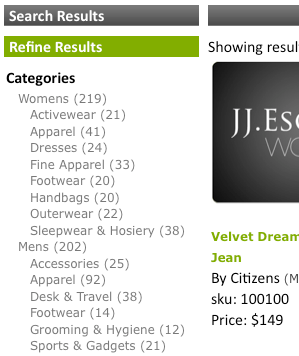

# Informazioni su facet{#about-facets}

Potete usare i facet per personalizzare il livello della presentazione e fornire agli utenti una ricerca guidata che consenta loro di approfondire i risultati della ricerca.

## Utilizzo dei facet {#concept_FA912B3B41EE493DB2F492D188457FF5}

Ad esempio, se un visitatore di un sito Web che vende strumenti esegue una ricerca di chiavi in mano, L&#39;azienda può utilizzare due facet: uno per specificare tutte le marche di chiavi che sono state trovate e il secondo per specificare tutte le dimensioni di chiave inglese. Il cliente può fare clic su qualsiasi marchio o dimensione all&#39;interno del facet appropriato per limitare i risultati e trovare rapidamente la chiave inglese corretta di cui ha bisogno.

Potete basare un facet su qualsiasi definizione di metadati esistente. Se un facet è definito come tipo di data nei metadati, viene visualizzato come facet di intervallo di date.

La tabella nella pagina [!DNL Staged Facets] mostra una panoramica generale delle impostazioni che compongono ciascun facet aggiunto. Potete aggiungere nuovi facet e modificare o eliminare i facet esistenti. Per ripristinare eventuali modifiche apportate ai facet, utilizzate **[!UICONTROL History]** accanto all’angolo superiore destro della pagina.

Per impostazione predefinita, le impostazioni dei facet sono organizzate in modo da consentire di verificare tutte le modifiche prima di renderle attive.

Vedere [Informazioni sullo stato di avanzamento](../c-about-staging.md#concept_08B8F3CA1F4241108F14BA7FC7806CA7).

È possibile utilizzare **[!UICONTROL View Live Settings]** per confrontare le impostazioni per uno stage con quelle per lo stato attuale. Utilizzare **[!UICONTROL View Staged Settings]** per tornare all&#39;area di gestione temporanea. Per un elemento messo in scena, la versione live delle impostazioni è di sola lettura. Di conseguenza, potete manipolarlo spingendo le impostazioni in fase di esecuzione. Dopo aver apportato tutte le modifiche apportate al facet, fate clic su **[!UICONTROL Push Live]** per renderlo attivo.

## Facet intervallo date {#section_FEFFF6B5B6534456913189FEF559BA58}

I facet definiti come tipo Data nei metadati vengono trattati in modo diverso rispetto ad altri facet. Invece di essere trattati come un insieme di valori, vengono trattati come un intervallo di date, con una data di inizio, una data di fine o entrambi.

Un facet di intervallo di date ha un valore della data iniziale, seguito da &quot;BTW&quot; (per &quot;tra&quot;), seguito dalla data finale. Le date sono nei due formati seguenti:

mm-gg-aaaa

mm/gg/aaaa

Sono necessari anni a quattro cifre. Devono essere presenti almeno una delle date di inizio o di fine, ma non sono entrambe obbligatorie. Ad esempio, &quot;12/1/2007BTW1/4/2009&quot; significa tutte le date comprese tra il 1° dicembre 2007 e il 4 gennaio 2009. Tuttavia, per &quot;1-1-2005BTW&quot; si intendono tutte le date dal 1 gennaio 2005.

Potete utilizzare il tag del modello di presentazione `<guided-facet-value/>` per ottenere il valore di un facet dell&#39;intervallo di date, come un facet normale. Al momento, JavaScript è richiesto per consentire agli utenti di immettere intervalli di date in cui effettuare la ricerca. Ad esempio, è possibile ricevere l&#39;input da due campi di immissione per le date di inizio e di fine. Potete quindi convalidare l&#39;input e aggiungere il valore del nuovo facet (creato dai due campi di input) e il nome del facet all&#39;URL esistente.

Vedere [Tag del modello di presentazione](../c-appendices/c-templates.md#reference_F1BBF616BCEC4AD7B2548ECD3CA74C64).

Di seguito è riportato un esempio di codice che illustra come presentare un intervallo di date in una pagina. Mostra l’intervallo di date esistente, se selezionato; in caso contrario, presenta un semplice modulo di input. Quando il modulo viene inviato, viene eseguita una semplice convalida. Invia quindi il browser a un nuovo URL che include due nuovi parametri:

* `q#` - Rappresenta l&#39;intervallo di date selezionato assemblato dai due campi di input.
* `x#` - Denomina la facet. In questo esempio, il facet dell&#39;intervallo di date è denominato &quot;modified&quot;.

Le parti `replace(/%2F/ig, '~2F')` nel codice sono necessarie perché Apache non consente `%2F` nei percorsi URL per motivi di sicurezza e quando si utilizzano gli URL SEO la query si trova nel percorso URL. Di conseguenza, `/` viene codificato come `~2F` anziché come `%2F`, come in genere avviene in un URL.

```
<div class="date_range"> 
 <p>Date Range</p> 
 <guided-if-facet-selected gsname="modified"> 
  <guided-facet-values gsname="modified"> 
   <script> 
   var modified_daterange= '<guided-facet-value />'.split(/BTW/) ; 
   if (modified_daterange[0]=='') modified_daterange[0]= '--/--/----' ; 
   if (modified_daterange[1]=='') modified_daterange[1]= '--/--/----' ; 
   document.write('From: ' + modified_daterange[0]) ; 
   document.write('<br>To: ' + modified_daterange[1]) ; 
   </script> 
  </guided-facet-values> 
 
 <guided-else-facet-selected> 
  <form action="#"> 
   From: <input name="dateFrom" size=10> 
   <br>To: <input name="dateTo" size=10> 
   <br><input type="button" value="Go" onclick="goClick(this.form)"> 
  </form> 
  <script> 
  function goClick(f) { 
   if (f.dateFrom.value=='' && f.dateTo.value=='') { 
    alert('You must enter either a From: date or a To: date.') ; 
    return ; 
   } 
   if ( f.dateFrom.value!='' && !f.dateFrom.value.match(/^\d+[\/\-]\d+[\/\-]\d\d\d\d$/) ) { 
    alert('From: date must be in "mm/dd/yyyy" or "mm-dd-yyyy" format.') ; 
    return ; 
   } 
   if ( f.dateTo.value!='' && !f.dateTo.value.match(/^\d+[\/\-]\d+[\/\-]\d\d\d\d$/) ) { 
    alert('To: date must be in "mm/dd/yyyy" or "mm-dd-yyyy" format.') ; 
    return ; 
   } 
   // Note that "/" is encoded as "~2F" instead of "%2F" to avoid Apache 404 error. 
   var new_url= '<guided-current-path />&<guided-query-param-name gsname="q#" offset="0" />=' 
    + encodeURIComponent(f.dateFrom.value).replace(/%2F/ig, '~2F') + 'BTW' 
    + encodeURIComponent(f.dateTo  .value).replace(/%2F/ig, '~2F') 
    + '&<guided-query-param-name gsname="x#" offset="0" />=modified' ; 
   location.href= new_url ; 
  } 
  </script> 
 </guided-if-facet-selected> 
</div>
```

## I facet nidificati {#section_6BC77F38DE9F43D5B6911F8CECB15DFC}

I facet nidificati sono facet che visualizzano più livelli di categorie come illustrato di seguito:



Le categorie Donne e Uomini si trovano nel facet superiore o padre. Le sottocategorie, come Accessori e Calzature, si trovano nella parte inferiore o secondaria.

La profondità del facet nidificato supportata corrente è due, ma può essere ovunque lungo l&#39;elenco a discesa.

Di seguito sono riportati i comportamenti di vari tipi di facet nidificati:

<table> 
 <thead> 
  <tr> 
   <th colname="col1" class="entry"> <p>Comportamento del tipo di facet nidificato </p> </th> 
   <th colname="col2" class="entry"> <p>Comportamento </p> </th> 
  </tr> 
 </thead>
 <tbody> 
  <tr> 
   <td colname="col1"> <p>Normale </p> </td> 
   <td colname="col2"> <p>Il comportamento di un facet nidificato normale è che si riduce se altri facet restringono la ricerca. </p> <p>Se il facet nidificato è selezionato, si restringe verso il basso verso la selezione. Se è selezionato un facet padre, solo tale padre viene visualizzato con tutti i facet figlio rimanenti. Se è selezionato un facet figlio, il facet mostra solo il facet principale selezionato e il facet figlio selezionato. </p> </td> 
  </tr> 
  <tr> 
   <td colname="col1"> <p>In rilievo </p> </td> 
   <td colname="col2"> <p>Il comportamento di un facet nidificato fisso consiste nel fatto che tenta di mantenere il facet aperto il più possibile in base allo stato di altri facet o criteri di ricerca. Se il facet figlio è selezionato, viene conteggiato verso la profondità fissa. </p> </td> 
  </tr> 
  <tr> 
   <td colname="col1"> <p>Selezione multipla </p> </td> 
   <td colname="col2"> <p>Il comportamento di un facet a selezione multipla consiste nel mantenere aperto il facet. Eventuali nuove selezioni tentano di cancellare tutte le altre selezioni di facet a meno che il facet non sia un "elemento padre" del facet nidificato della categoria. In questo caso, "parent" si riferisce ai facet di categoria, non alle categorie di livello principale di un facet nidificato. </p> </td> 
  </tr> 
  <tr> 
   <td colname="col1"> <p>Selezione multipla categoria </p> </td> 
   <td colname="col2"> <p>Come per il tipo di facet nidificato Multi-Select con le seguenti eccezioni: </p> 
    <ul id="ul_D5AB6AF3169A483E8F3FC6D2A2EA3A28"> 
     <li id="li_9308156EF2FF43CE9DFB933F13786C58">Se il facet è selezionato per la prima volta, tutti gli altri facet precedentemente scelti vengono deselezionati. </li> 
     <li id="li_DD96D6802A9C479283212A0FD68C6F85">Anche altri facet precedentemente scelti sono deselezionati se il cliente effettua un'esercitazione direttamente verso il facet figlio senza fare clic sul facet padre o scegliere un facet di pari livello diverso. </li> 
     <li id="li_8BF58F10969B4743986D5D0E0086AD6C">Possono avere genitori nel senso che i facet di categoria hanno genitori. Non confondete questo comportamento con le relazioni padre-figlio rilevate con tutti i facet nidificati. </li> 
    </ul> </td> 
  </tr> 
 </tbody> 
</table>

Vedere anche [Informazioni su Facet Rail](../c-about-design-menu/c-about-facet-rails.md#concept_1FDC8BCDFFC84A0889DA670F63D5F6DB).

## Aggiunta di un nuovo facet {#task_FC07BFFA62CA4B718D6CBF4F2855C89B}

Potete aggiungere facet per personalizzare il livello della presentazione e fornire ai clienti una Ricerca guidata che consenta loro di approfondire i risultati della ricerca.

<!-- 

t_adding_a_new_facet.xml

 -->

La tabella facet nella pagina [!DNL Facets] mostra un estratto delle impostazioni che compongono un singolo facet. Potete aggiungere nuovi facet e modificare o eliminare i facet esistenti. Qualsiasi modifica apportata ai facet può essere ripristinata utilizzando la funzione Cronologia.

>[!NOTE]
>
>Accertatevi di fare riferimento al facet nel modello di presentazione in modo che sia visibile sul sito Web.

Vedere anche [Informazioni su Facet Rail](../c-about-design-menu/c-about-facet-rails.md#concept_1FDC8BCDFFC84A0889DA670F63D5F6DB).

**Per aggiungere un nuovo facet**

1. Prima di aggiungere un nuovo facet, accertatevi di aver già fatto quanto segue prima di passare al passaggio successivo:

   * Alcuni campi meta tag sono già stati definiti.

      Vedere [Aggiunta di un nuovo campo tag meta](../c-about-settings-menu/c-about-metadata-menu.md#task_6DF188C0FC7F4831A4444CA9AFA615E5).
   * Inserite i metadati nell’indice.
Vedere [Aggiunta di definizioni di iniezione di campi](../c-about-settings-menu/c-about-metadata-menu.md#task_E86566FA1FF74CF68115C0ADA05172AE).

1. Scegliere **[!UICONTROL Design]** > **[!UICONTROL Navigation]** > **[!UICONTROL Facets.]** dal menu del prodotto
1. Nella pagina [!DNL Facets] fare clic su **[!UICONTROL Add New Facet]**.
1. Nella pagina [!DNL Add Facet], impostate le opzioni desiderate.

   Queste impostazioni influiscono sia sul comportamento che sulla presentazione predefinita di un facet. Potete ignorare alcune di queste impostazioni mediante le impostazioni del modello di presentazione.

   Se un facet è definito come tipo di data nei metadati, viene visualizzato come intervallo di date.

   Vedere [Facet intervallo date](../c-about-design-menu/c-about-facets.md#section_FEFFF6B5B6534456913189FEF559BA58).

   A seconda delle opzioni di facet selezionate, non tutte le opzioni sono disponibili.

   <!-- 
   r_add_facet_options.xml
   -->

   <table> 
    <thead> 
      <tr> 
      <th colname="col1" class="entry"> <p>Opzione </p> </th> 
      <th colname="col2" class="entry"> <p>Descrizione </p> </th> 
      </tr> 
    </thead>
    <tbody> 
      <tr> 
      <td colname="col1"> <p>Nome facet </p> </td> 
      <td colname="col2"> <p>Identifica il nome di un dato facet. </p> <p> <p>Nota:  Potete avere un solo facet basato su metadati definiti dall’utente esistenti. Se nell’elenco a discesa non sono disponibili facet, è innanzitutto necessario definire alcuni metadati. </p> </p> <p>Vedere <a href="../c-about-settings-menu/c-about-metadata-menu.md#task_6DF188C0FC7F4831A4444CA9AFA615E5" type="task" format="dita" scope="local"> Aggiunta di un nuovo campo tag meta </a>. </p> <p>Per creare un facet basato su una tabella di campi, utilizzate il nome facet personalizzato e specificate il nome della tabella di campi. </p> </td> 
      </tr> 
      <tr> 
      <td colname="col1"> <p>Etichetta visualizzazione </p> </td> 
      <td colname="col2"> <p>Imposta l'etichetta di un facet che può quindi essere utilizzato in una breadcrumb, invece di un nome campo di metadati (con il tag <span class="codeph"> &lt;etichetta-breadcrumb-guida&gt; </span>) o un valore autonomo (con il tag <span class="codeph"> &lt;nome-visualizzazione-facet-display&gt; </span>). </p> </td> 
      </tr> 
      <tr> 
      <td colname="col1"> <p>Comportamento </p> </td> 
      <td colname="col2"> <p>Imposta uno dei tre comportamenti dei facet. </p> <p> 
      <ul id="ul_67C19E1C16224B9990F04A0D05BD3D05"> 
      <li id="li_6B232C11A61840B68CA59E1F593405A0"> <span class="uicontrol"> Normale </span> <p>Quando un cliente fa clic su un facet il cui comportamento è impostato su <span class="uicontrol"> Normale </span>, esegue la ricerca nei risultati per tale elemento. Da qui, il cliente può perfezionare e restringere ulteriormente il numero di risultati di ricerca. </p> </li> 
      <li id="li_7D7C43A7F7AB4B84A9B0FEF34627605A"> <span class="uicontrol"> Categoria </span> <p>I facet delle categorie si comportano come elementi di navigazione. Questi facet sono facet di primo livello che i clienti solitamente esplorano prima di rivelare i facet con le opzioni degli attributi. I facet delle categorie non si restringono quando altri facet sono selezionati e rimangono aperti. Facendo clic su un valore diverso all'interno di un facet di categoria, vengono deselezionati tutti gli altri facet della pagina, ad eccezione dei facet principali di tale categoria. </p> </li> 
      <li id="li_01255993D71F40DBA8870AA3FEA7D304"> <span class="uicontrol"> Selezione multipla categoria  </span> <p>i facet sono facet di categoria che supportano la selezione di più elementi del facet in cui gli elementi sono "ORed" insieme. </p> </li> 
      </ul> 
      <ul id="ul_683F6D3FC8524E65AF303453ADDB6001"> 
        <li id="li_81F504D1D1294666BBBC5EA43B34B712"> <span class="uicontrol"> In rilievo </span> <p>Quando un cliente fa clic su un facet il cui comportamento è impostato su <span class="uicontrol"> Sticky </span>, il facet con l'opzione selezionata rimane aperto durante il drill-down. Questa opzione è utile quando desiderate consentire a un cliente di cambiare una scelta precedente. </p> </li> 
      </ul> 
      <ul id="ul_8E871D63B09445268C600C8ABC20F6A4"> 
        <li id="li_F88AC5528B0C4751BC4CFE7FA9525857"> <span class="uicontrol"> Selezione multipla  </span> <p>Consente la selezione di più elementi da un facet, dove gli elementi all'interno del facet sono "ORed" insieme. Questa opzione è utile per un facet che può mostrare un attributo minore come i colori e si desidera consentire al cliente di creare una query che consenta loro di "mostrare scarpe nelle mie dimensioni che sono rosse o nere". </p> </li> 
      </ul> </p> </td> 
      </tr> 
      <tr> 
      <td colname="col1"> <p>Mostra sempre </p> </td> 
      <td colname="col2"> <p>Per un facet normale o fisso, imposta il facet in modo che resti sempre visibile al cliente. </p> <p>Questa opzione è disponibile solo se è stata selezionata l'opzione <span class="uicontrol"> Normale </span>, <span class="uicontrol"> Categoria </span> o <span class="uicontrol"> Sticky </span> dall'elenco a discesa <span class="uicontrol"> Comportamento </span>. </p> </td> 
      </tr> 
      <tr> 
      <td colname="col1"> <p>I genitori di Facet </p> </td> 
      <td colname="col2"> <p>Questa opzione è disponibile solo se si è selezionato <span class="uicontrol"> Categoria </span> o <span class="uicontrol"> Categoria Selezione multipla </span> dall'elenco a discesa <span class="uicontrol"> Comportamento </span>. </p> <p>Indica gli elementi padre del facet della categoria. Gli elementi selezionati nelle categorie facet padre vengono utilizzati per limitare le scelte disponibili all'interno del facet categoria corrente. I facet padre non sono deselezionati quando un cliente interagisce con il facet della categoria. Potete specificare più elementi principali delimitati da virgole. </p> </td> 
      </tr> 
      <tr> 
      <td colname="col1"> <p>Profondità adesiva </p> </td> 
      <td colname="col2"> <p>Questa opzione è disponibile solo se si è selezionato <span class="uicontrol"> Sticky </span> dall'elenco a discesa <span class="uicontrol"> Comportamento </span>. </p> <p>Imposta il numero di opzioni che devono rimanere aperte durante l'espansione. </p> </td> 
      </tr> 
      <tr> 
      <td colname="col1"> <p>Soglia lunghezza </p> </td> 
      <td colname="col2"> <p>Imposta la lunghezza verticale (1-9999) del facet definito in numero di elementi. </p> <p>Se il modello di presentazione è impostato correttamente, potete utilizzare questa impostazione per fornire un "Show more..." oppure determinare quando lanciare il facet in un div scorrevole e così via. </p> </td> 
      </tr> 
      <tr> 
      <td colname="col1"> <p>Soglia lunghezza troncata </p> </td> 
      <td colname="col2"> <p>Tronca il numero di elementi in un facet dopo una determinata soglia. </p> <p>Alcune implementazioni hanno facet con migliaia di elementi al loro interno. Può essere costoso inviare tutti i dati via cavo. Potete utilizzare questa impostazione per rifilare il facet fino a un livello gestibile. Il facet verrà troncato dopo l'ordinamento. </p> </td> 
      </tr> 
      <tr> 
      <td colname="col1"> <p>Larghezza valore max </p> </td> 
      <td colname="col2"> <p>Specifica un limite alla lunghezza della stringa del valore del facet (1-999). </p> <p>Questa opzione è utile quando si desidera inserire un facet in un layout a larghezza fissa e impedire il ritorno a capo delle stringhe. Per impostazione predefinita, la stringa è impostata su 3 caratteri più corti della soglia, in modo che sia possibile aggiungere un puntino di sospensione. </p> </td> 
      </tr> 
      <tr> 
      <td colname="col1"> <p>Estensione valore </p> </td> 
      <td colname="col2"> <p>Specifica la stringa da utilizzare per indicare che il valore di un facet è troncato. Per impostazione predefinita, la stringa "..." viene utilizzato. </p> </td> 
      </tr> 
      <tr> 
      <td colname="col1"> <p>Delimitatore </p> </td> 
      <td colname="col2"> <p>Specifica il delimitatore da utilizzare per qualsiasi elenco di valori separati delimitati applicabile al facet. </p> <p>Il delimitatore utilizzato è lo stesso definito nei metadati su cui si basa il facet. Il delimitatore predefinito è una virgola. Tuttavia, potete utilizzare qualsiasi valore conforme con XML. </p> </td> 
      </tr> 
      <tr> 
      <td colname="col1"> <p>Ordina </p> </td> 
      <td colname="col2"> <p>Specifica come devono essere ordinati i facet nel sito Web. I facet possono essere ordinati come segue. Se lo desiderate, potete combinare fino a cinque tipi. </p> 
      <ul id="ul_12987F4DC7B34C63ABC906B59688A174"> 
      <li id="li_3206C96013DF431D90119F594D93D85D"> <span class="uicontrol"> alpha  </span> <p>Ordina i valori in ordine alfabetico (0-9, A-Z), inclusi i caratteri di punteggiatura. </p> </li> 
      <li id="li_304E4A518FBE48D18D9E9EA7339A3481"> <span class="uicontrol"> alpha (solo alfanumerico)  </span> <p>Ordina i valori in ordine alfabetico (0-9, A-Z), ignorando i caratteri di punteggiatura. </p> </li> 
      <li id="li_CADB888CC514455F9CA379C8EEE490AA"> <span class="uicontrol"> alpha (senza distinzione tra maiuscole e minuscole)  </span> <p>Ordina i valori in ordine alfabetico (0-9, A-Z), ignorando le maiuscole e le minuscole dei caratteri alfabetici e includendo i caratteri di punteggiatura. </p> </li> 
      <li id="li_F61122E79AB5413792DA31F8AB1414BD"> <span class="uicontrol"> alfa (senza distinzione tra maiuscole e minuscole, solo alfanumerico)  </span> <p>Ordina i valori in ordine alfabetico (0-9, A-Z), ignorando le maiuscole e le minuscole dei caratteri alfabetici e ignorando i caratteri di punteggiatura. </p> </li> 
      <li id="li_F50CC298ABF046D0A39D5AE5B1261823"> <span class="uicontrol"> count  </span> <p>Ordina per numero di risultati che corrispondono a ciascun valore del facet da maggiore a minore. </p> </li> 
      <li id="li_32B6AF39E9534762B39B15181DC5AD01"> <span class="uicontrol"> numeric  </span> <p>Ordina i valori numericamente. Quando si ordinano i numeri, questa opzione è superiore all'ordinamento Alfa perché se si utilizza un ordinamento Alfa, 10 viene visualizzato prima di 2. </p> </li> 
      <li id="li_CF8E76A7B1184E0C8DCC11B53E31A1DC"> <span class="uicontrol"> split  </span> <p>Suddivide l'elenco in due elenchi separati per soglia di conteggio. I valori dei facet al di sopra della soglia vengono spostati in alto. I valori di facet con conteggi inferiori alla soglia vengono spostati in basso. Quando si desidera che i valori di un determinato intervallo siano sempre nella parte superiore, è necessaria una soglia di suddivisione. </p> </li> 
      <li id="li_4AB8276577384B1099CBA895898205AD"> <span class="uicontrol"> break  </span> <p>Forza alcuni valori nella parte superiore o inferiore dell'elenco. Ad esempio, è sempre possibile visualizzare il termine "Altro" in fondo all’elenco. I valori superiori o inferiori sono richiesti quando si utilizza un ordinamento di tipo break per identificare i valori espliciti che devono trovarsi nella parte superiore o inferiore dell'ordinamento. </p> </li> 
      <li id="li_227E96CFED2044FCA2F10B6913B03CFB"> <span class="uicontrol"> ordered  </span> <p>I valori dei facet devono sempre essere in ordine fisso (un elenco di valori separati da delimitatori definito nell'opzione <span class="uicontrol"> Ordine </span> descritta di seguito). </p> </li> 
      </ul> </td> 
      </tr> 
      <tr> 
      <td colname="col1"> <p>Alias facet </p> </td> 
      <td colname="col2"> <p>Per supportare gli URL di ricerca esistenti eventualmente disattivati, potete usare un alias facet per mappare il nome del parametro legacy su modificato o semplicemente creare un facet con un nome diverso. L’alias viene applicato solo alle richieste in entrata e non viene utilizzato per creare collegamenti ai facet. </p> </td> 
      </tr> 
      <tr> 
      <td colname="col1"> <p>Nome barra laterale facet </p> </td> 
      <td colname="col2"> <p>Nome della barra laterale se decidete di ordinare i facet in ordine alfabetico, per conteggio o tramite un metodo personalizzato. </p> <p>Vedere <a href="../c-about-design-menu/c-about-facet-rails.md#concept_1FDC8BCDFFC84A0889DA670F63D5F6DB" format="dita" scope="local"> La barra laterale </a>. </p> </td> 
      </tr> 
      <tr> 
      <td colname="col1"> <p>Ordine </p> </td> 
      <td colname="col2"> <p>Questa opzione è disponibile solo se è stato selezionato <span class="uicontrol"> Ordinato </span> dall'elenco a discesa <span class="uicontrol"> Ordina </span>. </p> <p>Consente di definire un elenco delimitato di valori che specifica l'ordine da utilizzare. </p> </td> 
      </tr> 
      <tr> 
      <td colname="col1"> <p>Aggiungi extra </p> </td> 
      <td colname="col2"> <p>Questa opzione è disponibile solo se è stato selezionato <span class="uicontrol"> Ordinato </span> dall'elenco a discesa <span class="uicontrol"> Ordina </span>. </p> <p>Se i valori non sono presenti nell'elenco ordinato, questi vengono aggiunti alla fine. </p> </td> 
      </tr> 
      <tr> 
      <td colname="col1"> <p>Mostra fantasmi </p> </td> 
      <td colname="col2"> <p>Questa opzione è disponibile solo se è stato selezionato <span class="uicontrol"> Ordinato </span> dall'elenco a discesa <span class="uicontrol"> Ordina </span>. </p> <p>Se i valori specificati dall'elenco ordinato non sono presenti, questa opzione contrassegna ogni elemento mancante nel facet come "fantasma" in modo che gli elementi vengano visualizzati in modo diverso. </p> </td> 
      </tr> 
      <tr> 
      <td colname="col1"> <p>Facet nidificato </p> </td> 
      <td colname="col2"> <p>Un facet nidificato visualizza le relative categorie e le relative categorie figlio. Può mostrare solo una profondità di due categorie, ma può essere ovunque lungo il drill-down. </p> <p>I dati per questo facet devono seguire una convenzione per descrivere i due livelli di categorie. Ad esempio, un valore di facet può essere 'shoes:boots', dove la categoria principale è 'shoes' e la categoria figlio è 'boots'. Il carattere di delimitazione ':' viene utilizzato come delimitatore per separarli. </p> <p>Per ulteriori informazioni sulla modifica del delimitatore, vedere la sezione Delimitatore nidificato riportata di seguito. </p> <p>Per generare i dati in questo formato, è possibile utilizzare uno script di filtro per combinare due categorie esistenti. Potete combinare i comportamenti Normale, Categoria e Sticky con facet nidificati. </p> </td> 
      </tr> 
      <tr> 
      <td colname="col1"> <p>Nome padre nidificato </p> </td> 
      <td colname="col2"> <p>Questo elenco a discesa è disponibile solo se avete selezionato <span class="uicontrol"> Facet nidificato </span>. </p> <p>Consente di scegliere quale campo rappresenta la categoria principale. Questo campo viene utilizzato durante il tempo di ricerca nelle categorie padre corrispondenti. </p> </td> 
      </tr> 
      <tr> 
      <td colname="col1"> <p>Nome figlio nidificato </p> </td> 
      <td colname="col2"> <p>Questo elenco a discesa è disponibile solo se avete selezionato <span class="uicontrol"> Facet nidificato </span>. </p> <p>Consente di scegliere quale campo rappresenta la categoria figlio. Questo campo viene utilizzato durante il tempo di ricerca nelle corrispondenti categorie figlio. </p> </td> 
      </tr> 
      <tr> 
      <td colname="col1"> <p>Delimitatore Facet nidificato </p> </td> 
      <td colname="col2"> <p>Questa opzione è disponibile solo se è stato selezionato <span class="uicontrol"> Facet nidificato </span>. </p> <p>Il carattere immesso qui viene utilizzato per analizzare le categorie padre e figlio dai relativi dati. </p> <p>Ad esempio, se ':' viene utilizzato come delimitatore e il padre è 'shoes' e il figlio è 'boots', i dati saranno formattati come 'shoes:boots'. </p> </td> 
      </tr> 
      <tr> 
      <td colname="col1"> <p>Soglia di divisione </p> </td> 
      <td colname="col2"> <p>Questa opzione è disponibile solo se è stato selezionato <span class="uicontrol"> Dividi </span> dall'elenco a discesa <span class="uicontrol"> Ordina </span>. </p> <p>Quando si utilizza un ordinamento Dividi, la soglia di suddivisione definisce il conteggio in cui dividere il facet in due elenchi separati. I valori con conteggi superiori o uguali alla soglia vengono mantenuti in alto, mentre i valori al di sotto della soglia vengono spostati in basso. </p> </td> 
      </tr> 
      <tr> 
      <td colname="col1"> <p>Valori principali </p> </td> 
      <td colname="col2"> <p>Questa opzione è disponibile solo se è stata selezionata l'opzione <span class="uicontrol"> Interrompi </span> dall'elenco a discesa <span class="uicontrol"> Ordina </span>. </p> <p>Quando si utilizza un ordinamento Interrompi, questo elenco delimitato di valori viene sempre posizionato in cima all'elenco. L'uso di espressioni regolari è consentito ma deve essere tra parentesi graffe o parentesi graffe, ad esempio: {^New.*?},{^Molto Nuovo.*} </p> </td> 
      </tr> 
      <tr> 
      <td colname="col1"> <p>Valori inferiori </p> </td> 
      <td colname="col2"> <p>Questa opzione è disponibile solo se è stata selezionata l'opzione <span class="uicontrol"> Interrompi </span> dall'elenco a discesa <span class="uicontrol"> Ordina </span>. </p> <p>Quando si utilizza un ordinamento Interrompi, questo elenco delimitato di valori viene sempre posizionato in fondo all'elenco. L'uso di espressioni regolari è consentito, ma tra parentesi graffe o parentesi graffe, come nell'esempio seguente: {^Old .*?},{^Molto vecchio.*} </p> </td> 
      </tr> 
    </tbody> 
    </table>

1. Clic **[!UICONTROL Add]**.
1. (Facoltativo) Nella pagina [!DNL Facets], effettuare una delle seguenti operazioni:

   * Fare clic su **[!UICONTROL History]** per annullare le modifiche apportate.

      Vedere [Utilizzo dell&#39;opzione Cronologia](../t-using-the-history-option.md#task_70DD3F87A67242BBBD2CB27156F43002).

   * Clic **[!UICONTROL Live]**.

      Vedere [Visualizzazione delle impostazioni dal vivo](../c-about-staging.md#task_401A0EBDB5DB4D4CA933CBA7BECDC10F).

   * Clic **[!UICONTROL Push Live]**.

      Vedere [Invio live delle impostazioni dell&#39;area di visualizzazione](../c-about-staging.md#task_44306783B4C0408AAA58B471DAF2D9A4).

## Aggiunta di un facet nidificato {#task_A132FA7EB7494A6B88E443F2C3FABBBA}

Potete aggiungere un facet nidificato per visualizzare più livelli di categorie.

<!-- 

t_adding_a_nested_facet.xml

 -->

Quando create un facet nidificato, tenete presente quanto segue:

* Ogni facet nidificato richiede un campo di tag meta definito dall&#39;utente.
* I facet nidificati sono composti da altri due facet, il facet principale e il facet figlio. Possono essere facet a valore singolo o facet multivalore. La combinazione di facet a valore singolo e facet multivalore non è consentita.
* È necessario determinare se il facet verrà utilizzato nella tabella dei campi di ricerca. La tabella dei campi richiede il facet nidificato e i relativi facet di composizione.
* Prendere in considerazione l&#39;uso di JSON per implementare facet nidificati; è più facile.

* [Attività 1 - Aggiunta di un tag meta](../c-about-design-menu/c-about-facets.md#task_6944558325204E749C725DCFEF17EF3D)
* [Attività 2 - Aggiunta di uno script di filtraggio per generare dati preformattati](../c-about-design-menu/c-about-facets.md#task_2DFED8BCB87B4067A6CE280945D7CAF4)
* [Task 3 - Aggiungere un nuovo facet](../c-about-design-menu/c-about-facets.md#task_3C11A4159FC44B9494D48594941AF8CF)
* [Attività 4 - Modifica ricerca guidata](../c-about-design-menu/c-about-facets.md#task_E50EFD7BBD0F45729C15759EA4F548D8)
* [Task 5 - Creare il modello di trasporto](../c-about-design-menu/c-about-facets.md#task_C1FEDEF11D2549DEB1A9C09BFBA64381)
* [Task 6 - Creare il modello di presentazione](../c-about-design-menu/c-about-facets.md#task_4B2ABB37B9CD4F3F8AF8E6874227A995)
* [Attività 7 - Modifica della traccia di base](../c-about-design-menu/c-about-facets.md#task_5E22409528EC4DA284821F82FDCE3438)

>[!NOTE]
>
>Questo argomento fa riferimento al facet nidificato come facet n1.

## Task 1 - Aggiungere un tag meta {#task_6944558325204E749C725DCFEF17EF3D}

Aggiungete un nuovo campo tag meta dedicato alla data del facet nidificato. Può trattarsi di un campo con più valori o di un campo con un solo valore.

1. Scegliere **[!UICONTROL Settings]** > **[!UICONTROL Metadata]** > **[!UICONTROL Definitions]** dal menu del prodotto.
1. Nella pagina [!DNL Definitions] fare clic su **[!UICONTROL Add New Field]**.
1. Nella pagina [!DNL Add Field], impostate le opzioni desiderate.

   Vedere [Aggiunta di un nuovo campo tag meta](../c-about-settings-menu/c-about-metadata-menu.md#task_6DF188C0FC7F4831A4444CA9AFA615E5).
1. Clic **[!UICONTROL Add]**.
1. (Facoltativo) Per visualizzare in anteprima i risultati, ricreate l’indice del sito in fase di progettazione.

   Vedere [Configurazione di un indice incrementale di un sito Web in fase](../c-about-index-menu/c-about-incremental-index.md#task_46A367B0786C4C90BFFA5D3F95FD86C0).

   Le attività rimanenti fanno riferimento a questo campo del tag meta come **n1**.

## Task 2 - Aggiunta di uno script di filtraggio per generare dati preformattati {#task_2DFED8BCB87B4067A6CE280945D7CAF4}

1. Aggiungete uno script di filtro per combinare i facet originali nel seguente formato: `<parent_value><nested_delimiter><child_value>`.

   Vedere [Aggiunta di uno script di filtro](../c-about-settings-menu/c-about-filtering-menu.md#task_0AB84FD1133F47F9AA069A79BEA13A22).

   Di seguito sono riportati alcuni esempi di valori per il campo tag meta n1, che utilizza il formato precedente

   `Womens:Handbags`

   `Womens:Dresses`

   `Mens:Accessories`

   `Mens:Footwear`
1. Dopo aver creato o modificato lo script di filtraggio, verificare lo script. Se sembra corretto, reindicizzate l&#39;account, se appropriato. È possibile controllare l&#39;indice utilizzando [!DNL Index Overview].

   Gli esempi seguenti presuppongono che siano incluse alcune librerie di consulenza standard con l&#39;inizializzazione dello script di filtraggio. Tenete presente che ogni account è diverso, pertanto lo script di filtraggio deve riflettere i requisiti necessari per il vostro account.

   **Esempio di script di filtraggio con più valori**

   ```
   my $doc; 
   { 
   # Slurp all the data into $doc 
   local $/; 
   undef $/; 
   $doc = <>; 
   } 
    # Create n1 field 
    if ( $doc =~ m{<meta\s+name="t1"\s+content="([^\"]*)"}is ) 
    { 
     my @t1arr = split(/\|/, $1); 
     if (scalar @t1arr > 0) 
     { 
      if ( $doc =~ m{<meta\s+name="t2"\s+content="([^\"]*)"}is ) 
      { 
       my @t2arr = split(/\|/, $1); 
   
       if ( scalar @t2arr > 0 ) 
       { 
        my $max = ((scalar @t1arr) < (scalar @t2arr)) ? (scalar @t1arr) : (scalar @t2arr); 
        for (my $i = 0; $i < $max; $i++) 
        { 
         $t1arr[$i] .= ":" . $t2arr[$i]; 
        } 
       } 
      } 
      my $output = join( '|', @t1arr ); 
      $doc =~ s{</head>}{<meta name="n1" content="$output" />\b</head>}is; 
     } 
    } 
    # END: n1 field
   ```

   **Esempio di uno script di filtraggio di un singolo valore**

   ```
   # This is a complete example. 
   # This script is designed for index connector where each record 
   # in the XML file is converted into a fake HTML page filled with 
   # meta data tags.  
   my $doc; 
   { 
   # Slurp all the data 
   local $/; 
   undef $/; 
   $doc = <>; 
   } 
   # All legitimate index connector data has key in its URL. 
   # Process the page if and only if it is coming from index connector and 
   # it is not the first entry point page.  Entry point pages don't have key 
   # in the URL. 
   if ($main::search_url =~ /\?key=/) { 
    my $meta = {}; 
    # Mine and scrape the meta fields from the page 
    my @lines = split(/\n/,$doc); 
    foreach my $line (@lines) 
    { 
     if ($line =~ m{<meta name="(.*?)" content="(.*?)" />}) 
     { 
      $meta->{lc($1)} = $2; 
     } 
    } 
    # Combined t1,t2 and t2,t3, and t3,t4 together. 
    # Assign them respectively to n1, n2, and n3. 
    my ($t1, $t2, $t3, $t4); 
    my %meta2; 
    $t1 = $meta->{'t1'}; 
    $t2 = $meta->{'t2'}; 
    $t3 = $meta->{'t3'}; 
    $t4 = $meta->{'t4'}; 
    if (defined $t1 && $t1) { 
     $meta2{'n1'} = $t1; 
     if (defined $t2 && $t2) { 
      $meta2{'n1'} .= ":" . $t2; 
      $meta2{'n2'} = $t2; 
      if (defined $t3 && $t3) { 
      $meta2{'n2'} .= ":" . $t3; 
       $meta2{'n3'} = $t3; 
       if (defined $t4 && $t4) { 
        $meta2{'n3'} .= ":" . $t4; 
       } 
      } 
     } 
    } 
    foreach my $stuff ( keys %meta2 ) 
    { 
     my $v = $meta2{$stuff}; 
     $doc =~ s{</head>}{<meta name="$stuff" content="$v" />\n</head>}; 
    } 
   } 
   
   # Do some ranking stuff here 
   ws_insert_static_rank_meta_tag(\$doc, "RANK"); 
   
   # Prints the entire page back out. 
   print $doc;
   ```

## Task 3 - Aggiungere un nuovo facet {#task_3C11A4159FC44B9494D48594941AF8CF}

1. Scegliere **[!UICONTROL Design]** > **[!UICONTROL Navigation]** > **[!UICONTROL Facets]** dal menu del prodotto.
1. Nella pagina [!DNL Facets] fare clic su **[!UICONTROL Add New Facet]**.
1. Nella pagina [!DNL Add Facet], impostate le seguenti opzioni:

   * Nell&#39;elenco a discesa [!DNL Facet Name], selezionare il campo del tag meta definito nell&#39;attività 1. Se si utilizzano tabelle di campi di ricerca, selezionare **[!UICONTROL custom]** nell&#39;elenco a discesa, quindi immettere il nome personalizzato del facet.

   * Selezionare **[!UICONTROL Nested Facet]** per &quot;attivare&quot; i facet nidificati.
   * Negli elenchi a discesa [!DNL Nested Parent Name] e [!DNL Nested Child Name], scegliete i campi meta tag che potete utilizzare. Se si utilizzano tabelle di campi di ricerca, selezionare **[!UICONTROL custom]** e immettere il nome personalizzato del facet.

   * Nel campo [!DNL Nested Facet Delimiter], specificate il carattere di delimitazione da utilizzare, ad esempio &quot;:&quot; (due punti). Non confondete questo con il delimitatore di più valori. Entrambi i delimitatori devono essere diversi l&#39;uno dall&#39;altro.
   * Se impostate il comportamento del facet **[!UICONTROL Category]**, potete specificare gli elementi principali del facet (non confondere l&#39;elemento padre con gli elementi padre nidificati). In generale, non utilizzare mai il nome di un altro facet nidificato come elemento padre della categoria. Utilizzate, invece, i singoli facet che compongono il facet nidificato.
   * Impostate le altre opzioni desiderate.

   Vedere [Aggiunta di un nuovo facet](../c-about-design-menu/c-about-facets.md#task_FC07BFFA62CA4B718D6CBF4F2855C89B).
1. Clic **[!UICONTROL Add]**.

## Task 4 - Modifica ricerca guidata {#task_E50EFD7BBD0F45729C15759EA4F548D8}

1. Scegliere **[!UICONTROL Settings]** > **[!UICONTROL Searching]** > **[!UICONTROL Searches]** dal menu del prodotto.
1. Nelle pagine [!DNL Searches], fare clic su **[!UICONTROL Edit]** nel nome del tipo di ricerca da aggiornare.
1. Il `sp_field_table` richiede il campo n1, t1 e t2.

   Se si utilizzano le tabelle dei campi, è necessario modificare il parametro `sp_field_table`. In alternativa, potete eseguire questa operazione altrove utilizzando le regole di pulizia delle query o le regole di pre-ricerca.

   Vedere [Aggiunta di una regola di pulizia query](../c-about-rules-menu/c-about-query-cleaning-rules.md#task_47F43988D3D9485F8AE1DFDA7E00BF54).

   Vedere [Aggiunta di una nuova regola di pre-ricerca](../c-about-rules-menu/c-about-pre-search-rules.md#task_182B95918462490D8BDA7F16A81CAC11).
1. Clic **[!UICONTROL Save Changes]**.

## Task 5 - Creare il modello di trasporto {#task_C1FEDEF11D2549DEB1A9C09BFBA64381}

1. Scegliere **[!UICONTROL Design]** > **[!UICONTROL Templates]** dal menu del prodotto.
1. Nelle pagine [!DNL Templates], fare clic su **[!UICONTROL Add New Template]**.
1. Nella finestra di dialogo [!DNL Add Template], specificate il nome del file modello di trasporto.
1. Nell&#39;elenco a discesa [!DNL New Template Type], selezionare **[!UICONTROL Transport]**.
1. Clic **[!UICONTROL Add]**.
1. Nella pagina [!DNL Templates] fare clic sul nome del file modello di trasporto appena aggiunto.
1. Nella pagina [!DNL Template Editor] del modello di trasporto, includi i dati provenienti dal campo n1. Vedere gli esempi seguenti.

   **Esempio XML di restituzione di** dati di facet nidificatiL&#39;esempio XML deve specificare quale carattere viene utilizzato come delimitatore tra i valori di facet. In questo caso si tratta di una tubazione (|).

   ```
   <facet name="n1"> 
     <values delimiter="|"><search-field-value-list name="n1" quotes="no" separator="|" sortby="values" data="values" /></values> 
     <counts><search-field-value-list name="n1" quotes="no" sortby="values" data="results" /></counts> 
   </facet>
   ```

   **Esempio JSON di restituzione di dati di facet nidificati**

   ```
   { 
      "name" : "n1", 
      "values" : [ <search-field-value-list name="n1" quotes="yes" sortby="values" data="values" encoding="json"/>], 
      "counts" : [<search-field-value-list name="n1" quotes="no" sortby="values" data="results" />] 
   },
   ```

## Task 6 - Creare il modello di presentazione {#task_4B2ABB37B9CD4F3F8AF8E6874227A995}

1. Scegliere **[!UICONTROL Design]** > **[!UICONTROL Templates]** dal menu del prodotto.
1. Nelle pagine [!DNL Templates], fare clic su **[!UICONTROL Add New Template]**.
1. Nella finestra di dialogo [!DNL Add Template], specificate il nome del file del modello di presentazione.
1. Nell&#39;elenco a discesa [!DNL New Template Type], selezionare **[!UICONTROL Presentation]**.
1. Clic **[!UICONTROL Add]**.
1. Nella pagina [!DNL Templates], fate clic sul nome del file del modello di presentazione appena aggiunto.
1. Nella pagina [!DNL Template Editor] del modello di presentazione, aggiungete il codice HTML che si integra con l&#39;output previsto.

   Per visualizzare i tag secondari è possibile utilizzare i seguenti tag:

* **Se esistono tag figlio** `<guided-if-facet-value-has-children><guided-else-facet-value-selected></guided-if-facet-value-has-children>`

* **Tag Valore figlio** `<guided-facet-value-children></guided-facet-value-children>`

   I tag Valore secondario non si comportano come normali tag di facet-value guidati. I tag sono wrapper e obbligano tutti i tag `<guided-facet-value>` ad iterare nei valori dei facet figlio anziché nei valori dei facet padre. Analogamente, altri tag di facet guidato, come i tag di annullamento, seguono la stessa cosa. Si consiglia di utilizzarli nei tag `<guided-if-facet-value-has-children>`.

   Di seguito è riportato un esempio di modello di presentazione con tag HTML.

   ```
   <guided-facet gsname="n1"> 
   <guided-if-facet-selected> 
    <guided-facet-values> 
    <guided-if-facet-value-selected> 
     <li><span class="selected"><guided-facet-value /></span><guided-facet-value-undo-link gsname="n1">X</guided-facet-value-undo-link></li> 
     <guided-if-facet-value-has-children> 
      <ul> 
      <guided-facet-value-children> 
      <guided-if-facet-value-selected> 
       <li><span class="selected"><guided-facet-value /></span><guided-facet-value-undo-link gsname="n1">X</guided-facet-value-undo-link></li> 
      <guided-else-facet-value-selected> 
       <li><guided-facet-link title='<guided-facet-value />'><guided-facet-value /> (<guided-facet-count />)</guided-facet-link> </li> 
      </guided-if-facet-value-selected> 
      </guided-facet-value-children> 
      </ul> 
     </guided-if-facet-value-has-children> 
    <guided-else-facet-value-selected> 
     <li><guided-facet-link title='<guided-facet-value />'><guided-facet-value /> (<guided-facet-count />)</guided-facet-link> </li> 
     <guided-if-facet-value-has-children> 
      <ul> 
      <guided-facet-value-children> 
       <li><guided-facet-link title='<guided-facet-value />'><guided-facet-value /> (<guided-facet-count />)</guided-facet-link> </li> 
      </guided-facet-value-children> 
      </ul> 
     </guided-if-facet-value-has-children> 
    </guided-if-facet-value-selected> 
    </guided-facet-values> 
   <guided-else-facet-selected>  
    <guided-facet-values> 
    <guided-if-facet-value-selected> 
     <li><span class="selected"><guided-facet-value /></span><guided-facet-value-undo-link gsname="n1">X</guided-facet-value-undo-link></li> 
     <guided-if-facet-value-has-children> 
      <ul> 
      <guided-facet-value-children> 
       <li><guided-facet-link title='<guided-facet-value />'><guided-facet-value /> (<guided-facet-count />)</guided-facet-link> </li> 
      </guided-facet-value-children> 
      </ul> 
     </guided-if-facet-value-has-children> 
    <guided-else-facet-value-selected> 
     <li><guided-facet-link title='<guided-facet-value />'><guided-facet-value /> (<guided-facet-count />)</guided-facet-link> </li> 
     <guided-if-facet-value-has-children> 
      <ul> 
      <guided-facet-value-children> 
       <li><guided-facet-link title='<guided-facet-value />'><guided-facet-value /> (<guided-facet-count />)</guided-facet-link> </li> 
      </guided-facet-value-children> 
      </ul> 
     </guided-if-facet-value-has-children> 
    </guided-if-facet-value-selected> 
    </guided-facet-values> 
   </guided-if-facet-selected> 
   </guided-facet>
   ```

## Task 7 - Modificare il percorso di navigazione {#task_5E22409528EC4DA284821F82FDCE3438}

Se utilizzate le breadcrumb nella ricerca, dovete impostare il comportamento su **Vai a**.

1. Scegliere **[!UICONTROL Design]** > **[!UICONTROL Navigation]** > **[!UICONTROL Breadcrumbs]** dal menu del prodotto.
1. Nelle pagine [!DNL Breadcrumbs], fare clic su **[!UICONTROL Edit]** sul nome del percorso di navigazione di cui si desidera aggiornare il comportamento.
1. Nella pagina [!DNL Edit Breadcrumb], nell&#39;elenco a discesa [!DNL Behavior], selezionare **Vai a**.
1. Clic **[!UICONTROL Save Changes]**.

## Modifica di un facet {#task_457EDC49983F4F7781873703AF574DA5}

Potete modificare le impostazioni di qualsiasi facet aggiunto.

<!-- 

t_editing_a_facet.xml

 -->

>[!NOTE]
>
>Assicuratevi di fare riferimento al facet nel modello di presentazione in modo che sia visibile sul sito Web.

**Per modificare un facet**

1. Scegliere **[!UICONTROL Design]** > **[!UICONTROL Navigation]** > **[!UICONTROL Facets.]** dal menu del prodotto
1. Nella pagina [!DNL Facets], fare clic su **[!UICONTROL Edit]** all&#39;estrema destra del nome di un facet.
1. Nella pagina [!DNL Edit Facet], impostate le opzioni desiderate.

   Vedere la tabella delle opzioni in [Aggiunta di un nuovo facet](../c-about-design-menu/c-about-facets.md#task_FC07BFFA62CA4B718D6CBF4F2855C89B).
1. Clic **[!UICONTROL Save Changes]**.
1. (Facoltativo) Sulla pagina [!DNL Facets],

   * Fare clic su **[!UICONTROL History]** per annullare le modifiche apportate.

      Vedere [Utilizzo dell&#39;opzione Cronologia](../t-using-the-history-option.md#task_70DD3F87A67242BBBD2CB27156F43002).

   * Clic **[!UICONTROL Live]**.

      Vedere [Visualizzazione delle impostazioni dal vivo](../c-about-staging.md#task_401A0EBDB5DB4D4CA933CBA7BECDC10F).

   * Clic **[!UICONTROL Push Live]**.

      Vedere [Invio live delle impostazioni dell&#39;area di visualizzazione](../c-about-staging.md#task_44306783B4C0408AAA58B471DAF2D9A4).

## Eliminazione di un facet {#task_17756FD66BCC49629325B2217F821BDD}

Potete eliminare qualsiasi facet aggiunto.

<!-- 

t_deleting_a_facet.xml

 -->

**Per eliminare un facet**

1. Scegliere **[!UICONTROL Design]** > **[!UICONTROL Navigation]** > **[!UICONTROL Facets]** dal menu del prodotto.
1. Nella pagina [!DNL Facets], fare clic su **[!UICONTROL Delete]** all&#39;estrema destra del nome di un facet.
1. Nella finestra di dialogo [!DNL Confirmation], fare clic su **[!UICONTROL OK]**.
1. Esegui una delle operazioni seguenti:

   * Fare clic su **[!UICONTROL History]** per annullare le modifiche apportate.

      Vedere [Utilizzo dell&#39;opzione Cronologia](../t-using-the-history-option.md#task_70DD3F87A67242BBBD2CB27156F43002).

   * Clic **[!UICONTROL Live]**.

      Vedere [Visualizzazione delle impostazioni dal vivo](../c-about-staging.md#task_401A0EBDB5DB4D4CA933CBA7BECDC10F).

   * Clic **[!UICONTROL Push Live]**.

      Vedere [Invio live delle impostazioni dell&#39;area di visualizzazione](../c-about-staging.md#task_44306783B4C0408AAA58B471DAF2D9A4).

