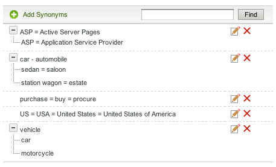

# Informazioni sui dizionari{#about-dictionaries}

È possibile utilizzare i dizionari per gestire una raccolta di dizionari e dei relativi sinonimi e ippoimi associati.

## Utilizzo dei dizionari {#concept_B8028B71EC8144669614C64578EDB034}

I sinonimi sono parole che hanno lo stesso significato o un significato simile, ad esempio pantaloni, jeans, pantaloni e pantaloni, o che comprano, acquistano, acquistano e ordinano.

Gli ippoimi sono sinonimi unidirezionali e forniscono una soluzione quando i sinonimi sono inappropriati. Ad esempio, il termine di ricerca principale di un sito di abbigliamento retail è &quot;pantaloni&quot;. Tuttavia, i jeans non vengono visualizzati nei risultati della ricerca. In tal caso, è possibile utilizzare un ipponimo per associare i jeans con i pantaloni, ma per consentire la ricerca di jeans solo per restituire i jeans. Utilizzare gli ipponimi per fornire una corrispondenza anche per prodotti fuori produzione o condizioni concorrenziali. Questa strategia assicura un impatto minimo sugli altri risultati di ricerca. Ad esempio, se il prodotto &quot;S2000&quot; viene interrotto e il prodotto &quot;S3000&quot; è il suo successore, utilizzate un iponimo invece di un sinonimo per garantire che i risultati della ricerca per &quot;S3000&quot; non includano i risultati &quot;S2000&quot; randagi.

Sinonimi e ipponimi aiutano i clienti a trovare risultati di ricerca rilevanti quando immettono termini di corrispondenza non esatti che non esistono sulle pagine Web. Ad esempio, se la parola &quot;pantaloni&quot; viene utilizzata in tutto il sito Web, potete creare un sinonimo che unisca &quot;pantaloni&quot; e &quot;pantaloni&quot;. A sua volta, quando i clienti cercano &quot;pantaloni&quot;, vengono restituiti i risultati di ricerca relativi ai pantaloni.

I sinonimi e i ippoimi sono raggruppati come Dizionari di dominio. Si tratta di dizionari speciali creati per un tema o uno scopo specifico.

Nella pagina Menu dizionario sono elencati tutti i dizionari di dominio attualmente definiti dall&#39;account. Da questa pagina principale è possibile rinominare, modificare, eliminare o abilitare e disabilitare i dizionari di dominio.

## Informazioni sul sinonimo e la notazione dell&#39;iponimo {#section_B459CCB850974F4FB16A14E489BBBEC0}

L&#39;immagine seguente è un esempio di un gruppo di termini con relazioni sinonimo e iponimo.

Sei relazioni sinonimi principali sono esplicitamente definite. Ogni termine è separato da segni uguali (=).

* &quot;Auto&quot; è un sinonimo di automobile.
* &quot;Sedan&quot; è un sinonimo di salone.
* &quot;Station wagon&quot; è un sinonimo di proprietà.
* &quot;ASP&quot; è un sinonimo di Active Server Pages e Application Service Provider.
* &quot;Purchase&quot;, &quot;buy&quot; e &quot;procure&quot; sono sinonimi l&#39;uno dell&#39;altro.
* &quot;US&quot;, &quot;USA&quot; e &quot;Stati Uniti d&#39;America&quot; sono sinonimi l&#39;uno dell&#39;altro.

Le righe contenenti una sola parola sono sinonimi semplici. Le righe con alberi espandibili formano relazioni di ippoimo. Nell&#39;esempio, il secondo albero definisce la berlina, il salone, il vagone della stazione, e la tenuta come ipponimi di auto e automobile. Al contrario, auto e automobili sono ipernimi del resto dei termini nell&#39;albero.

Il terzo albero definisce auto e moto come ipponimi di veicolo.

È possibile includere più acronimi e/o espansioni di più parole in ciascun sinonimo, come illustrato nel sinonimo &quot;US&quot; di cui sopra. Quando una parola o un acronimo ha diversi significati, create un sinonimo per ogni significato, come nell&#39;esempio &quot;ASP&quot; precedente. Aggiungendo più sinonimi si garantisce che la ricerca di &quot;Application Service Provider&quot;, ad esempio, non restituisca i risultati di ricerca per &quot;Active Server Pages&quot;.

Gli ippoimi non si espandono con altri ipomponimi. Gli ippoimi si espandono al massimo di un livello con i loro sinonimi. Ad esempio, una ricerca per &quot;veicolo&quot; restituisce i risultati per &quot;auto&quot; e &quot;automobile&quot;, ma non restituisce i risultati per &quot;berlina&quot; e &quot;carro della stazione&quot;.

## Ricerca di termini tra dizionari {#section_28E7F80CE68D4481BBF4F51EED237C67}

È possibile cercare iponimi e sinonimi in tutti i dizionari aggiunti. Questa funzione è utile per modificare o eliminare un termine specifico che potrebbe esistere in più dizionari. Ogni dizionario con risultati corrispondenti viene visualizzato con i relativi set di parole corrispondenti. Se la query restituisce più di 1000 set, o alberi, vengono presentati solo i primi 1000.

Consultate [Ricerca nei dizionari](../c-about-linguistics-menu/c-about-dictionaries.md#task_8D2BACC6F9B4487FA82367CBEDEE306F).

Consultate [Modifica di un dizionario](../c-about-linguistics-menu/c-about-dictionaries.md#task_7B349B2D385048D7A06E754FAB75316A).

## Informazioni sulla configurazione di un dizionario come dizionario di origine {#section_B859E2E957674F558AC6F8D05A0ED190}

Stemming, che è la capacità di cercare alla radice di una parola che può avere più finali, può funzionare in una delle tre modalità: Dizionari di dominio, moduli Word alternativi predefiniti e Nessuno.

Consultate [Parole e lingua](../c-about-linguistics-menu/c-about-words-and-language.md#concept_CEB4B9576F3C4E2EB87B352EEC738D79).

Le informazioni seguenti presuppongono che l’account sia **[!UICONTROL Alternative Word Forms]** impostato su **[!UICONTROL Domain Dictionaries]**, in modo da poter configurare dizionari di dominio specifici come origine degli stemmi.

Puoi trasformare qualsiasi dizionario di dominio in un &quot;dizionario di origine&quot;. I suoi sinonimi e i suoi ipponici continuano ad espandersi come previsto, ma con effetti collaterali aggiuntivi. Con qualsiasi termine in comune trovato in un altro dizionario, o anche se stesso, unisce il suo gruppo di parole con quei sinonimi o ipponimi. Potete considerarlo come un altro livello di espansione delle parole.

Senza stemming, sinonimi e iponimi devono essere verbosi e completi, elencando ogni parola pertinente come membro.

Di seguito è riportato un esempio di sinonimi e di assenza di stemming:

* Sinonimi: jog = run
* Una query per &quot;jog&quot; restituisce documenti con le parole &quot;run&quot; e &quot;jog&quot;.
* Una query per l&#39;esecuzione restituisce gli stessi documenti di &quot;jog&quot;.
* Nel risultato della query non sono presenti pagine Web senza &quot;jog&quot; e &quot;run&quot;, ma con altri moduli di parole quali &quot;run&quot; e &quot;run&quot;.

In questo esempio, una parola di query non si espande a meno che non sia un membro di un sinonimo o di un ipponimo specifico.

Esempio di sinonimi e stemmi:

* Sinonimi: jog = run
* Sinonimo di voce da un dizionario stemming: run = run = run
* Una query per &quot;jog&quot; o &quot;run&quot; restituisce tutte le pagine Web con le parole &quot;run&quot;, &quot;run&quot;, &quot;run&quot; e &quot;jog&quot;.
* Una query per &quot;run&quot; e &quot;run&quot; restituisce gli stessi risultati, o simili.

In questo esempio, un sinonimo di dizionario stemming ha la capacità di unire il gruppo di parole equivalenti con qualsiasi altro sinonimo o ipponimo in qualsiasi altro dizionario che abbia almeno un termine in comune.

La designazione di troppi dizionari con troppe parole può avere delle ramificazioni nelle prestazioni. È necessario designare i dizionari di dominio come dizionari di origine sparentemente. La creazione di sequenze di parole può anche creare espansioni di parole impreviste durante il tempo di ricerca e complicare il processo di debug e di tracciamento delle espansioni di parole.

Consultate [Configurazione di un dizionario come dizionario](../c-about-linguistics-menu/c-about-dictionaries.md#task_541E8453A12F4A8E89CF6F595469F074)stemming.

## Adding a new dictionary {#task_F31AC6723E894C4F91D12AB2A4CEE9FB}

Puoi aggiungere un nuovo dizionario di sinonimi e iponimi per aiutare i clienti a trovare risultati di ricerca rilevanti. Questa funzione è particolarmente utile quando i clienti immettono termini di corrispondenza non esatti che potrebbero non esistere sulle pagine Web.

Vedere anche [Aggiunta di una nuova regola](../c-about-rules-menu/c-about-business-rules.md#task_BD3B31ED48BB4B1B8F1DCD3BFA2528E7)business.

**Per aggiungere un nuovo dizionario**

1. Scegliere **[!UICONTROL Linguistics]** > **[!UICONTROL Dictionaries]** dal menu del prodotto.
1. Sulla **[!UICONTROL Dictionary Menu]** pagina, fate clic su **[!UICONTROL Add New Dictionary]**.
1. Nella **[!UICONTROL Dictionary]** pagina, nel **[!UICONTROL Name]** campo, immettete il nome del nuovo dizionario.
1. Clic **[!UICONTROL Add Synonyms]**.
1. Nella finestra di **[!UICONTROL Add Terms]** dialogo, effettuate una delle seguenti operazioni:

   * Per aggiungere sinonimi, immettere due o più termini nel campo di testo principale, separando ogni parola o frase con un segno uguale (=). Ad esempio, pantaloni = pantaloni = pantaloni = pantaloni.
   * Per aggiungere degli ippoimi, immettete un termine di ipernym nel campo di testo principale. Fate clic **[!UICONTROL Add Hyponym]** e immettete un iponimo relativo all&#39;ipernimo immesso. Ad esempio, &quot;berlina&quot;, &quot;saloon&quot;, &quot;station wagon&quot; e &quot;estate&quot; potrebbero essere ipponimi di &quot;auto&quot; e &quot;automobile&quot; (entrambi ipernimi) come mostrato di seguito.

      

      Le voci dell&#39;ipponimo possono anche formare sinonimi come &quot;berlina&quot; e &quot;salone&quot;.

1. Clic **[!UICONTROL Save]**.
1. Esegui una delle operazioni seguenti:

   * Ripetete i passaggi da 4 a 6 per aggiungere altri sinonimi e iponimi.
   * Procedi al passaggio successivo.

1. Per visualizzare in anteprima i risultati delle modifiche, fate clic **[!UICONTROL regenerate your staged site index]** per ricreare l’indice del sito Web in fase di creazione.

   Consultate [Esecuzione di un indice completo di un sito Web attivo o in fase di esecuzione...](../c-about-index-menu/c-about-full-index.md#task_F7FE04D8A1654A7787FCCA31B45EB42D).

   Consultate [Esecuzione di un indice incrementale di un sito Web attivo o in fase di esecuzione...](../c-about-index-menu/c-about-incremental-index.md#task_9BFB6157F3884B2FAECB7E0E9CA318CB).
1. (Facoltativo) Scegliere **[!UICONTROL Linguistics]** > **[!UICONTROL Dictionaries]** dal menu del prodotto, quindi effettuare una delle seguenti operazioni:

   * Fate clic **[!UICONTROL History]** per annullare le modifiche apportate.

      Consultate [Utilizzo dell’opzione](../t-using-the-history-option.md#task_70DD3F87A67242BBBD2CB27156F43002)Cronologia.

   * Clic **[!UICONTROL Live]**.

      Consultate [Visualizzazione delle impostazioni](../c-about-staging.md#task_401A0EBDB5DB4D4CA933CBA7BECDC10F)dal vivo.

   * Clic **[!UICONTROL Push Live]**.

      Consultate [Invio live](../c-about-staging.md#task_44306783B4C0408AAA58B471DAF2D9A4)delle impostazioni dell’area di visualizzazione.

## Abilitazione o disabilitazione di un dizionario {#task_EC282EA0846942F6913918EA8218220B}

Le relazioni di ciascuna parola vengono generate al momento dell’indicizzazione del sito Web. Prima della successiva operazione di indicizzazione, è possibile attivare o disattivare qualsiasi dizionario aggiunto.

**Per attivare o disattivare un dizionario**

1. Scegliere **[!UICONTROL Linguistics]** > **[!UICONTROL Dictionaries]** dal menu del prodotto.
1. Nella **[!UICONTROL Dictionary Menu]** pagina, sotto la **[!UICONTROL Enabled]** colonna della tabella, effettuare una delle seguenti operazioni:

   * Selezionare la casella di un dizionario da attivare e con indicizzazione.
   * Deselezionare la casella di un dizionario che si desidera disattivare e che non è stato indicizzato.

1. Clic **[!UICONTROL Save Changes]**.
1. Per visualizzare in anteprima i risultati delle modifiche, fate clic **[!UICONTROL regenerate your staged site index]** per ricreare l’indice del sito Web in fase di creazione.

   Consultate [Esecuzione di un indice completo di un sito Web attivo o in fase di esecuzione...](../c-about-index-menu/c-about-full-index.md#task_F7FE04D8A1654A7787FCCA31B45EB42D).

   Consultate [Esecuzione di un indice incrementale di un sito Web attivo o in fase di esecuzione...](../c-about-index-menu/c-about-incremental-index.md#task_9BFB6157F3884B2FAECB7E0E9CA318CB).
1. (Facoltativo) Scegliere **[!UICONTROL Linguistics]** > **[!UICONTROL Dictionaries]** dal menu del prodotto, quindi effettuare una delle seguenti operazioni:

   * Fate clic **[!UICONTROL History]** per annullare le modifiche apportate.

      Consultate [Utilizzo dell’opzione](../t-using-the-history-option.md#task_70DD3F87A67242BBBD2CB27156F43002)Cronologia.

   * Clic **[!UICONTROL Live]**.

      Consultate [Visualizzazione delle impostazioni](../c-about-staging.md#task_401A0EBDB5DB4D4CA933CBA7BECDC10F)dal vivo.

   * Clic **[!UICONTROL Push Live]**.

      Consultate [Invio live](../c-about-staging.md#task_44306783B4C0408AAA58B471DAF2D9A4)delle impostazioni dell’area di visualizzazione.

## Modifica di un dizionario {#task_7B349B2D385048D7A06E754FAB75316A}

Potete modificare o eliminare i gruppi di sinonimi e iponimi che compongono un dizionario specifico.

<!-- 

t_editing_a_dictionary.xml

 -->

È inoltre possibile utilizzare **[!UICONTROL Find]** per individuare sinonimi e iponimi specifici che si desidera modificare o eliminare in tutti i dizionari.

**Per modificare un dizionario**

1. Scegliere **[!UICONTROL Linguistics]** > **[!UICONTROL Dictionaries]** dal menu del prodotto.
1. Esegui una delle operazioni seguenti:

   * Nella [!DNL Dictionary Menu] pagina, nella tabella, fare clic sul nome collegamento ipertestuale di un singolo dizionario di cui si desidera modificare o eliminare i termini.
   * Nella [!DNL Dictionary Menu] pagina, nel campo di **[!UICONTROL Find]** testo, digitare il termine che si desidera individuare tra tutti i dizionari, quindi fare clic su **[!UICONTROL Find]**.

      Nella [!DNL Find in Dictionaries] pagina, utilizzare gli elenchi a discesa associati per impostare le opzioni di perfezionamento desiderate.

      <table> 
      <thead> 
        <tr> 
        <th colname="col1" class="entry"> 
Opzione 
 </th> 
        <th colname="col2" class="entry"> 
Descrizione 
 </th> 
        </tr> 
      </thead>
      <tbody> 
        <tr> 
        <td colname="col1"> 
Trova 
 </td> 
        <td colname="col2"> 
Consente di inserire il termine che si desidera cercare in tutti i dizionari. 
 </td> 
        </tr> 
        <tr> 
        <td colname="col1"> 
Elenco a discesa Corrispondenza 
 </td> 
        <td colname="col2"> 
Consente di selezionare uno dei quattro tipi di corrispondenza seguenti: 
        <ul id="ul_D656F159677946938050115F610EEF4B"> 
        <li id="li_2D6B302E021A4CE7A47F028812633EDC">  Corrispondenza esatta  
La query deve avere una corrispondenza esatta con un iponimo o un sinonimo. 
 </li> 
        <li id="li_30AD5976E43041E98190F4757E821092">  Contiene testo  
La query richiede solo una corrispondenza di sottostringa; una corrispondenza all'interno di un ipponimo o sinonimo. 
 </li> 
        <li id="li_9BF911EFB54345BB82679BDE51DDF8AF">  Inizia con  
La corrispondenza della query viene eseguita solo rispetto all'inizio di ciascun ippogramma e sinonimo. 
 </li> 
        <li id="li_CB791C7F5B5A4496B329ED505E7D97BC">  Corrispondenza Word  
La query viene confrontata con ogni parola proveniente da un sinonimo o da un iponimo, ma la parola deve corrispondere esattamente. 
 </li> 
        </ul> 
 </td> 
        </tr> 
        <tr> 
        <td colname="col1"> 
Elenco a discesa Dizionario abilitato/Disattivato 
 </td> 
        <td colname="col2"> 
Consente di selezionare una delle seguenti opzioni: 
        <ul id="ul_EBBD3F3A2D854952A35CBDDBECB40958"> 
        <li id="li_7F5654C284BE485EAC9B000A663C6C60">  Dizionari attivati e disattivati  
Cercare il termine specificato nei dizionari abilitati e disabilitati. 
 </li> 
        <li id="li_4A83EECF38044287A923EC0AAF639079">  Solo dizionari attivati  
La ricerca dei dizionari abilitati è utile solo per il debug dell'indice corrente. 
 </li> 
        </ul> 
 
Consultate <a href="../c-about-linguistics-menu/c-about-dictionaries.md#task_EC282EA0846942F6913918EA8218220B" type="task" format="dita" scope="local"> Attivare o disattivare un dizionario </a>. 
 </td> 
        </tr> 
        <tr> 
        <td colname="col1"> 
Elenco a discesa Staged/Live 
 </td> 
        <td colname="col2"> 
Consente di selezionare una delle seguenti opzioni: 
        <ul id="ul_BD0733A30E6B470E942B21F499A4373B"> 
        <li id="li_F9A8C39C22EA4FBF86536F5924ED973C">  Dizionari In Fase/Live  
Cerca il termine specificato tra dizionari in fase e in diretta. Tuttavia, esegue la ricerca nella versione in fase del dizionario solo se esiste. Se la versione in fase non esiste, la ricerca viene eseguita nella versione dal vivo del dizionario. 
 </li> 
        <li id="li_DB0944DB18564269AA10676BDFDB0460">  Dizionari dal vivo  
Cercare il termine specificato solo nei dizionari live. 
 </li> 
        </ul> 
 </td> 
        </tr> 
      </tbody> 
      </table>

1. Nella tabella, effettuate una delle seguenti operazioni:

   * Fare clic  associato al termine che si desidera aggiornare. Nella finestra di **[!UICONTROL Edit Terms]** dialogo, modificare i termini desiderati. Al termine, fate clic **[!UICONTROL Save]**.

   * Fare clic  associato al termine che si desidera rimuovere. Nella finestra di **[!UICONTROL Delete Terms]** dialogo fare clic su **[!UICONTROL Delete]**. Assicurarsi di eliminare il termine corretto; non esiste alcuna finestra di dialogo di conferma dell&#39;eliminazione.

1. Per visualizzare in anteprima i risultati delle modifiche, fate clic **[!UICONTROL regenerate your staged site index]** per ricreare l’indice del sito Web in fase di creazione.

   Consultate [Esecuzione di un indice completo di un sito Web attivo o in fase di esecuzione...](../c-about-index-menu/c-about-full-index.md#task_F7FE04D8A1654A7787FCCA31B45EB42D).

   Consultate [Esecuzione di un indice incrementale di un sito Web attivo o in fase di esecuzione...](../c-about-index-menu/c-about-incremental-index.md#task_9BFB6157F3884B2FAECB7E0E9CA318CB).
1. (Facoltativo) Scegliere **[!UICONTROL Linguistics]** > **[!UICONTROL Dictionaries]** dal menu del prodotto, quindi effettuare una delle seguenti operazioni:

   * Fate clic **[!UICONTROL History]** per annullare le modifiche apportate.

      Consultate [Utilizzo dell’opzione](../t-using-the-history-option.md#task_70DD3F87A67242BBBD2CB27156F43002)Cronologia.

   * Clic **[!UICONTROL Live]**.

      Consultate [Visualizzazione delle impostazioni](../c-about-staging.md#task_401A0EBDB5DB4D4CA933CBA7BECDC10F)dal vivo.

   * Clic **[!UICONTROL Push Live]**.

      Consultate [Invio live](../c-about-staging.md#task_44306783B4C0408AAA58B471DAF2D9A4)delle impostazioni dell’area di visualizzazione.

## Ridenominazione di un dizionario {#task_7F1F372B337B4853BFA2A60AD267B092}

Potete cambiare il nome di un dizionario aggiunto.

<!-- 

t_renaming_a_dictionary.xml

 -->

Se impostate l’ **[!UICONTROL Alternate Word Forms]** opzione su **[!UICONTROL Domain Dictionaries]** in **[!UICONTROL Words & Language]**, **[!UICONTROL Configure]** viene utilizzata l’opzione invece di **[!UICONTROL Rename]**.

Consultate [Parole e lingua](../c-about-linguistics-menu/c-about-words-and-language.md#concept_CEB4B9576F3C4E2EB87B352EEC738D79).

**Per rinominare un dizionario**

1. Scegliere **[!UICONTROL Linguistics]** > **[!UICONTROL Dictionaries]** dal menu del prodotto.
1. Nella **[!UICONTROL Dictionary Menu]** pagina, sotto la **[!UICONTROL Actions]** colonna della tabella, effettuare una delle seguenti operazioni:

   * Fare clic **[!UICONTROL Rename]** per il dizionario associato di cui si desidera modificare il nome.

      Nella finestra di **[!UICONTROL Rename Dictionary]** dialogo. nel **[!UICONTROL Name]** campo, immettere il nuovo nome del dizionario.

      Clic **[!UICONTROL Rename File]**.

   * Fare clic **[!UICONTROL Configure]** per il dizionario associato di cui si desidera modificare il nome.

      Nella finestra di **[!UICONTROL Configure Dictionary]** dialogo. nel **[!UICONTROL Name]** campo, immettere il nuovo nome del dizionario.

      Clic **[!UICONTROL Save Configuration]**.

1. (Facoltativo) Effettuate una delle seguenti operazioni:

   * Fate clic **[!UICONTROL History]** per annullare le modifiche apportate.

      Consultate [Utilizzo dell’opzione](../t-using-the-history-option.md#task_70DD3F87A67242BBBD2CB27156F43002)Cronologia.

   * Clic **[!UICONTROL Live]**.

      Consultate [Visualizzazione delle impostazioni](../c-about-staging.md#task_401A0EBDB5DB4D4CA933CBA7BECDC10F)dal vivo.

   * Clic **[!UICONTROL Push Live]**.

      Consultate [Invio live](../c-about-staging.md#task_44306783B4C0408AAA58B471DAF2D9A4)delle impostazioni dell’area di visualizzazione.

## Configurazione di un dizionario come dizionario radice {#task_541E8453A12F4A8E89CF6F595469F074}

È possibile impostare un dizionario su una modalità di stemming avanzata per sfruttare le parole che si trovano nelle ricerche.

<!-- 

t_configuring_a_dictionary_as_a_stemming_dictionary.xml

 -->

Tale modalità restituisce pagine Web che corrispondono alle varianti di ciò che i clienti stanno cercando.

Vedere [Informazioni sui dizionari](../c-about-linguistics-menu/c-about-dictionaries.md#concept_B8028B71EC8144669614C64578EDB034).

Consultate [Parole e lingua](../c-about-linguistics-menu/c-about-words-and-language.md#concept_CEB4B9576F3C4E2EB87B352EEC738D79).

**Per configurare un dizionario come dizionario di origine**

1. Scegliere **[!UICONTROL Linguistics]** > **[!UICONTROL Words & Language]** dal menu del prodotto.
1. Nella [!DNL Words & Languages] pagina, nell’elenco a **[!UICONTROL Alternate Words Forms]** discesa, selezionare **[!UICONTROL Domain Dictionaries]**.

   Qualsiasi dizionario di dominio impostato come dizionario di origine (vedere il punto 7 di seguito) viene utilizzato come origine di moduli di parole alternative.

1. Clic **[!UICONTROL Save Changes]**.
1. Scegliere **[!UICONTROL Linguistics]** > **[!UICONTROL Dictionaries]** dal menu del prodotto.
1. Nella [!DNL Dictionaries Menu] pagina, nella **[!UICONTROL Actions]** colonna della tabella, fare clic **[!UICONTROL Configure]** per individuare un dizionario associato da impostare come dizionario di origine.
1. Nell&#39;elenco a **[!UICONTROL Configure Dictionary]** discesa della finestra di **[!UICONTROL Advanced Stemming Mode]** dialogo, selezionare **[!UICONTROL Yes]**.
1. Clic **[!UICONTROL Save Configuration]**.
1. Fate clic **[!UICONTROL regenerate your staged site index]** per ricreare l’indice del sito Web in fase di creazione.

   Consultate [Esecuzione di un indice completo di un sito Web attivo o in fase di esecuzione...](../c-about-index-menu/c-about-full-index.md#task_F7FE04D8A1654A7787FCCA31B45EB42D).

   Consultate [Esecuzione di un indice incrementale di un sito Web attivo o in fase di esecuzione...](../c-about-index-menu/c-about-incremental-index.md#task_9BFB6157F3884B2FAECB7E0E9CA318CB).
1. (Facoltativo) Scegliere **[!UICONTROL Linguistics]** > **[!UICONTROL Dictionaries]** dal menu del prodotto, quindi effettuare una delle seguenti operazioni:

   * Fate clic **[!UICONTROL History]** per annullare le modifiche apportate.

      Consultate [Utilizzo dell’opzione](../t-using-the-history-option.md#task_70DD3F87A67242BBBD2CB27156F43002)Cronologia.

   * Clic **[!UICONTROL Live]**.

      Consultate [Visualizzazione delle impostazioni](../c-about-staging.md#task_401A0EBDB5DB4D4CA933CBA7BECDC10F)dal vivo.

   * Clic **[!UICONTROL Push Live]**.

      Consultate [Invio live](../c-about-staging.md#task_44306783B4C0408AAA58B471DAF2D9A4)delle impostazioni dell’area di visualizzazione.

## Ricerca tra dizionari {#task_8D2BACC6F9B4487FA82367CBEDEE306F}

È possibile cercare iponimi e sinonimi in tutti i dizionari aggiunti alla ricerca nel sito/merchandising.

<!-- 

t_searching_across_dictionaries.xml

 -->

Questa funzione è utile per modificare o eliminare un termine specifico che potrebbe esistere in più dizionari. Ogni dizionario con risultati corrispondenti viene visualizzato con i relativi set di parole corrispondenti. Se la query restituisce più di 1000 set, o alberi, vengono presentati solo i primi 1000.

Consultate [Modifica di un dizionario](../c-about-linguistics-menu/c-about-dictionaries.md#task_7B349B2D385048D7A06E754FAB75316A).

**Per effettuare ricerche tra i dizionari**

1. Scegliere **[!UICONTROL Linguistics]** > **[!UICONTROL Dictionaries]** dal menu del prodotto.
1. Nella [!DNL Dictionary Menu] pagina, nel campo di **[!UICONTROL Find]** testo, digitare il termine che si desidera individuare tra tutti i dizionari, quindi fare clic su **[!UICONTROL Find]**.
1. Nella [!DNL Find in Dictionaries] pagina, utilizzare gli elenchi a discesa associati per impostare le opzioni di perfezionamento desiderate.

   Consultate [Modifica di un dizionario](../c-about-linguistics-menu/c-about-dictionaries.md#task_7B349B2D385048D7A06E754FAB75316A).
1. (Facoltativo) Utilizzate l&#39; **[!UICONTROL Show]** elenco a discesa per specificare il numero massimo di risultati da visualizzare per pagina.

## Eliminazione di un dizionario {#task_DBAAEE624BC14D2590444B0B7869ECCA}

È possibile eliminare dizionari che non sono più necessari o che non vengono più utilizzati.

<!-- 

t_deleting_a_dictionary.xml

 -->

Se eliminate un dizionario attivo, questo viene messo in sequenza per l’eliminazione. Se eliminate un dizionario che è in fase, questo viene eliminato immediatamente.

Assicurarsi di eliminare un dizionario che si sa più bisogno; non è disponibile alcuna funzione di cronologia per ripristinare l&#39;eliminazione.

**Per eliminare un dizionario**

1. Scegliere **[!UICONTROL Linguistics]** > **[!UICONTROL Dictionaries]** dal menu del prodotto.
1. Nella [!DNL Dictionary Menu] pagina, nella **[!UICONTROL Actions]** colonna della tabella, fare clic **[!UICONTROL Delete]** per il dizionario associato da rimuovere.
1. Nella finestra di **[!UICONTROL Delete Dictionary]** dialogo. click **[!UICONTROL Yes]** to confirm the deletion.
1. (Facoltativo) Se avete eliminato un dizionario attivo, effettuate una delle seguenti operazioni:

   * Clic **[!UICONTROL Live]**.

      Consultate [Visualizzazione delle impostazioni](../c-about-staging.md#task_401A0EBDB5DB4D4CA933CBA7BECDC10F)dal vivo.

   * Clic **[!UICONTROL Push Live]**.

      Consultate [Invio live](../c-about-staging.md#task_44306783B4C0408AAA58B471DAF2D9A4)delle impostazioni dell’area di visualizzazione.

