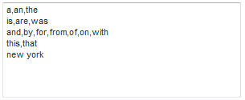

# Parole escluse{#about-excluded-words}

È possibile utilizzare Escludi parole per specificare frasi e parole comuni utilizzate di frequente, come &quot;a&quot; e &quot;the&quot;, che si desidera escludere dai risultati della ricerca.

## Utilizzo delle parole escluse {#concept_9DB67BD2F0DC43AC88741003D9F39812}

Vedere anche [Informazioni sulle ricerche](../c-about-settings-menu/c-about-searching-menu.md#concept_207105CF26B1448F8A3D223787C56AB8).

Senza parole escluse, le ricerche che contengono tali parole possono identificare numerosi risultati irrilevanti. Quando si escludono parole e frasi, i risultati della ricerca vengono omessi e corrispondono solo ai termini esclusi specificati. Se una query di ricerca contiene una parola esclusa, per trovare i documenti vengono utilizzate solo le parole non escluse.

Le parole di ricerca escluse non sono evidenziate nei risultati della ricerca. Tuttavia, il punteggio di rilevanza di ciascun risultato è influenzato dalle parole escluse. In altre parole, le parole escluse vengono ignorate durante la ricerca di documenti, ma vengono comunque utilizzate per classificare i documenti nella pagina dei risultati della ricerca. Prima che gli effetti delle impostazioni Parole escluse (o modifiche a tali impostazioni) siano disponibili per i clienti, accertatevi di rigenerare l’indice del sito.

Quando si immettono parole da escludere dai risultati della ricerca, si separano parole o frasi tra loro con virgole. È possibile immettere una o più parole escluse per riga. Di seguito è riportato un esempio di parole escluse su righe separate e divise per virgole.

Utilizzando l&#39;elenco di esempi di parole escluse sopra, se il cliente cerca &quot;gli stati uniti dell&#39;America&quot;, la parola &quot;il&quot; e la parola &quot;di&quot; sono escluse dalla ricerca. Al contrario, la ricerca trova tutte le pagine che contengono le parole &quot;unito&quot;, &quot;stati&quot; e &quot;america&quot;. Le pagine che contengono solo la parola &quot;di&quot; o &quot;di&quot; non vengono visualizzate.

Alcuni siti contengono frasi specifiche sulla maggior parte o su tutte le pagine. Ad esempio, un sito web sul turismo a New York City potrebbe contenere le parole New York nel titolo di ogni pagina. Prendete in considerazione l&#39;aggiunta di questa frase, e di altre simili, all&#39;elenco di esclusione:

Quando una frase viene esclusa, le singole parole che la compongono vengono ancora utilizzate come termini di ricerca. Solo quando un visitatore cerca le parole esatte, nell&#39;ordine esatto di una frase esclusa, è la frase esclusa dai risultati della ricerca. Utilizzando l&#39;esempio precedente, se un cliente ha cercato &quot;new york ballet&quot;, sono escluse la parola &quot;the&quot; e la frase &quot;new york&quot;; come risultato della ricerca vengono restituite solo le pagine contenenti la parola &quot;balletto&quot;. D&#39;altra parte, la ricerca di &quot;nuovi edifici&quot; o &quot;duca di lavoro&quot; trova ancora pagine che contengono rispettivamente la parola &quot;nuovo&quot; o &quot;york&quot;.

## Configurazione delle parole escluse {#task_60BF6BB7A66C48479D2BBB32C0F38CDE}

È possibile escludere dai risultati di ricerca le frasi e le parole più comuni utilizzate frequentemente.

È possibile immettere una o più parole per riga. Separate ogni parola con virgole come nell&#39;esempio seguente:

È possibile scegliere di visualizzare i risultati della ricerca quando tutte le parole incluse nella ricerca del cliente sono parole escluse. Ad esempio, se avete escluso la parola &quot;il&quot; e un cliente sceglie di cercare solo &quot;il&quot;, i risultati della ricerca mostrano tutte le pagine che contengono la parola &quot;il&quot;. Questo risultato è vero anche se la parola &quot;il&quot; è esclusa. Se non selezionate questa opzione, il cliente non riceve alcun risultato di ricerca. Questa impostazione non ha alcun effetto se la ricerca contiene almeno una parola non esclusa.

**Per configurare le parole escluse**

1. Scegliere **[!UICONTROL Linguistics]** > **[!UICONTROL Excluded Words]** dal menu del prodotto.
1. Nella pagina [!DNL Excluded Words], nel campo di testo **[!UICONTROL Words and Phrases]** immettere le parole che si desidera escludere dai risultati della ricerca.
1. (Facoltativo) Fare clic su **[!UICONTROL Show results when all words in the query are excluded words]**.

   Quando tutte le parole nella ricerca del cliente sono escluse, tutte le parole vengono utilizzate insieme per eseguire la ricerca.
1. Clic **[!UICONTROL Save Changes]**.
1. Per visualizzare in anteprima i risultati delle modifiche, fate clic su **[!UICONTROL regenerate your staged site index]** per ricreare l&#39;indice del sito Web in fase di creazione.

   Vedere [Esecuzione di un indice completo di un sito Web attivo o in fase di esecuzione...](../c-about-index-menu/c-about-full-index.md#task_F7FE04D8A1654A7787FCCA31B45EB42D).

   Vedere [Esecuzione di un indice incrementale di un sito Web live o in fase...](../c-about-index-menu/c-about-incremental-index.md#task_9BFB6157F3884B2FAECB7E0E9CA318CB).
1. (Facoltativo) Scegliere **[!UICONTROL Linguistics]** > **[!UICONTROL Excluded Words]** dal menu del prodotto, quindi effettuare una delle seguenti operazioni:

   * Fare clic su **[!UICONTROL History]** per annullare le modifiche apportate.

      Vedere [Utilizzo dell&#39;opzione Cronologia](../t-using-the-history-option.md#task_70DD3F87A67242BBBD2CB27156F43002).

   * Clic **[!UICONTROL Live]**.

      Vedere [Visualizzazione delle impostazioni dal vivo](../c-about-staging.md#task_401A0EBDB5DB4D4CA933CBA7BECDC10F).

   * Clic **[!UICONTROL Push Live]**.

      Vedere [Invio live delle impostazioni dell&#39;area di visualizzazione](../c-about-staging.md#task_44306783B4C0408AAA58B471DAF2D9A4).

