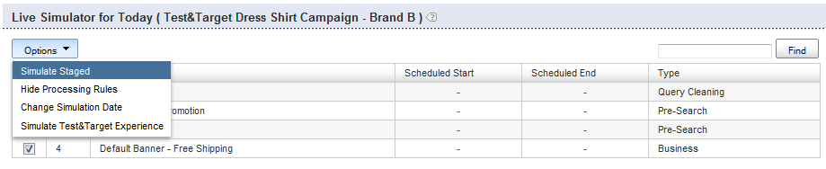

# Informazioni sulle regole aziendali{#about-business-rules}

Potete utilizzare le Regole aziendali per merchandising della ricerca.

## Utilizzo delle regole aziendali {#concept_2A93D76216754D3D8412CDEA00BD26BD}

Ad esempio, potete configurare quando vengono visualizzati i banner, quali risultati vengono visualizzati e in quale ordine. Potete anche configurare la posizione di un elemento nel facet e il modello da usare per una determinata ricerca. Le regole vengono eseguite nell&#39;ordine in cui sono state definite; più alto è il numero d&#39;ordine di una regola, più tardi verrà eseguito nel processo, trumping regole precedenti. È possibile trascinare le regole per modificarne l&#39;ordine, oppure riordinarle immettendo un nuovo numero nella casella di testo dell&#39;ordine delle regole.

Ogni regola business è composta da attivatori e azioni.

Il trigger definisce quando la regola viene eseguita. Ad esempio, quando il termine della query è &quot;mens&quot; o i risultati sono principalmente cappelli. L&#39;attivatore è costituito da più condizioni che devono essere tutte, o che devono essere vere per rendere l&#39;attivatore complessivo vero. È possibile specificare la precedenza modificando l&#39;operatore di attivazione.

L&#39;azione definisce cosa accade quando viene soddisfatta la condizione di attivazione. Ad esempio, se impostate il banner in modo che visualizzi o sposti un dato risultato in posizione 1, La tabella delle regole mostra informazioni di riepilogo sulla regola. Potete fare clic sul nome di una regola per aprirla e visualizzare ulteriori informazioni.

La tabella delle regole mostra un elenco di tutte le regole aziendali. Per impostazione predefinita, la tabella mostra le ultime dieci regole aggiunte, in ordine decrescente. È possibile fare clic sulle intestazioni delle colonne nella tabella per ordinare le regole in ordine crescente o decrescente.

Le regole aziendali possono avere uno dei tre stati seguenti: Approvato, sospeso o WIP (Work In Progress)

<table> 
 <thead> 
  <tr> 
   <th colname="col1" class="entry"> 
Stato della regola commerciale 
 </th> 
   <th colname="col2" class="entry"> 
Descrizione 
 </th> 
  </tr> 
 </thead>
 <tbody> 
  <tr> 
   <td colname="col1"> 
Approvato 
 </td> 
   <td colname="col2"> 
Le regole aziendali approvate vengono eseguite nell'ambiente live e nell'ambiente di gestione. È possibile approvare una regola business nel Generatore di regole avanzate. 
 </td> 
  </tr> 
  <tr> 
   <td colname="col1"> 
Sospeso 
 </td> 
   <td colname="col2"> 
Le regole di business sospese non vengono mai eseguite nell'ambiente in cui sono state create le fasi o in ambiente live. 
 </td> 
  </tr> 
  <tr> 
   <td colname="col1"> 
WIP 
 </td> 
   <td colname="col2"> 
WIP (Work In Progress) sono regole aziendali non approvate né sospese. In altre parole, potreste ancora lavorare su di loro o potreste desiderare testarli prima di approvarli. Le regole aziendali in uno stato di WIP vengono eseguite solo nell'ambiente in cui sono state create le fasi. 
 </td> 
  </tr> 
 </tbody> 
</table>

Approvate le regole di business e le inviate live in modo che vengano eseguite nel vostro ambiente live. Al momento è possibile inviare live solo le regole *all*. Tuttavia, puoi modificare lo stato di una regola per avere il controllo su quali regole vengono eseguite e non vengono eseguite nell&#39;ambiente live.

Per impostazione predefinita, le regole vengono eseguite ogni volta che vengono soddisfatti i trigger associati. È tuttavia possibile pianificare l&#39;esecuzione di una regola per un intervallo di date e ore specifico.

Inoltre, per impostazione predefinita, le regole vengono eseguite ogni volta che i relativi trigger associati vengono soddisfatti per tutti gli store. Se desiderate che la regola venga applicata solo a determinati store, potete utilizzare il pannello Store per selezionare uno o più store a cui è applicata la regola.

## Aggiunta di una nuova regola business {#task_BD3B31ED48BB4B1B8F1DCD3BFA2528E7}

Potete utilizzare [!DNL Visual Rule Builder] o [!DNL Advanced Rule Builder] per aggiungere regole business che adattino l&#39;esperienza di ricerca del cliente.

**Aggiunta di una nuova regola business**

Nella procedura seguente si presuppone che si stia utilizzando Visual Rule Builder.

1. Esegui una delle operazioni seguenti:

   * Scegliere **[!UICONTROL Rules]** > **[!UICONTROL Business Rules]** dal menu del prodotto. Nella pagina [!DNL Business Rules] fare clic su **[!UICONTROL Add New Rule]**.

   * Scegliere **[!UICONTROL Simulator]** dal menu del prodotto. Nella pagina **[!UICONTROL Simulator for Today]**, fare clic su **[!UICONTROL Add New Rule]** a destra del menu a discesa **[!UICONTROL Options]**.

      Se l&#39;opzione **[!UICONTROL Add New Rule]** non è visibile sulla pagina, scegliere **[!UICONTROL Options]** dal menu a discesa **[!UICONTROL Simulate Staged]**.

      

1. Nel campo di testo **[!UICONTROL Name]**, digitare il nuovo nome della regola business.

   Non fare ancora clic su **[!UICONTROL Save Rule]**.
1. (Facoltativo) Se gestite un gran numero di regole business, potete assegnare alle regole business dei tag etichette specifiche. Nel campo **[!UICONTROL Tags]** immettete una o più etichette di tag, utilizzate una virgola, una tabulazione o un Invio come delimitatore.

   Nella pagina [!DNL Business Rules], utilizzate la funzione **[!UICONTROL Filter by tag]** per filtrare le regole che corrispondono a una determinata etichetta. 1. Nella pagina [!DNL Business Rule Builder], impostate i trigger e le azioni da utilizzare.

   **Opzioni di attivazione**

   Triggers sono le condizioni che devono essere soddisfatte per l&#39;esecuzione di una regola business. Quando una regola business ha più attivatori, puoi configurare il modo in cui i trigger rispondono utilizzando uno dei tre metodi seguenti:

   * Una risposta in cui tutti i trigger devono essere veri (impostazione predefinita), come nell&#39;esempio seguente:

      `if a AND b AND c then ...`

   * Una risposta in cui uno degli attivatori deve essere vero, come nell&#39;esempio seguente:

      `if a OR b OR c then ...`

   * Risposta in cui è specificata una combinazione personalizzata di trigger. In altre parole, è possibile combinare singoli trigger o &quot;condizioni&quot; con operatori `AND` e operatori `OR`.

      È inoltre possibile modificare la precedenza della valutazione aggiungendo combinazioni di parentesi sinistra e destra come nell&#39;esempio seguente:

      `if (a OR b) AND c then ...`

      >[!NOTE]
      >
      >Se si combinano operatori `AND` con operatori `OR` in un set di regole aziendali personalizzate, assicurarsi di specificare le parentesi in modo appropriato per garantire che i trigger vengano valutati nell&#39;ordine corretto.

      Per impostazione predefinita, questa particolare funzione di personalizzazione di una combinazione di attivatori non è abilitata. Per attivare questa funzione, contattate il supporto tecnico.
   <table> 
      <thead> 
      <tr> 
      <th colname="col1" class="entry"> 
Attiva, opzione 
 </th> 
      <th colname="col2" class="entry"> 
Descrizione 
 </th> 
      </tr> 
    </thead>
    <tbody> 
      <tr> 
      <td colname="col1"> 
Parole chiave corrispondenti 
 </td> 
      <td colname="col2"> 
Trigger è true quando il termine di ricerca corrisponde alla parola chiave con distinzione tra maiuscole e minuscole specificata. L'attivatore è vero sia per la parola chiave che per tutti i sinonimi, come definito nel dizionario Linguistico. 
 </td> 
      </tr> 
      <tr> 
      <td colname="col1"> 
 Corrispondenza query 
 </td> 
      <td colname="col2"> 
 Trigger è true quando tutti i parametri di ricerca corrispondono. 
 </td> 
      </tr> 
      <tr> 
      <td colname="col1"> 
 Il gruppo di risultati è dominante 
 </td> 
      <td colname="col2"> 
 Trigger è true quando il gruppo di risultati definito dalla ricerca specificata domina il set di risultati. 
 
Per impostazione predefinita, la dominanza è impostata su 50%. Questa impostazione è una preferenza merchandising che potete impostare. 
 
 
        <!--See <xref href="t_Configuring_Merchandising_preferences.xml#task_7AC7B9F5D9F44E10AB5BC0B8CB31C37A" type="task" format="dita" scope="local">Configuring Merchandising preferences</xref>. --> 
 
L'intero gruppo deve essere presente all'interno del set di risultati affinché l'attivatore sia vero. Il gruppo di risultati è dinamico. Possono essere modificati dopo le operazioni di indice, a seconda dei risultati che corrispondono ai criteri di ricerca originali. 
 </td> 
      </tr> 
      <tr> 
      <td colname="col1"> 
Gruppo di risultati presente 
 </td> 
      <td colname="col2"> 
 Trigger è true quando nel set di risultati è presente il gruppo di risultati definito dalla ricerca specificata. Affinché il trigger possa essere soddisfatto, l'intero gruppo deve essere presente all'interno del set di risultati (i risultati possono essere presentati su qualsiasi pagina). Il gruppo di risultati è dinamico e può variare dopo le operazioni di indice a seconda dei risultati che corrispondono ai criteri di ricerca originali. 
 </td> 
      </tr> 
      <tr> 
      <td colname="col1"> 
 Risultati presenti 
 </td> 
      <td colname="col2"> 
 Trigger è true quando il singolo risultato si trova all'interno del set di risultati. Il risultato può trovarsi ovunque nel set di risultati, non deve necessariamente trovarsi nella pagina visualizzata dall’utente. 
 </td> 
      </tr> 
    </tbody> 
    </table>

   **Opzioni azione**

   Quando vengono soddisfatti i trigger di una regola business, vengono eseguite le azioni associate alla regola. Con il Generatore di regole visive è possibile creare le azioni seguenti, mentre con il Generatore di regole avanzate è possibile creare ulteriori tipi di azioni.

   Le azioni Rimuovi elemento facet, Rivela elemento facet, Mostra facet, Rimuovi facet, Sposta elemento facet nella tabella seguente richiedono un facet. L&#39;interfaccia per la scelta di un facet dipende dalla configurazione dell&#39;account. Ad esempio, un account normale utilizza un elenco a discesa per scegliere i facet. Tuttavia, se l’account ha dei facet con inclinazione, viene visualizzata una casella di testo con completamento automatico in cui è possibile immettere il nome di qualsiasi facet. Il completamento automatico suggerisce i facet in un elenco a discesa quando si digita il nome del facet. I suggerimenti includono facet attualmente definiti. Se il vostro account ha una mappa slot, suggerisce anche facet inclinati.

   <table> 
    <thead> 
      <tr> 
      <th colname="col1" class="entry"> 
Azioni, opzione 
 </th> 
      <th colname="col2" class="entry"> 
Descrizione 
 </th> 
      </tr> 
    </thead>
    <tbody> 
      <tr> 
      <td colname="col1"> 
Gruppo push 
 </td> 
      <td colname="col2"> 
 Invia a una posizione specifica il gruppo di risultati di ricerca definito dai criteri di ricerca specificati. 
 
L'invio di un gruppo di risultati di ricerca non comporta l'aggiunta implicita del gruppo. 
 </td> 
      </tr> 
      <tr> 
      <td colname="col1"> 
Aggiungi gruppo 
 </td> 
      <td colname="col2"> 
 Aggiungete il gruppo di risultati di ricerca come definito dai criteri di ricerca specificati. 
 </td> 
      </tr> 
      <tr> 
      <td colname="col1"> 
Rimuovi gruppo 
 </td> 
      <td colname="col2"> 
 Rimuovere il gruppo di risultati di ricerca definito dai criteri di ricerca specificati. 
 </td> 
      </tr> 
      <tr> 
      <td colname="col1"> 
Push Single 
 </td> 
      <td colname="col2"> 
 Invia il singolo risultato di ricerca alla posizione selezionata. 
 </td> 
      </tr> 
      <tr> 
      <td colname="col1"> 
Aggiungi singolo 
 </td> 
      <td colname="col2"> 
 Aggiunge un singolo risultato di ricerca alla posizione selezionata. 
 </td> 
      </tr> 
      <tr> 
      <td colname="col1"> 
Rimuovi singola 
 </td> 
      <td colname="col2"> 
 Rimuove un singolo risultato di ricerca dal set di risultati della ricerca. 
 </td> 
      </tr> 
      <tr> 
      <td colname="col1"> 
Rimuovi tutti i risultati 
 </td> 
      <td colname="col2"> 
Rimuove tutti i risultati dal set di risultati della ricerca. 
 
 
        <!-- Bug #3331637 The option is meant to be used in conjunction with other rule actions in order to create "canned landing pages" where we want to create a page's content solely by rule actions, and need to completely discard the "natural" results of the search. Given that the other options don't have any kind of "here's how/why you might use this", I don't see much point in breaking that precedent here.--> 
 </td> 
      </tr> 
      <tr> 
      <td colname="col1"> 
Selezionate un banner diverso 
 </td> 
      <td colname="col2"> 
 Modifica il banner nell’area del banner selezionata. 
 
Questa opzione è disponibile quando fate clic con il pulsante destro del mouse su un banner nell’area di visualizzazione della pagina Web. 
 </td> 
      </tr> 
      <tr> 
      <td colname="col1"> 
Aggiunta di comandi per banner 
 </td> 
      <td colname="col2"> 
Si applica solo  Adobe modelli Dynamic Media Classic. 
 
Consente di modificare i parametri predefiniti utilizzati nel modello per banner. 
 
Consultate la tabella delle opzioni in <a scope="local" href="../c-about-design-menu/c-about-banners.md#task_AD1E0C00A9E04B1FA819EB93288786B3" type="reference" format="dita"> Aggiunta di un banner tramite  Adobe Dynamic Media Classic </a>. 
 
Consultate anche <a href="../c-about-design-menu/c-about-banners.md#task_C3E782477FBF428ABEA220751781ACA9" type="task" format="dita" scope="local"> Modifica di un banner con  Adobe Dynamic Media Classic </a>. 
 </td> 
      </tr> 
      <tr> 
      <td colname="col1"> 
Rimuovi banner 
 </td> 
      <td colname="col2"> 
 Rimuove il banner dall'area del banner selezionata; nessun banner viene visualizzato a meno che un'altra regola che imposta un banner non sovrascriva questa regola. 
 
Questa opzione è disponibile quando fate clic con il pulsante destro del mouse su un banner nell’area di visualizzazione della pagina Web. 
 </td> 
      </tr> 
      <tr> 
      <td colname="col1"> 
Elemento Facet push 
 </td> 
      <td colname="col2"> 
 Sposta un elemento all’interno di un facet nella posizione selezionata. 
 </td> 
      </tr> 
      <tr> 
      <td colname="col1"> 
Rimuovi zona 
 </td> 
      <td colname="col2"> 
 Rimuove una zona dalla pagina dei risultati della ricerca. 
 
Consultate anche l’azione Rimuovi facet di seguito. 
 </td> 
      </tr> 
      <tr> 
      <td colname="col1"> 
Zona Di Rivela 
 </td> 
      <td colname="col2"> 
 Mostra una zona nella pagina dei risultati della ricerca. 
 
Vedi anche l’azione Mostra facet di seguito. 
 </td> 
      </tr> 
      <tr> 
      <td colname="col1"> 
Rimuovi elemento facet 
 </td> 
      <td colname="col2"> 
 Rimuove un elemento facet da un facet. 
 </td> 
      </tr> 
      <tr> 
      <td colname="col1"> 
Reveal Facet Item (Mostra elemento facet) 
 </td> 
      <td colname="col2"> 
 Mostra un elemento facet specifico. 
 </td> 
      </tr> 
      <tr> 
      <td colname="col1"> 
Facet di rivelazione 
 </td> 
      <td colname="col2"> 
 Rivela un facet specifico. Questa azione è preferibile rispetto all’azione Zona di visualizzazione. 
 </td> 
      </tr> 
      <tr> 
      <td colname="col1"> 
Rimuovi facet 
 </td> 
      <td colname="col2"> 
 Rimuove un facet specifico. Questa azione è preferibile rispetto all’azione Rimuovi zona. 
 </td> 
      </tr> 
    </tbody> 
    </table>

   A seconda del pannello del generatore di regole attivo (non piegato), potete anche effettuare le seguenti operazioni per impostare attivatori e azioni.

   * Quando il pannello **[!UICONTROL Triggers]** è aperto - Nell&#39;area del modello di presentazione della pagina Generatore regole aziendali, fare clic con il pulsante destro del mouse su un risultato di ricerca o un facet di ricerca, quindi fare clic su **[!UICONTROL Add "result present" trigger]**.

      Nel pannello Triggers fare clic sulla &quot;X&quot; a sinistra di un trigger per rimuoverlo dall&#39;elenco dei trigger.

   * Quando il pannello **[!UICONTROL Actions]** è aperto - Nell&#39;area del modello di presentazione della pagina Generatore di regole aziendali, fare clic con il pulsante destro del mouse su un risultato di ricerca. Fare clic su **[!UICONTROL Add Result]**, **[!UICONTROL Remove Result]**, **[!UICONTROL Push to bottom]** o **[!UICONTROL Push to #`<n>`]** (dove `<n>` è un numero).

1. (Facoltativo) In qualsiasi pannello Generatore di regole business ( [!DNL Triggers], [!DNL Actions] o [!DNL Schedule]), effettuate una delle seguenti operazioni:

   * Nell&#39;area del modello di presentazione dell&#39;area della pagina Generatore regole business, fare clic con il pulsante destro del mouse su un banner, quindi scegliere **[!UICONTROL Select different banner]**. Nella pagina **[!UICONTROL Pick Banner]**, fate clic su **[!UICONTROL Pick this banner]** sotto la miniatura del banner per aggiungerlo al modello di presentazione. Potete scegliere solo i banner che corrispondono alle dimensioni e all’area del banner originale nel modello di presentazione.

      L&#39;azione Aggiungi banner viene aggiunta al pannello [!DNL Actions].

   * Nell&#39;area del modello di presentazione della pagina [!DNL Business Rule Builder], fare clic con il pulsante destro del mouse su un banner modello Dynamic Media Classic di Adobe  cui si desidera modificare i parametri, quindi fare clic su **[!UICONTROL Add banner commands]**. Nella finestra di dialogo [!DNL Change Parameters], impostare le opzioni di parametro desiderate.

      Consultate la tabella delle opzioni in [Aggiunta di un banner tramite  Adobe Dynamic Media Classic](../c-about-design-menu/c-about-banners.md#task_AD1E0C00A9E04B1FA819EB93288786B3).

      Clic **[!UICONTROL Save]**.

      Le modifiche ai parametri vengono aggiunte al pannello [!DNL Actions].

      Consultate anche [Modifica di un banner con  Adobe Dynamic Media Classic](../c-about-design-menu/c-about-banners.md#task_C3E782477FBF428ABEA220751781ACA9).

   * Nell’area del modello di presentazione della pagina Generatore regole di business, fare clic con il pulsante destro del mouse sul banner che si desidera eliminare dalla pagina, quindi fare clic su **[!UICONTROL Remove banner]**. L’azione Rimuovi banner viene aggiunta al pannello Azioni.

1. (Facoltativo) Nel pannello **[!UICONTROL Schedule]**, effettuate una delle seguenti operazioni:

   * Fare clic su **[!UICONTROL Run Indefinitely]** per far eseguire la regola ogni volta che vengono soddisfatti i trigger associati. Questa è l&#39;opzione predefinita.
   * Fare clic su **[!UICONTROL Fixed Schedule]**, quindi specificare la data e l&#39;ora di inizio e la data e l&#39;ora di fine per l&#39;esecuzione della regola ogni volta che viene soddisfatto il trigger associato.

1. Clic **[!UICONTROL Save Rule]**.
1. (Facoltativo) Nella pagina [!DNL Business Rules], effettuare una delle seguenti operazioni:

   * Fare clic su **[!UICONTROL History]** per annullare le modifiche apportate.

      Vedere [Utilizzo dell&#39;opzione Cronologia](../t-using-the-history-option.md#task_70DD3F87A67242BBBD2CB27156F43002).

   * Clic **[!UICONTROL Live]**.

      Vedere [Visualizzazione delle impostazioni dal vivo](../c-about-staging.md#task_401A0EBDB5DB4D4CA933CBA7BECDC10F).

   * Clic **[!UICONTROL Push Live]**.

      Vedere [Invio live delle impostazioni dell&#39;area di visualizzazione](../c-about-staging.md#task_44306783B4C0408AAA58B471DAF2D9A4).

## Modifica di una regola business {#task_375CFA75D1D94D9E92A35DE1228E5087}

È possibile utilizzare Visual Rule Builder o Advanced Rule Builder per modificare le regole aziendali aggiunte.

**Per modificare una nuova regola business**

1. Scegliere **[!UICONTROL Rules]** > **[!UICONTROL Business Rules]** dal menu del prodotto.
1. Nella pagina [!DNL Business Rules], effettuare una delle seguenti operazioni:

   * Nella colonna [!DNL Name], fare clic sul nome di una regola business che si desidera modificare.

      La regola business viene aperta nell&#39;interfaccia predefinita specificata in **[!UICONTROL Settings]** > **[!UICONTROL My Profile]** > **[!UICONTROL My Preferences]**.

   * Nell&#39;elenco a discesa, accanto al nome di una regola business che si desidera modificare, fare clic su **[!UICONTROL Edit in advanced mode]** o **[!UICONTROL Edit in visual mode]**.

1. Nel campo di testo [!DNL Name], digitare il nuovo nome della regola business.

   Non fare ancora clic su **[!UICONTROL Save Rule]**. 1. Nella pagina [!DNL Business Rule Builder], impostate i trigger e le azioni da utilizzare.

   Vedere la tabella delle opzioni in [Aggiunta di una nuova regola business](../c-about-rules-menu/c-about-business-rules.md#task_BD3B31ED48BB4B1B8F1DCD3BFA2528E7).
1. (Facoltativo) In qualsiasi pannello **[!UICONTROL Business Rule Builder]** ( [!DNL Triggers], [!DNL Actions] o [!DNL Schedule], effettuare una delle seguenti operazioni:

   * Nell&#39;area del modello di presentazione della pagina [!DNL Business Rule Builder], fare clic con il pulsante destro del mouse su un banner, quindi scegliere **[!UICONTROL Select different banner]**. In [!DNL Pick Banner page], fate clic su **[!UICONTROL Pick this banner]** sotto la miniatura del banner per aggiungerlo al modello di presentazione. Potete scegliere solo i banner che corrispondono alle dimensioni e all’area del banner originale nel modello di presentazione.

      L&#39;azione Aggiungi banner viene aggiunta al pannello [!DNL Actions].

   * Nell&#39;area del modello di presentazione della pagina [!DNL Business Rule Builder], fare clic con il pulsante destro del mouse su un banner modello Dynamic Media Classic di Adobe  cui si desidera modificare i parametri, quindi fare clic su **[!UICONTROL Add banner commands]**. Nella finestra di dialogo [!DNL Change Parameters], impostare le opzioni di parametro desiderate.

      Consultate la tabella delle opzioni in [Aggiunta di un banner tramite  Adobe Dynamic Media Classic](../c-about-design-menu/c-about-banners.md#task_AD1E0C00A9E04B1FA819EB93288786B3).

      Clic **[!UICONTROL Save]**.

      Le modifiche ai parametri vengono aggiunte al pannello [!DNL Actions].

      Consultate anche [Modifica di un banner con  Adobe Dynamic Media Classic](../c-about-design-menu/c-about-banners.md#task_C3E782477FBF428ABEA220751781ACA9).

   * Nell&#39;area del modello di presentazione della pagina [!DNL Business Rule Builder], fare clic con il pulsante destro del mouse sul banner che si desidera eliminare dalla pagina, quindi fare clic su **[!UICONTROL Remove banner]**. L&#39;azione di rimozione del banner viene aggiunta al pannello [!DNL Actions].

1. (Facoltativo) Nel pannello [!DNL Schedule], effettuate una delle seguenti operazioni:

   * Fare clic su **[!UICONTROL Run Indefinitely]** per far eseguire la regola ogni volta che vengono soddisfatti i trigger associati. Questa è l&#39;opzione predefinita.
   * Fare clic su **[!UICONTROL Fixed Schedule]**, quindi specificare la data e l&#39;ora di inizio e la data e l&#39;ora di fine per l&#39;esecuzione della regola ogni volta che viene soddisfatto il trigger associato.

1. Clic **[!UICONTROL Save Rule]**.

   La pagina [!DNL Business Rule Builder] si chiude e si torna alla pagina **[!UICONTROL Business Rule]**. Le regole vengono visualizzate nella tabella. Fare clic sull&#39;intestazione di colonna **[!UICONTROL Modified]** per ordinare le regole per data di modifica. 1. (Facoltativo) Effettuate una delle seguenti operazioni:

   * Fare clic su **[!UICONTROL History]** per annullare le modifiche apportate.

      Vedere [Utilizzo dell&#39;opzione Cronologia](../t-using-the-history-option.md#task_70DD3F87A67242BBBD2CB27156F43002).

   * Clic **[!UICONTROL Live]**.

      Vedere [Visualizzazione delle impostazioni dal vivo](../c-about-staging.md#task_401A0EBDB5DB4D4CA933CBA7BECDC10F).

   * Clic **[!UICONTROL Push Live]**.

      Vedere [Invio live delle impostazioni dell&#39;area di visualizzazione](../c-about-staging.md#task_44306783B4C0408AAA58B471DAF2D9A4).

## Copia di una regola business {#task_89F1879C71A54EE9B7454439302C03EC}

È possibile copiare una regola aziendale esistente da utilizzare come base per una nuova regola business che si desidera creare.

**Per copiare una regola business**

1. Scegliere **[!UICONTROL Rules]** > **[!UICONTROL Business Rules]** dal menu del prodotto.
1. Nella pagina **[!UICONTROL Business Rules]**, nell&#39;elenco a discesa accanto al nome di una regola business che si desidera copiare, fare clic su **[!UICONTROL Copy rule]**.
1. Modificate la regola business copiata come di consueto.

   Vedere [Modifica di una regola business](../c-about-rules-menu/c-about-business-rules.md#task_375CFA75D1D94D9E92A35DE1228E5087).

## Approvazione delle regole aziendali {#task_BD569D18BF664272B8692294C162E2C1}

È possibile attivare regole business con stato WIP (Work In Progress) o sospeso.

**Per approvare le regole aziendali**

1. Scegliere **[!UICONTROL Rule]** > **[!UICONTROL Business Rules]** dal menu del prodotto.
1. Nella pagina [!DNL Business Rules], utilizzando l&#39;intestazione della colonna di stato nella colonna [!DNL Status] della tabella delle regole business, ordinate le regole che hanno uno stato **[!UICONTROL WIP]** o **[!UICONTROL suspended]**.

   Utilizzare l&#39;intestazione della colonna casella di controllo a sinistra della tabella per controllare tutte le regole visualizzate sulla pagina o controllare solo quelle che hanno uno stato **[!UICONTROL WIP]** o **[!UICONTROL suspended]**. 1. Nella barra dei menu accanto alla parte superiore della pagina, fare clic su **[!UICONTROL Approve]**.
1. Nella finestra di dialogo **[!UICONTROL Confirm Action]**, fare clic su **[!UICONTROL OK]**.
1. (Facoltativo) Effettuate una delle seguenti operazioni:

   * Fare clic su **[!UICONTROL History]** per annullare le modifiche apportate.

      Vedere [Utilizzo dell&#39;opzione Cronologia](../t-using-the-history-option.md#task_70DD3F87A67242BBBD2CB27156F43002).

   * Clic **[!UICONTROL Live]**.

      Vedere [Visualizzazione delle impostazioni dal vivo](../c-about-staging.md#task_401A0EBDB5DB4D4CA933CBA7BECDC10F).

   * Clic **[!UICONTROL Push Live]**.

      Vedere [Invio live delle impostazioni dell&#39;area di visualizzazione](../c-about-staging.md#task_44306783B4C0408AAA58B471DAF2D9A4).

## Sospensione delle regole aziendali {#task_364E1FFB905141C08E306C8F1794A20E}

È possibile sospendere le regole aziendali con stato WIP (Work In Progress) o approvate.

Quando si sospende una regola, nell&#39;interfaccia utente viene indicato che la si è temporaneamente resa inattiva e si sta rinviando qualsiasi lavoro su di essa per un altro momento. È tuttavia possibile modificare una regola sospesa.

**Sospensione delle regole aziendali**

1. Scegliere **[!UICONTROL Rule]** > **[!UICONTROL Business Rules]** dal menu del prodotto.
1. Nella pagina [!DNL Business Rules], utilizzando lo stato nella colonna Stato della tabella delle regole aziendali, nella colonna a sinistra della tabella verificare le regole con stato **[!UICONTROL WIP]** o **[!UICONTROL approved]**.
1. Nella barra dei menu accanto alla parte superiore della pagina, fare clic su **[!UICONTROL Suspend]**.
1. Nella finestra di dialogo **[!UICONTROL Confirm Action]**, fare clic su **[!UICONTROL OK]**.
1. (Facoltativo) Effettuate una delle seguenti operazioni:

   * Fare clic su **[!UICONTROL History]** per annullare le modifiche apportate.

      Vedere [Utilizzo dell&#39;opzione Cronologia](../t-using-the-history-option.md#task_70DD3F87A67242BBBD2CB27156F43002).

   * Clic **[!UICONTROL Live]**.

      Vedere [Visualizzazione delle impostazioni dal vivo](../c-about-staging.md#task_401A0EBDB5DB4D4CA933CBA7BECDC10F).

   * Clic **[!UICONTROL Push Live]**.

      Vedere [Invio live delle impostazioni dell&#39;area di visualizzazione](../c-about-staging.md#task_44306783B4C0408AAA58B471DAF2D9A4).

## Riprendi regole aziendali {#task_E67D678C765B436EA2A3D6ADD7A49ABA}

È possibile riprendere le regole aziendali per riattivare una regola sospesa. Dopo aver ripreso la regola business, il suo stato è impostato su WIP (Work In Progress).

**Per riprendere le regole business**

1. Scegliere **[!UICONTROL Rule]** > **[!UICONTROL Business Rules]** dal menu del prodotto.
1. Nella pagina [!DNL Business Rules], utilizzando lo stato nella colonna Stato della tabella delle regole aziendali, nella colonna a sinistra della tabella verificare le regole con stato **[!UICONTROL suspended]**.
1. Nella barra dei menu accanto alla parte superiore della pagina, fare clic su **[!UICONTROL Resume]**.
1. Nella finestra di dialogo [!DNL Confirm Action], fare clic su **[!UICONTROL OK]**.
1. (Facoltativo) Effettuate una delle seguenti operazioni:

   * Fare clic su **[!UICONTROL History]** per annullare le modifiche apportate.

      Vedere [Utilizzo dell&#39;opzione Cronologia](../t-using-the-history-option.md#task_70DD3F87A67242BBBD2CB27156F43002).

   * Clic **[!UICONTROL Live]**.

      Vedere [Visualizzazione delle impostazioni dal vivo](../c-about-staging.md#task_401A0EBDB5DB4D4CA933CBA7BECDC10F).

   * Clic **[!UICONTROL Push Live]**.

      Vedere [Invio live delle impostazioni dell&#39;area di visualizzazione](../c-about-staging.md#task_44306783B4C0408AAA58B471DAF2D9A4).

## Modifica dell&#39;ordine di esecuzione delle regole aziendali {#task_FE3B1C17307F49B49050C2EC5A063991}

Potete riordinare le regole business per modificare l&#39;ordine in cui vengono eseguite sui modelli di presentazione.

Le regole aziendali vengono eseguite nell&#39;ordine in cui sono state definite; più alto è il numero d&#39;ordine di una regola, più tardi verrà eseguito nel processo, trumping regole precedenti. Riordinare le regole immettendo un nuovo numero nella colonna Ordine della tabella nella pagina [!DNL Business Rules]. Potete anche utilizzare le regole di trascinamento per modificarne l&#39;ordine di esecuzione.

**Per modificare l&#39;ordine di esecuzione delle regole aziendali**

1. Scegliere **[!UICONTROL Rule]** > **[!UICONTROL Business Rules]** dal menu del prodotto.
1. Nella pagina [!DNL Business Rules], nella tabella, effettuare una delle seguenti operazioni:

   * Fate clic sull&#39;intestazione della colonna **[!UICONTROL Order]** per ordinare le regole in ordine crescente o decrescente.
   * Nella colonna **[!UICONTROL Order]**, nel campo di testo a sinistra del nome di una regola business, digitare il numero d&#39;ordine che si desidera eseguire.
   * Trascinare una riga di tabella nella posizione in cui si desidera eseguire la regola. Tutti i numeri di ordine vengono aggiornati in base al nuovo ordine in cui vengono eseguite le regole.

1. Clic **[!UICONTROL Save Changes]**.

   Le regole aziendali verranno ora eseguite nell&#39;ordine specificato. L&#39;eccezione è rappresentata dalla presenza di una regola business di reindirizzamento specificata. Se e quando la regola business di reindirizzamento viene attivata o colpita, l&#39;elaborazione della regola business si arresta per consentire il reindirizzamento.
1. (Facoltativo) Effettuate una delle seguenti operazioni:

   * Fare clic su **[!UICONTROL History]** per annullare le modifiche apportate.

      Vedere [Utilizzo dell&#39;opzione Cronologia](../t-using-the-history-option.md#task_70DD3F87A67242BBBD2CB27156F43002).

   * Clic **[!UICONTROL Live]**.

      Vedere [Visualizzazione delle impostazioni dal vivo](../c-about-staging.md#task_401A0EBDB5DB4D4CA933CBA7BECDC10F).

   * Clic **[!UICONTROL Push Live]**.

      Vedere [Invio live delle impostazioni dell&#39;area di visualizzazione](../c-about-staging.md#task_44306783B4C0408AAA58B471DAF2D9A4).

## Eliminazione delle regole business {#task_AE37B42412044541BCC6D46CF8793DFF}

È possibile eliminare le regole business il cui stato è WIP, sospeso o approvato, utilizzando il menu a discesa Azioni di massa.

**Per eliminare le regole business**

1. Scegliere **[!UICONTROL Rules]** > **[!UICONTROL Business Rules]** dal menu del prodotto.
1. Nella pagina [!DNL Business Rules], effettuare una delle seguenti operazioni:

   * Utilizzate l&#39;intestazione della colonna della casella di controllo per controllare tutte le regole attualmente visualizzate sulla pagina.
   * Selezionare solo le regole aziendali da eliminare, in base allo stato nella colonna Stato della tabella.

1. Nell&#39;elenco a discesa [!DNL Bulk Actions], fare clic su **[!UICONTROL Delete]**.
1. Nella finestra di dialogo [!DNL Confirm Action], fare clic su **[!UICONTROL OK]**.
1. (Facoltativo) Effettuate una delle seguenti operazioni:

   * Fare clic su **[!UICONTROL History]** per annullare le modifiche apportate.

      Vedere [Utilizzo dell&#39;opzione Cronologia](../t-using-the-history-option.md#task_70DD3F87A67242BBBD2CB27156F43002).

   * Clic **[!UICONTROL Live]**.

      Vedere [Visualizzazione delle impostazioni dal vivo](../c-about-staging.md#task_401A0EBDB5DB4D4CA933CBA7BECDC10F).

   * Clic **[!UICONTROL Push Live]**.

      Vedere [Invio live delle impostazioni dell&#39;area di visualizzazione](../c-about-staging.md#task_44306783B4C0408AAA58B471DAF2D9A4).
