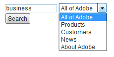
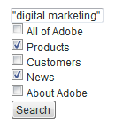
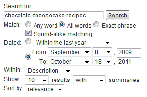

# Ricerca di moduli{#search-forms}

## Uso delle raccolte nei moduli di ricerca {#reference_5A079AEEEFB84457892EF0870D0605C3}

Le raccolte consentono ai clienti di effettuare ricerche in aree specifiche del sito Web. A seconda se implementate un elenco a discesa o un elenco di caselle di controllo, potete consentire ai clienti di cercare una o più raccolte.

Consultate anche [Informazioni sulle raccolte](../c-about-settings-menu/c-about-searching-menu.md#concept_62E42ACE53D54EEE9273433B86259127).

L&#39;esempio seguente mostra quattro nomi di raccolta diversi e le aree associate del sito Web che coprono:

<table> 
 <thead> 
  <tr> 
   <th colname="col1" class="entry"> <p>Nome raccolta </p> </th> 
   <th colname="col2" class="entry"> <p> </p> </th> 
  </tr> 
 </thead>
 <tbody> 
  <tr> 
   <td colname="col1"> <p>Variabile   </p> </td> 
   <td colname="col2"> <p> 
     <ul id="ul_7AE70789C0914EBFBCCC7695C6F53B9E"> 
      <li id="li_72525BAA34E2442D86152F2FD8CA83D5"> https://www.mycompany.com/products.htm </li> 
      <li id="li_5CA4152239124BDBB251E6C94B15D45B"> https://www.mycompany.com/publish/ </li> 
      <li id="li_6E266736B3494696A3AFD841C4AFEC57"> https://www.mycompany.com/search/ </li> 
     </ul> </p> </td> 
  </tr> 
  <tr> 
   <td colname="col1"> <p>Clienti </p> </td> 
   <td colname="col2"> <p>https://www.mycompany.com/customers/ </p> </td> 
  </tr> 
  <tr> 
   <td colname="col1"> <p>News </p> </td> 
   <td colname="col2"> <p>https://www.mycompany.com/news/ </p> </td> 
  </tr> 
  <tr> 
   <td colname="col1"> <p>Informazioni su Adobe </p> </td> 
   <td colname="col2"> <p>https://www.mycompany.com/company/ </p> </td> 
  </tr> 
 </tbody> 
</table>

L&#39;interfaccia del modulo di ricerca a discesa consente agli utenti di selezionare una raccolta ed è simile alla seguente:



Il modulo di ricerca a discesa viene generato con il seguente codice HTML:

```
<select name="sp_k"> 
<option value="">All of Adobe</option> 
<option value="Products">Products</option> 
<option value="Customers">Customers</option> 
<option value="News">News</option> 
<option value="About Adobe">About Adobe</option> 
</select>
```

In alternativa, è possibile utilizzare un gruppo di caselle di controllo nel modulo di ricerca in modo che i visitatori possano selezionare più raccolte:



Il modulo di ricerca casella di controllo viene generato con il seguente codice HTML:

```
<input type="checkbox" name="sp_k" value="">All of Adobe<br> 
<input type="checkbox" name="sp_k" value="Products">Products<br> 
<input type="checkbox" name="sp_k" value="Customers">Customers<br> 
<input type="checkbox" name="sp_k" value="News">News<br> 
<input type="checkbox" name="sp_k" value="About Adobe">About Adobe<br>
```

## Search results {#section_BBDD5B44E2B349BC88D937F44583D350}

Il tag del modello di ricerca `<search-input-collections>` genera la casella di riepilogo della raccolta HTML nei risultati della ricerca e seleziona automaticamente la raccolta specificata nella ricerca. Se invece desiderate generare le caselle di controllo, utilizzate il `<search-input>` tag invece del `<input>` tag come segue:

```
<search-input type="checkbox" name="sp_k" value="">All of Adobe<br> 
<search-input type="checkbox" name="sp_k" value="Products">Products<br> 
<search-input type="checkbox" name="sp_k" value="Customers">Customers<br> 
<search-input type="checkbox" name="sp_k" value="News">News<br> 
<search-input type="checkbox" name="sp_k" value="About Adobe">About Adobe<br>
```

Il `<search-input>` tag produce un `<input>` tag e include l&#39; `checked` attributo se la raccolta è stata specificata nella ricerca.

## Uso delle cornici con i moduli {#reference_82CDDDA1E37042E4849EBF7EA05407C5}

Potete configurare i set di frame in modo che funzionino con la ricerca e il merchandising del sito.

Per ulteriori informazioni sui frame HTML e l’elemento del set di frame HTML, consultate il seguente URL:

[https://www.w3schools.com/html/html_frames.asp](https://www.w3schools.com/html/html_frames.asp)

Se il sito utilizza frame, potete specificare una cornice di destinazione per i collegamenti dei risultati di ricerca. Il target predefinito è _self, che apre i collegamenti nel frame corrente o nella finestra del browser. Potete, invece, specificare target specifici per il sito o riservati ai browser:

* _top (riservato al browser) risultati aperti nella finestra del browser corrente e sostituiti tutti i fotogrammi correnti.
* _blank (i risultati riservati ai browser) vengono aperti in una nuova finestra del browser.
* _parent (i risultati riservati ai browser) vengono aperti nel frame principale del frame corrente.
* i risultati di frame2 (specifici per il sito) si aprono in un frame denominato &quot;frame2&quot;. Potete specificare il nome di qualsiasi fotogramma come valore (ad esempio, principale o contenuto).

Se il sito non utilizza frame, è probabile che non si desideri modificare il nome di destinazione predefinito.

Se create un modello di risultati di ricerca personalizzato per il sito Web, potete ignorare l’impostazione specificata utilizzando l’ `target` attributo del `<search-link>` tag .

La procedura per la configurazione dei set di frame è la seguente:

<table> 
 <thead> 
  <tr> 
   <th colname="col1" class="entry"> <p>Passaggio processo </p> </th> 
   <th colname="col02" class="entry"> <p>Descrizione processo </p> </th> 
   <th colname="col2" class="entry"> <p>Collegamento </p> </th> 
  </tr> 
 </thead>
 <tbody> 
  <tr> 
   <td colname="col1"> <p>1 </p> </td> 
   <td colname="col02"> <p>Aggiungere il modulo alla cornice desiderata nella pagina Web. </p> </td> 
   <td colname="col2"> <p> <a href="#section_BAA8A502BB2243F8B5FF9783CDF2BFFD" type="section" format="dita" scope="local"> Aggiunta del codice del modulo di ricerca a una cornice dell'utente in corso... </a> </p> </td> 
  </tr> 
  <tr> 
   <td colname="col1"> <p>2 </p> </td> 
   <td colname="col02"> <p>Impostate il frame di destinazione per la pagina dei risultati di ricerca. </p> </td> 
   <td colname="col2"> <p> <a scope="local" href="#section_532CACB90888467093D95EACB64FDFA1" type="section" format="dita"> Impostazione del frame di destinazione per la pagina dei risultati di ricerca </a> </p> </td> 
  </tr> 
  <tr> 
   <td colname="col1"> <p>3 </p> </td> 
   <td colname="col02"> <p>Impostate la destinazione per i collegamenti creati dalla pagina dei risultati della ricerca. </p> </td> 
   <td colname="col2"> <p> <a scope="local" href="#section_523248C5AC424D878321C21A23A5CD66" type="section" format="dita"> Impostazione della destinazione per i collegamenti provenienti dai risultati della ricerca... </a> </p> </td> 
  </tr> 
  <tr> 
   <td colname="col1"> <p>4 </p> </td> 
   <td colname="col02"> <p>Modificate le pagine delle cornici di navigazione per evitare che vengano indicizzate. </p> </td> 
   <td colname="col2"> <p> <a scope="local" href="#section_C62E5F0EE1294D5EBD97E123E54433FC" type="section" format="dita"> Modifica delle pagine delle cornici di navigazione per impedirne l’utilizzo... </a> </p> </td> 
  </tr> 
  <tr> 
   <td colname="col1"> <p>5 </p> </td> 
   <td colname="col02"> <p>Verificare il modulo di ricerca. </p> </td> 
   <td colname="col2"> <p> <a scope="local" href="#section_43D8D4A7BF524DC480DFE5442F6A2E3C" type="section" format="dita"> Verifica del modulo di ricerca </a> </p> </td> 
  </tr> 
 </tbody> 
</table>

## Aggiunta del codice del modulo di ricerca a una cornice della pagina Web {#section_BAA8A502BB2243F8B5FF9783CDF2BFFD}

1. Nel menu del prodotto, fate clic su **[!UICONTROL Design]** > **[!UICONTROL Auto-Complete]** > **[!UICONTROL Form Source]**.

   Il codice del modulo di ricerca HTML è simile al seguente:

   ```
   <!-- Adobe Target HTML for [your customer name] --> 
   <form method="get" action="https://search.atomz.com/search/"> 
   <input size=15 name="sp_q"><br> 
   <input type=submit value="Search"> 
   <input type=hidden name="sp_a" value="[your account number]"> 
   </form>
   ```

1. Nella [!DNL Standard Form Source] pagina, selezionare e copiare il codice del modulo di ricerca HTML che viene visualizzato nel campo di testo.
1. Incollate il codice del modulo di ricerca nella cornice desiderata nel set di frame.

   Nell&#39;esempio seguente, il codice del modulo di ricerca viene incollato nella cornice di navigazione, la cornice verticale stretta sul lato sinistro dello schermo.

   

## Impostazione del frame di destinazione per la pagina dei risultati di ricerca {#section_532CACB90888467093D95EACB64FDFA1}

Se il codice del modulo di ricerca è stato inserito nella cornice di navigazione verticale come sopra, è possibile visualizzare i risultati della ricerca nella cornice principale più grande. In questo esempio, il fotogramma principale viene chiamato &quot;corpo&quot; e lo si imposta come fotogramma di destinazione.


1. Per specificare il frame di destinazione per la pagina dei risultati, aggiungere una destinazione e un valore al modulo modificando la seguente riga nel codice del modulo di ricerca da quanto segue:

   `<form method="get" action="https://search.atomz.com/search/">`

   al seguente indirizzo:

   `<form target="body" method="get" action="https://search.atomz.com/search/">`

   Assicurarsi di inserire delle virgolette intorno al valore di destinazione del modulo.

Quando un cliente esegue una ricerca nel sito Web, i risultati della ricerca vengono visualizzati nella cornice &quot;body&quot; della pagina Web.

## Impostazione della destinazione per i collegamenti effettuati dalla pagina dei risultati della ricerca {#section_523248C5AC424D878321C21A23A5CD66}

Potete impostare la cornice di destinazione modificando direttamente il modello.

Se i risultati della ricerca vengono visualizzati nella cornice &quot;body&quot;, è probabile che anche i collegamenti si aprano nella cornice &quot;body&quot;. Poiché si tratta dello stesso fotogramma, il valore di destinazione `"_self"` che è l’impostazione predefinita, non è necessario apportare alcuna modifica.

Potete anche impostare il frame di destinazione per i collegamenti dei risultati. Di seguito sono riportati diversi esempi di operazioni che è possibile eseguire:

* Specificate fotogrammi diversi per i risultati della ricerca e i relativi collegamenti in modo che i risultati rimangano attivi nella propria cornice mentre ogni risultato su cui si fa clic si apre in una cornice separata.
* Specificate che i risultati della ricerca si aprano in una nuova finestra vuota, in modo che la vecchia finestra rimanga attiva con i contenuti originali, mantenendo anche i risultati della ricerca.

Il nome di destinazione può essere il nome di un fotogramma specificato nel codice HTML oppure può essere uno dei seguenti valori HTML predefiniti:

* `target="_blank"` Aprite i collegamenti in una nuova finestra vuota senza nome.

* `target="_self"` impostazione predefinita. Aprite i collegamenti nella stessa finestra in cui risiedono i risultati della ricerca. In questo caso, la finestra dei risultati della ricerca originale. Utilizzate questa opzione per ignorare una destinazione di base assegnata a livello globale.

* `target="_parent"` Apri i collegamenti nel set di frame principale della pagina di collegamento. Se il documento non ha un elemento padre, questo funziona come `"_self"` per impostazione predefinita.

* `target="_top"` Aprite i collegamenti nella finestra completa. Se il documento è già nella parte superiore, questo funziona come `"_self"` per impostazione predefinita. Utilizzate questa opzione per uscire da una nidificazione arbitraria dei fotogrammi profondi.

Ad esempio, per impostare il fotogramma di destinazione di `_blank` destinazione, potete modificare il modello nel modo seguente:

1. Scegliere **[!UICONTROL Design]** > **[!UICONTROL Templates]** dal menu del prodotto.

1. Nella [!DNL Staged Templates] pagina, nella tabella, fate clic sul nome del modello con la cornice di destinazione.
1. Individuate il `<search-link>` tag . Your default `<search-link>` tag should look similar to the following:

   `<search-link><search-title length=100></search-link>`

1. Aggiungete la destinazione del fotogramma al `<search-link>` tag . Nell&#39;esempio precedente, immettere `target="_blank"`. Accertatevi di includere il carattere di sottolineatura e le virgolette intorno al valore di destinazione.

   Il `<search-link>` tag viene ora visualizzato come segue:

   `<search-link target="_blank"><search-title length=100></search-link>`

Quando un visitatore sceglie un collegamento per i risultati della ricerca, la pagina collegata ora si apre in una nuova finestra vuota.

## Modifica delle pagine delle cornici di navigazione per evitare che vengano indicizzate {#section_C62E5F0EE1294D5EBD97E123E54433FC}

In genere, si desidera escludere le cornici di navigazione dall’indicizzazione con i risultati della ricerca. Per ottenere questa funzionalità, potete aggiungere `noindex` tag meta a tali pagine.

1. Aprite l’origine della pagina HTML per il frame di navigazione.
1. Aggiungete il seguente tag meta nella `<head>` sezione del codice HTML:

   `<meta name="robots" content="noindex">`

   Ad esempio:

   ```
   <html> 
   <head> 
   <title>This page is a frameset that I do not want indexed</title> 
   <meta http-equiv="Content-Type" content="text/html; charset=iso-8859-1"> 
   <meta name="robots" content="noindex"> 
   </head>
   ```

## Verifica del modulo di ricerca {#section_43D8D4A7BF524DC480DFE5442F6A2E3C}

1. Passare al sito Web e individuare un modulo.
1. Nel campo di ricerca, immettete alcuni termini di ricerca e fate clic **[!UICONTROL Search]**.

   È vero quanto segue:

   * La pagina dei risultati della ricerca viene visualizzata nel frame di destinazione specificato.
   * I collegamenti dai risultati della ricerca si trovano nella cornice di destinazione specificata.
   * I risultati della cornice di navigazione non vengono visualizzati.
   In caso di problemi con i frame dopo aver verificato il modulo di ricerca, contattate l&#39;Assistenza clienti.

## Modulo di ricerca avanzato di esempio {#reference_82E1051918744EBA88A01E9E6AE42C4A}

È possibile modificare il codice modulo avanzato in base alle esigenze di progettazione e di contenuto, oppure aggiungere o rimuovere ulteriori parametri di ricerca.

La home page è un luogo ideale per inserire un modulo di ricerca avanzato, in quanto molti clienti si aspettano di trovare funzionalità di ricerca. Potete anche creare una pagina HTML che include il modulo di ricerca e altre informazioni utili, e quindi il collegamento a tale pagina all&#39;interno del sito Web.

Se si sta effettuando l&#39;indicizzazione di contenuto protetto, è possibile ottenere i risultati della ricerca da server Web di ricerca sicuri. Modificate l’URL nell’attributo dell’azione del modulo di ricerca in: action=&quot;https://search.atomz.com/search/&quot; per eseguire questa operazione.

>[!NOTE]
>
>Alcuni editor HTML non riescono a incollare il codice HTML da altre applicazioni. Se il codice HTML viene visualizzato sulla pagina Web come testo, copiate e incollate il codice di ricerca in un semplice editor di testo, come Blocco note in Windows o Testo semplice in Mac, quindi copiate e incollate di nuovo dal semplice editor di testo al vostro editor HTML.

I parametri di ricerca vengono utilizzati nel codice modulo di ricerca avanzato per creare pulsanti di scelta, caselle di controllo e caselle di riepilogo che i clienti possono utilizzare per personalizzare le singole ricerche. I clienti possono specificare il numero di risultati di ricerca visualizzati, ad esempio, o un intervallo di date, oppure se i riepiloghi vengono visualizzati con i risultati di ricerca attraverso le opzioni visualizzate nei moduli di ricerca avanzati.

Utilizzando il seguente modulo di ricerca avanzato di esempio, il resto di questo argomento mostra come ogni opzione del modulo viene creata utilizzando i parametri di ricerca.



È possibile visualizzare l&#39;intero codice HTML del modulo di ricerca avanzata dell&#39;esempio precedente.

Vedere Codice [HTML per moduli di ricerca](#reference_9AAD4A46B68D4D48865508982CB86DB9)avanzati.

Consultate [Configurazione della funzione di completamento automatico del CSS](../c-about-auto-complete.md#task_EECE35DEB6C94F4A8A5B42B4DED76D96).

Vedere [Copia del codice HTML del modulo di ricerca in corso...](../c-about-auto-complete.md#task_A3A01EA800F24C0AA33902387E0362C7).

<table> 
 <thead> 
  <tr> 
   <th colname="col2" class="entry"> <p>Posizione nel modulo </p> </th> 
   <th colname="col1" class="entry"> <p>Parametro </p> </th> 
   <th colname="col3" class="entry"> <p>Codice HTML </p> </th> 
   <th colname="col4" class="entry"> <p>Descrizione </p> </th> 
  </tr> 
 </thead>
 <tbody> 
  <tr> 
   <td colname="col2"> <p>Abilitare le opzioni avanzate del modulo di ricerca (campo nascosto) </p> </td> 
   <td colname="col1"> <p> <span class="codeph"> sp_advanced </span> </p> </td> 
   <td colname="col3"> <p> <span class="syntax html codeph"> &lt;input type=hidden name="sp_advanced" value=1&gt; </span> </p> </td> 
   <td colname="col4"> <p>Abilitare o disabilitare le opzioni di ricerca avanzate. Ad esempio, è possibile inserire un modulo di ricerca standard nella home page con un collegamento a una seconda pagina contenente un modulo avanzato. In questo caso, è possibile inserire una copia del modulo standard all'interno di <span class="codeph"> &lt;search-if-not-advanced&gt;...&lt;/search-if-not-advanced&gt; </span> tag modello. </p> <p>Un cliente che esegue una ricerca dal modulo standard visualizza un modulo di ricerca standard quando vengono visualizzati i risultati della ricerca. Nella schermata del modulo di ricerca avanzata, è possibile includere il tag <span class="codeph"> &lt;input type=hidden name="sp_advanced" value=1&gt; </span> con le altre opzioni avanzate del modulo. </p> <p>È inoltre inclusa una copia del modulo di ricerca avanzata all'interno di &lt;search-if-advanced&gt;... &lt;/search-if-advanced&gt; tag modello. Un cliente che esegue una ricerca dal modulo di ricerca avanzato vede un modulo di ricerca avanzato quando vengono visualizzati i risultati della ricerca. </p> </td> 
  </tr> 
  <tr> 
   <td colname="col2"> <p> Corrispondenza con qualsiasi, tutti o frase </p> </td> 
   <td colname="col1"> <p> <span class="codeph"> sp_p </span> </p> <p> </p> </td> 
   <td colname="col3"> <p> <code class="syntax html"> &lt;!--&nbsp;Allow&nbsp;"any,"&nbsp;"all,"&nbsp;or&nbsp;"phrase"&nbsp;--&gt; 
      &lt;input&nbsp;type=radio&nbsp;name="sp_p"&nbsp;value="any"&gt;Any&nbsp;word 
      &lt;input&nbsp;type=radio&nbsp;name="sp_p"&nbsp;value="all"&nbsp;checked&gt;All&nbsp;words 
      &lt;input&nbsp;type=radio&nbsp;name="sp_p"&nbsp;value="phrase"&gt;Exact&nbsp;phrase </code> </p> </td> 
   <td colname="col4"> <p>Consentire al cliente di specificare che "qualsiasi parola," "tutte le parole" o "la frase esatta" deve essere presente affinché un documento corrisponda. Quando il parametro <span class="codeph"> sp_p </span> è specificato, i clienti non devono utilizzare "+", "-" o entrambi nella query di ricerca. </p> <p> Se il parametro <span class="codeph"> sp_p </span> viene omesso o se è impostato su "" o "any", i clienti possono comunque utilizzare gli identificatori "+" e "-". Se il parametro <span class="codeph"> sp_p </span> è impostato su "all" o "phrase", i valori specificati "+" e "-" vengono ignorati. </p> <p>Per ulteriori informazioni sull’utilizzo di "+" e "-" in una ricerca, </p> <p>Consultate <a href="../c-about-settings-menu/c-about-searching-menu.md#concept_207105CF26B1448F8A3D223787C56AB8" type="concept" format="dita" scope="local"> Le Ricerche </a>. </p> </td> 
  </tr> 
  <tr> 
   <td colname="col2"> <p> Corrispondenza audio simile </p> </td> 
   <td colname="col1"> <p> <span class="codeph"> sp_w </span> </p> <p>e </p> <p> <span class="codeph"> sp_w_control </span> </p> <p> </p> </td> 
   <td colname="col3"> <p> <code class="syntax html"> &lt;!--&nbsp;Checkbox&nbsp;enables&nbsp;sound-alike&nbsp;matching&nbsp;--&gt; 
      &lt;input&nbsp;type=hidden&nbsp;name="sp_w_control"&nbsp;value=1&gt; 
      &lt;input&nbsp;type=checkbox&nbsp;name="sp_w"&nbsp;value="alike"&gt;&nbsp;Sound-alike&nbsp;matching </code> </p> </td> 
   <td colname="col4"> <p>Consente ai clienti di abilitare o disabilitare la corrispondenza audio-simili. La corrispondenza sonora simile consente alle query di ricerca errate di corrispondere alle parole che "suonano allo stesso modo" nei documenti. </p> <p>Quando il <span class="codeph"> parametro </span> sp_w_control è impostato su 1 e il parametro <span class="codeph"> sp_w </span> è impostato su "similar", la casella di controllo generata è selezionata e per impostazione predefinita viene abilitata la corrispondenza simile al suono. </p> <p>Se il parametro <span class="codeph"> sp_w </span> è impostato su "", la casella di controllo non è selezionata. </p> <p>Se durante l'operazione di indicizzazione più recente non è stata abilitata la corrispondenza audio-simili, la corrispondenza audio-simile non è possibile e il parametro <span class="codeph"> sp_w </span> viene ignorato. Per abilitare la corrispondenza tra suoni simili, scegliere <span class="uicontrol"> Linguistica </span> &gt; <span class="uicontrol"> Parole e lingua </span> &gt; <span class="uicontrol"> Uniformità audio </span>dal menu prodotto. </p> <p>È inoltre possibile assegnare i parametri <span class="codeph"> sp_w </span> e <span class="codeph"> sp_w_control </span> nel modo seguente: </p> <p> <code class="syntax html"> &lt;!--&nbsp;Checkbox&nbsp;disables&nbsp;sound-alike&nbsp;matching&nbsp;--&gt; 
      &lt;input&nbsp;type=hidden&nbsp;name="sp_w_control"&nbsp;value=0&gt; 
      &lt;input&nbsp;type=checkbox&nbsp;name="sp_w"&nbsp;value="exact"&gt; 
      No&nbsp;sound-alike&nbsp;matching </code> </p> <p>In questo caso, quando il <span class="codeph"> parametro sp_w_control </span> è impostato su 0 e il parametro <span class="codeph"> sp_w </span> è impostato su "exact", la corrispondenza simile all'audio è disattivata per impostazione predefinita. Se il parametro <span class="codeph"> sp_w </span> è impostato su "", viene attivata la corrispondenza audio-simili. </p> </td> 
  </tr> 
  <tr> 
   <td colname="col2"> <p>Corrispondenza intervallo date </p> </td> 
   <td colname="col1"> <p> <span class="codeph"> sp_d </span> </p> <p> </p> </td> 
   <td colname="col3"> <p> <code class="syntax html"> &lt;!--Specifies&nbsp;type&nbsp;of&nbsp;date&nbsp;range&nbsp;searching&nbsp;to&nbsp;perform.--&gt; 
      &lt;input&nbsp;type=radio&nbsp;name="sp_d"&nbsp;value="custom"&nbsp;checked&gt; 
      &lt;input&nbsp;type=radio&nbsp;name="sp_d"&nbsp;value="specific"&gt; </code> </p> </td> 
   <td colname="col4"> <p>Il parametro <span class="codeph"> sp_d </span> specifica un intervallo di dati personalizzato che corrisponde a un'esecuzione o un intervallo di date specifico che deve essere eseguito. </p> <p>Nel modulo di ricerca avanzata predefinito, questa opzione viene presentata come un gruppo di pulsanti di scelta con un elenco a discesa di intervalli di date "personalizzati", come generato con un parametro <span class="codeph"> sp_date_range </span> . Include inoltre un gruppo di date di inizio e di fine "specifiche" generate con i parametri <span class="codeph"> sp_start_day </span>, <span class="codeph"> sp_start_month </span>, <span class="codeph"> sp_start_year </span>, sp_end_day <span class="codeph"> , </span>sp_end_month <span class="codeph"> , e sp_end_year </span><span class="codeph"> </span> anno. </p> <p>Un intervallo di date "personalizzato" è un intervallo di date con nome da cercare. Ad esempio, "In qualsiasi momento" "Oggi", "Nell'ultimo anno" e così via. </p> <p>Un intervallo di date "specifico" è costituito da una data di inizio e una data di fine. Ad esempio, da "8 settembre 2009 a 18 ottobre 2011". </p> </td> 
  </tr> 
  <tr> 
   <td colname="col2"> <p>Corrispondenza intervallo date: intervallo date personalizzato </p> </td> 
   <td colname="col1"> <p> <span class="codeph"> sp_date_range </span> </p> <p> </p> </td> 
   <td colname="col3"> <p> <code class="syntax html"> &lt;!--Selection&nbsp;list&nbsp;for&nbsp;custom&nbsp;date&nbsp;range.--&gt; 
      &lt;select&nbsp;name="sp_date_range"&nbsp;size=1&gt; 
      &lt;option&nbsp;value=-1&nbsp;selected&gt;Anytime&lt;/option&gt; 
      &lt;option&nbsp;value=7&gt;Within&nbsp;the&nbsp;last&nbsp;week&lt;/option&gt; 
      &lt;option&nbsp;value=14&gt;Within&nbsp;the&nbsp;last&nbsp;2&nbsp;weeks&lt;/option&gt; 
      &lt;option&nbsp;value=30&gt;Within&nbsp;the&nbsp;last&nbsp;30&nbsp;days&lt;/option&gt; 
      &lt;option&nbsp;value=60&gt;Within&nbsp;the&nbsp;last&nbsp;60&nbsp;days&lt;/option&gt; 
      &lt;option&nbsp;value=90&gt;Within&nbsp;the&nbsp;last&nbsp;90&nbsp;days&lt;/option&gt; 
      &lt;option&nbsp;value=180&gt;Within&nbsp;the&nbsp;last&nbsp;180&nbsp;days&lt;/option&gt; 
      &lt;option&nbsp;value=365&gt;Within&nbsp;the&nbsp;last&nbsp;year&lt;/option&gt; 
      &lt;option&nbsp;value=730&gt;Within&nbsp;the&nbsp;last&nbsp;two&nbsp;years&lt;/option&gt; 
      &lt;/select&gt; </code> </p> </td> 
   <td colname="col4"> <p>Il parametro <span class="codeph"> sp_date_range </span> viene utilizzato per creare un intervallo di date "personalizzato". Ad esempio, "In qualsiasi momento" "Oggi", "Nell'ultimo anno" e così via. </p> <p>Valori maggiori o uguali a zero specificano il numero di giorni in cui eseguire la ricerca prima di oggi. Ad esempio, un valore pari a 0 specifica "Today", un valore pari a "1" specifica "Today and YIeri", un valore pari a "30" specifica "Within the Last 30 Days," e così via. Valori inferiori a zero specificano un intervallo personalizzato come segue: </p> <p> 
     <ul id="ul_E65DDE33883F441F9730F315E485AD98"> 
      <li id="li_83E9466AB9D7438A8544001F6B007186"> <p>-1 = "In qualsiasi momento", come se non si specificasse alcun intervallo di date. </p> </li> 
      <li id="li_38AB8D97179A47F9B860A96EA09119BB"> <p>-2 = "Questa settimana", che esegue la ricerca da domenica a sabato della settimana corrente. </p> </li> 
      <li id="li_F4C3A8658428418A8A06FBAAB4733C68"> <p>-3 = "Ultima settimana", che esegue la ricerca da domenica a sabato della settimana precedente la settimana corrente. </p> </li> 
      <li id="li_DF2D0B043A4E4DE9BE8D82E69A76E793"> <p>-4 = "Questo mese", che esegue la ricerca delle date entro il mese corrente. </p> </li> 
      <li id="li_76BC4C2CED574E2A81448158828BFF1B"> <p>-5 = "Last month", che esegue la ricerca nelle date entro il mese precedente quello corrente. </p> </li> 
      <li id="li_17FF849384FB46D58AF6FF1D3BC408C8"> <p>-6 = "Quest'anno", che esegue la ricerca delle date entro l'anno corrente. </p> </li> 
      <li id="li_E2B8B4DFF3914BBDB86D0EB77F52B305"> <p>-7 = "Last year", che esegue la ricerca delle date entro l'anno precedente l'anno corrente. </p> </li> 
     </ul> </p> </td> 
  </tr> 
  <tr> 
   <td colname="col2"> <p>Corrispondenza intervallo date: date di inizio </p> </td> 
   <td colname="col1"> <p> <span class="codeph"> sp_start_day, sp_start_month, sp_start_year </span> </p> <p> </p> </td> 
   <td colname="col3"> </td> 
   <td colname="col4"> <p>Questo triplo di valori numerici specifica la data di inizio di un intervallo di date specifico da cercare. Accertatevi di specificare tutti e tre i valori perché una data specificata parzialmente viene ignorata. </p> <p>È legale specificare solo la data di inizio, solo la data di fine o sia la data di inizio che la data di fine. Se viene specificata solo la data di inizio, la ricerca include documenti corrispondenti con data corrispondente o successiva alla data di inizio. Se viene specificata solo la data di fine, la ricerca include documenti corrispondenti alla data di fine o prima di essa. Se sono specificate sia la data di inizio che la data di fine, la ricerca include documenti corrispondenti dalla data di inizio alla data di fine. </p> <p>Vengono cercate tutte le date relative all’ora media di Greenwich. </p> </td> 
  </tr> 
  <tr> 
   <td colname="col2"> <p> Corrispondenza intervallo date: date di fine </p> </td> 
   <td colname="col1"> <p> <span class="codeph"> sp_end_day, sp_end_month, sp_end_year </span> </p> <p> </p> </td> 
   <td colname="col3"> </td> 
   <td colname="col4"> <p>Questo triplo di valori numerici specifica la data di fine dell'intervallo di date specifico da cercare. Accertatevi di specificare tutti e tre i valori perché una data specificata parzialmente viene ignorata. </p> <p>È legale specificare solo la data di inizio, solo la data di fine o sia la data di inizio che la data di fine. Se viene specificata solo la data di inizio, la ricerca include documenti corrispondenti con data corrispondente o successiva alla data di inizio. Se viene specificata solo la data di fine, la ricerca include documenti corrispondenti alla data di fine o prima di essa. Se sono specificate sia la data di inizio che la data di fine, la ricerca include documenti corrispondenti dalla data di inizio alla data di fine. </p> <p>Vengono cercate tutte le date relative all’ora media di Greenwich. </p> </td> 
  </tr> 
  <tr> 
   <td colname="col2"> <p>All'interno del campo di ricerca </p> </td> 
   <td colname="col1"> <p> <span class="codeph"> sp_x </span> </p> </td> 
   <td colname="col3"> <p> <code class="syntax html"> &lt;!--&nbsp;List&nbsp;box&nbsp;selects&nbsp;the&nbsp;search&nbsp;field&nbsp;--&gt; 
      Within&nbsp;&lt;select&nbsp;name="sp_x"&nbsp;size=1&gt; 
      &lt;option&nbsp;value="any"&nbsp;selected&gt;Anywhere&lt;/option&gt; 
      &lt;option&nbsp;value="title"&gt;Title&lt;/option&gt; 
      &lt;option&nbsp;value="desc"&gt;Description&lt;/option&gt; 
      &lt;option&nbsp;value="keys"&gt;Keywords&lt;/option&gt; 
      &lt;option&nbsp;value="body"&gt;Body&lt;/option&gt; 
      &lt;option&nbsp;value="alt"&gt;Alternate&nbsp;text&lt;/option&gt; 
      &lt;option&nbsp;value="url"&gt;URL&lt;/option&gt; 
      &lt;option&nbsp;value="target"&gt;Target&lt;/option&gt; 
      &lt;option&nbsp;value="date"&gt;Date&lt;/option&gt;* 
      &lt;/select&gt; </code> </p> </td> 
   <td colname="col4"> <p>La casella di riepilogo <span class="codeph"> sp_x </span> consente ai clienti di specificare il campo in cui cercare le stringhe di query. </p> <p>I clienti possono scegliere tutti i campi, il titolo, la descrizione del documento, le parole chiave del documento, il corpo, il testo alternativo, l'URL del documento, la data o le parole chiave di destinazione. </p> <p>Quando si utilizza il parametro <span class="codeph"> sp_x </span> , i clienti non devono specificare "title:", "desc:", "keys:", "body:", "alt:", "url:" e "target:" nelle stringhe di query di ricerca. </p> <p>Se il parametro <span class="codeph"> sp_x </span> viene omesso, o se è impostato su "" o "any", i clienti possono comunque utilizzare le stringhe identificatore del campo. Se il parametro <span class="codeph"> sp_x </span> è impostato su un campo specifico, tutte le altre stringhe identificatore di campo vengono ignorate. </p> <p>Consultate <a href="../c-about-settings-menu/c-about-searching-menu.md#concept_207105CF26B1448F8A3D223787C56AB8" type="concept" format="dita" scope="local"> Le Ricerche </a>. </p> </td> 
  </tr> 
  <tr> 
   <td colname="col2"> <p>Mostra conteggio risultati </p> </td> 
   <td colname="col1"> <p> <span class="codeph"> sp_c </span> </p> </td> 
   <td colname="col3"> <p> <code class="syntax html"> &lt;!--&nbsp;List&nbsp;box&nbsp;selects&nbsp;number&nbsp;of&nbsp;results&nbsp;to&nbsp;show&nbsp;per&nbsp;page&nbsp;--&gt; 
      Show&nbsp;&lt;select&nbsp;name="sp_c"&nbsp;size=1&gt; 
      &lt;option&nbsp;value=5&gt;5&lt;/option&gt; 
      &lt;option&nbsp;value=10&nbsp;selected&gt;10&lt;/option&gt; 
      &lt;option&nbsp;value=25&gt;25&lt;/option&gt; 
      &lt;option&nbsp;value=50&gt;50&lt;/option&gt; 
      &lt;option&nbsp;value=100&gt;100&lt;/option&gt; 
      &lt;/select&gt;&nbsp;results </code> </p> </td> 
   <td colname="col4"> <p>Consente ai clienti di scegliere il numero di risultati di ricerca che vengono visualizzati su ogni pagina di risultati di ricerca. </p> <p>Nel modulo è possibile avere un numero di opzioni pari o inferiore a quello desiderato. Verificate che il valore "value=" corrisponda al valore visualizzato. </p> </td> 
  </tr> 
  <tr> 
   <td colname="col2"> <p>Mostrare o nascondere i riepiloghi </p> </td> 
   <td colname="col1"> <p> <span class="codeph"> sp_m </span> </p> </td> 
   <td colname="col3"> <p> <code class="syntax html"> &lt;!--&nbsp;Show&nbsp;or&nbsp;hide&nbsp;summaries&nbsp;in&nbsp;search&nbsp;results&nbsp;--&gt; 
      &lt;select&nbsp;name="sp_m"&nbsp;size=1&gt; 
      &lt;option&nbsp;value=1&nbsp;selected&gt;with&lt;/option&gt; 
      &lt;option&nbsp;value=0&gt;without&lt;/option&gt; 
      &lt;/select&gt;&nbsp;summaries&nbsp; </code> </p> </td> 
   <td colname="col4"> <p>Consente ai clienti di scegliere se visualizzare il testo di riepilogo per ogni corrispondenza. </p> <p>Impostate il valore su 1 se desiderate visualizzare i riepiloghi. Impostate il valore su 0 se desiderate nascondere i riepiloghi. È inoltre possibile utilizzare il parametro con un set di pulsanti di scelta, come nell'esempio seguente: </p> <p> <code class="syntax html"> &lt;!--&nbsp;Show&nbsp;or&nbsp;hide&nbsp;summaries&nbsp;in&nbsp;search&nbsp;results&nbsp;--&gt; 
      &lt;input&nbsp;type=radio&nbsp;name="sp_m"&nbsp;value=1&nbsp;selected&gt;Show&nbsp;summaries 
      &lt;input&nbsp;type=radio&nbsp;name="sp_m"&nbsp;value=0&gt;Hide&nbsp;summaries </code> </p> </td> 
  </tr> 
  <tr> 
   <td colname="col2"> <p>Ordina per risultati </p> </td> 
   <td colname="col1"> <p> <span class="codeph"> sp_s </span> </p> </td> 
   <td colname="col3"> <p> <code class="syntax html"> &lt;!--&nbsp;Sort&nbsp;results&nbsp;by&nbsp;relevance&nbsp;or&nbsp;by&nbsp;date&nbsp;--&gt; 
      Sort&nbsp;by&nbsp;&lt;select&nbsp;name="sp_s"&nbsp;size=1&gt; 
      &lt;option&nbsp;value=0&nbsp;selected&gt;relevance&lt;/option&gt; 
      &lt;option&nbsp;value=1&gt;date&lt;/option&gt; 
      &lt;/select&gt; </code> </p> </td> 
   <td colname="col4"> <p>Consente ai clienti di scegliere se i risultati sono elencati in ordine di rilevanza o data. </p> <p>Quando il valore è impostato su 1, i risultati vengono elencati dal documento modificato più di recente al documento modificato meno di recente. Quando il valore è impostato su 0, i risultati sono elencati tra quelli più rilevanti e quelli meno rilevanti. È inoltre possibile utilizzare questo parametro con i pulsanti di scelta come nell'esempio seguente: </p> <p> <code class="syntax html"> &lt;!--&nbsp;Sort&nbsp;results&nbsp;by&nbsp;relevance&nbsp;or&nbsp;by&nbsp;date&nbsp;--&gt; 
      &lt;input&nbsp;type=radio&nbsp;name="sp_s"&nbsp;value=0&nbsp;selected&gt;Sort&nbsp;by&nbsp;relevance 
      &lt;input&nbsp;type=radio&nbsp;name="sp_s"&nbsp;value=1&gt;Sort&nbsp;by&nbsp;date </code> </p> </td> 
  </tr> 
 </tbody> 
</table>

## Codice HTML per modulo di ricerca avanzato {#reference_9AAD4A46B68D4D48865508982CB86DB9}

Il codice del modulo HTML utilizzato per generare il modulo di ricerca avanzata che viene visualizzato nella parte superiore dell&#39;argomento Modulo di ricerca avanzata di esempio.

Vedere [Esempio di modulo](#reference_82E1051918744EBA88A01E9E6AE42C4A)di ricerca avanzato.

Se utilizzate questo codice, ricordate di sostituire il `sp_a` valore di `sp99999999` con il numero di account effettivo.

Per trovare il numero di account, scegliere **[!UICONTROL Settings]** > **[!UICONTROL Account Options]** > **[!UICONTROL Account Settings]** dal menu prodotto.

```
<form method="get" action="https://search.atomz.com/search/"> 
<table cellspacing=0 cellpadding=0 border=0> 
<tr><td colspan=4> 
<b>Search For:</b><br> 
<input size=35 name="sp_q"> 
<!-- The "Search" button --> 
<input type=submit value="Search"> 
<input type=hidden name="sp_a" value="sp99999999"> 
<input type=hidden name="sp_f" value="ISO-8859-1"> 
</td></tr> 
<input type=hidden name="sp_advanced" value=1> 
<!-- Allow "any," "all," or "phrase" --> 
<tr><td valign=top> 
<b>Match: </b> 
</td><td colspan=4> 
<input type=radio name="sp_p" value="any">Any word 
<input type=radio name="sp_p" value="all" checked>All words 
<input type=radio name="sp_p" value="phrase">Exact phrase<br> 
<!-- Checkbox enables sound-alike matching --> 
<input type=hidden name="sp_w_control" value=1> 
<input type=checkbox name="sp_w" value="alike" checked> 
Sound-alike matching 
</td></tr> 
<!-- Date range criteria --> 
<tr><td><b>Dated:</b></td><td colspan=4> 
<input type=radio name="sp_d" value="custom" checked> 
<select name="sp_date_range" size=1> 
<option value=-1 selected>Anytime</option> 
<option value=7>Within the last week</option> 
<option value=14>Within the last 2 weeks</option> 
<option value=30>Within the last 30 days</option> 
<option value=60>Within the last 60 days</option> 
<option value=90>Within the last 90 days</option> 
<option value=180>Within the last 180 days</option> 
<option value=365>Within the last year</option> 
<option value=730>Within the last two years</option> 
</select> 
</td></tr> 
<tr><td></td><td rowspan=2> 
<input type=radio name="sp_d" value=specific> 
</td><td align=right>From:</td><td> 
<select name="sp_start_month" size=1> 
<option value=0 selected></option> 
<option value=1>January</option> 
<option value=2>February</option> 
<option value=3>March</option> 
<option value=4>April</option> 
<option value=5>May</option> 
<option value=6>June</option> 
<option value=7>July</option> 
<option value=8>August</option> 
<option value=9>September</option> 
<option value=10>October</option> 
<option value=11>November</option> 
<option value=12>December</option> 
</select> 
<select name="sp_start_day" size=1> 
<option value=0 selected></option> 
<option value=1>1</option> 
<option value=2>2</option> 
<option value=3>3</option> 
<option value=4>4</option> 
<option value=5>5</option> 
<option value=6>6</option> 
<option value=7>7</option> 
<option value=8>8</option> 
<option value=9>9</option> 
<option value=10>10</option> 
<option value=11>11</option> 
<option value=12>12</option> 
<option value=13>13</option> 
<option value=14>14</option> 
<option value=15>15</option> 
<option value=16>16</option> 
<option value=17>17</option> 
<option value=18>18</option> 
<option value=19>19</option> 
<option value=20>20</option> 
<option value=21>21</option> 
<option value=22>22</option> 
<option value=23>23</option> 
<option value=24>24</option> 
<option value=25>25</option> 
<option value=26>26</option> 
<option value=27>27</option> 
<option value=28>28</option> 
<option value=29>29</option> 
<option value=30>30</option> 
<option value=31>31</option> 
</select> 
<!--comma-->, 
<input size=4 name="sp_start_year"> 
</td></tr> 
<tr><td></td> 
<td align=right>To:</td><td> 
<select name="sp_end_month" size=1> 
<option value=0 selected></option> 
<option value=1>January</option> 
<option value=2>February</option> 
<option value=3>March</option> 
<option value=4>April</option> 
<option value=5>May</option> 
<option value=6>June</option> 
<option value=7>July</option> 
<option value=8>August</option> 
<option value=9>September</option> 
<option value=10>October</option> 
<option value=11>November</option> 
<option value=12>December</option> 
</select> 
<select name="sp_end_day" size=1> 
<option value=0 selected></option> 
<option value=1>1</option> 
<option value=2>2</option> 
<option value=3>3</option> 
<option value=4>4</option> 
<option value=5>5</option> 
<option value=6>6</option> 
<option value=7>7</option> 
<option value=8>8</option> 
<option value=9>9</option> 
<option value=10>10</option> 
<option value=11>11</option> 
<option value=12>12</option> 
<option value=13>13</option> 
<option value=14>14</option> 
<option value=15>15</option> 
<option value=16>16</option> 
<option value=17>17</option> 
<option value=18>18</option> 
<option value=19>19</option> 
<option value=20>20</option> 
<option value=21>21</option> 
<option value=22>22</option> 
<option value=23>23</option> 
<option value=24>24</option> 
<option value=25>25</option> 
<option value=26>26</option> 
<option value=27>27</option> 
<option value=28>28</option> 
<option value=29>29</option> 
<option value=30>30</option> 
<option value=31>31</option> 
</select> 
<!--comma-->, 
<input size=4 name="sp_end_year"> 
</td></tr> 
<!-- List box selects the search field --> 
<tr><td valign=top> 
<b>Within: </b> 
</td><td colspan=4><select name="sp_x" size=1> 
<option value="any" selected>Anywhere</option> 
<option value="title">Title</option> 
<option value="desc">Description</option> 
<option value="keys">Keywords</option> 
<option value="body">Body</option> 
<option value="alt">Alternate text</option> 
<option value="url">URL</option> 
<option value="target">Target</option> 
</select> 
</td></tr> 
<!-- List box selects number of results to show per page --> 
<tr><td valign=top> 
<b>Show: </b> 
</td><td colspan=4><select name="sp_c" size=1> 
<option value=5>5</option> 
<option value=10 selected>10</option> 
<option value=25>25</option> 
<option value=50>50</option> 
<option value=100>100</option> 
</select> results  
<!-- Show or hide summaries in search results --> 
<select name="sp_m" size=1> 
<option value=1 selected>with</option> 
<option value=0>without</option> 
</select> summaries<br> 
</td></tr> 
<!-- Sort results by relevance or by date --> 
<tr><td valign=top> 
<b>Sort by: </b> 
</td><td colspan=4><select name="sp_s" size=1> 
<option value=0 selected>relevance</option> 
<option value=1>date</option> 
</select> 
</td></tr> 
</table> 
</form>
```

## Codice modello di modulo di ricerca avanzata {#reference_D762C22E754E462DBEECD88D2C3FA579}

È possibile aggiungere al modello il codice HTML del modulo di ricerca avanzata in modo che la scelta predefinita per qualsiasi parametro sia la stessa della ricerca precedente.

In altre parole, se un cliente fa clic sul **[!UICONTROL Exact phrase]** pulsante di scelta, è possibile assicurarsi che il pulsante di scelta sia selezionato per impostazione predefinita quando vengono visualizzati i risultati della ricerca.

Questa funzionalità viene realizzata rimuovendo tutti gli identificatori &quot;selezionati&quot; o &quot;selezionati&quot; dai tag HTML standard, quindi sostituendo i seguenti tag HTML:

* `<input>`
* `<select>`
* `<option>`
* `</option>`
* `</select>`

con i seguenti tag di modello corrispondenti:

* `<search-input>`
* `<search-select>`
* `<search-option>`
* `</search-option>`
* `</search-select>`

A questo scopo, usate il seguente codice come `<form>` tag nel modello di ricerca.

```
<!-- Adobe Target results section.--> 
 
<!-- Show heading and logo graphic. --> 
<SEARCH-IF-RESULTS> 
<b>SEARCH RESULTS <SEARCH-LOWER> - <SEARCH-UPPER></b> 
of <SEARCH-TOTAL> total results for <b><SEARCH-QUERY></b><br> 
</SEARCH-IF-RESULTS> 
<SEARCH-IF-NOT-RESULTS> 
<b>SEARCH RESULTS</b> for <b><SEARCH-QUERY></b><br> 
</SEARCH-IF-NOT-RESULTS> 
<SEARCH-LOGO><br> 
 
<!-- Display Results. --> 
<SEARCH-RESULTS LENGTH=160> 
<p><b><SEARCH-LINK><SEARCH-TITLE LENGTH=160></SEARCH-LINK></b><br> 
<SEARCH-IF-SHOW-SUMMARIES> 
<SEARCH-IF-CONTEXT LENGTH=240><SEARCH-CONTEXT><br></SEARCH-IF-CONTEXT> 
<font size="-1"><SEARCH-URL LENGTH=60></font><br> 
</SEARCH-IF-SHOW-SUMMARIES> 
</SEARCH-RESULTS> 
 
<!-- If no results, show a message. --> 
<SEARCH-IF-NOT-RESULTS><p> 
Sorry, no matches were found containing <b><SEARCH-QUERY>.</b> 
</SEARCH-IF-NOT-RESULTS> 
<!-- Show By Relevance, By Date links, Show/Hide Summaries links. --> 
<SEARCH-IF-RESULTS><p> 
<SEARCH-IF-SORT-BY-DATE> 
<b><SEARCH-SORT-BY-SCORE COUNT=10>Sort By Relevance</SEARCH-SORT-BY-SCORE></b> 
</SEARCH-IF-SORT-BY-DATE> 
<SEARCH-IF-SORT-BY-SCORE> 
<b><SEARCH-SORT-BY-DATE COUNT=10>Sort By Date</SEARCH-SORT-BY-DATE></b> 
</SEARCH-IF-SORT-BY-SCORE> 
| <b> 
<SEARCH-IF-SHOW-SUMMARIES> 
<SEARCH-HIDE-SUMMARIES COUNT=20>Hide Summaries</SEARCH-HIDE-SUMMARIES> 
</SEARCH-IF-SHOW-SUMMARIES> 
<SEARCH-IF-HIDE-SUMMARIES> 
<SEARCH-SHOW-SUMMARIES COUNT=10>Show Summaries</SEARCH-SHOW-SUMMARIES> 
</SEARCH-IF-HIDE-SUMMARIES> 
</b><br> 
</SEARCH-IF-RESULTS> 
 
<!-- Display Prev & Next links. --> 
<SEARCH-IF-RESULTS> 
<SEARCH-IF-PREV-COUNT> 
<b><SEARCH-PREV>Prev <SEARCH-PREV-COUNT></SEARCH-PREV></b> 
<SEARCH-IF-NEXT-COUNT> | </SEARCH-IF-NEXT-COUNT> 
</SEARCH-IF-PREV-COUNT> 
<SEARCH-IF-NEXT-COUNT> 
<b><SEARCH-NEXT>Next <SEARCH-NEXT-COUNT></SEARCH-NEXT></b><br> 
</SEARCH-IF-NEXT-COUNT><p> 
</SEARCH-IF-RESULTS> 
 
<!-- Put up the next form. --> 
<form method="get" action="https://search.atomz.com/search/"> 
<SEARCH-IF-NOT-ADVANCED> 
<SEARCH-INPUT-ACCOUNT> 
<SEARCH-INPUT-GALLERY> 
<SEARCH-INPUT-QUERY SIZE=25> 
<SEARCH-INPUT type=hidden name=sp_p> 
<input type=submit value="New Search"> 
<SEARCH-IF-INPUT-COLLECTIONS> 
<br><SEARCH-INPUT-COLLECTIONS> 
</SEARCH-IF-INPUT-COLLECTIONS> 
</SEARCH-IF-NOT-ADVANCED> 
<SEARCH-IF-ADVANCED> 
<table cellspacing=0 cellpadding=0 border=0> 
<tr><td colspan=4> 
<b>Search For:</b><br> 
<SEARCH-INPUT-QUERY SIZE=35> 
 
<!-- The "Search" button --> 
<input type=submit value="New Search"> 
<SEARCH-INPUT-ACCOUNT> 
<SEARCH-INPUT-GALLERY> 
</td></tr> 
<SEARCH-IF-INPUT-COLLECTIONS> 
<!-- Collections --> 
<tr><td> 
<b>In: </b> 
</td><td colspan=4> 
<SEARCH-INPUT-COLLECTIONS> 
</td></tr> 
</SEARCH-IF-INPUT-COLLECTIONS> 
<input type=hidden name="sp_advanced" value=1> 
 
<!-- Allow "any," "all," or "phrase" --> 
<tr><td valign=top> 
<b>Match: </b> 
</td><td colspan=4> 
<SEARCH-INPUT type=radio name="sp_p" value="any">Any word 
<SEARCH-INPUT type=radio name="sp_p" value="all">All words 
<SEARCH-INPUT type=radio name="sp_p" value="phrase">Exact phrase<br> 
<!-- Checkbox enables sound-alike matching --> 
<input type=hidden name="sp_w_control" value=1> 
<SEARCH-INPUT type=checkbox name="sp_w" value="alike">Sound-alike matching 
</td></tr> 
 
<!-- Date range section --> 
<tr> 
<td><b>Dated:</b></td> 
<td colspan=3> 
<SEARCH-INPUT type=radio name="sp_d" value="custom"> 
<SEARCH-SELECT name="sp_date_range" size=1> 
<SEARCH-OPTION value=-1>Anytime</SEARCH-OPTION> 
<SEARCH-OPTION value=7>Within the last week</SEARCH-OPTION> 
<SEARCH-OPTION value=14>Within the last 2 weeks</SEARCH-OPTION> 
<SEARCH-OPTION value=30>Within the last 30 days</SEARCH-OPTION> 
<SEARCH-OPTION value=60>Within the last 60 days</SEARCH-OPTION> 
<SEARCH-OPTION value=90>Within the last 90 days</SEARCH-OPTION> 
<SEARCH-OPTION value=180>Within the last 180 days</SEARCH-OPTION> 
<SEARCH-OPTION value=365>Within the last year</SEARCH-OPTION> 
<SEARCH-OPTION value=730>Within the last two years</SEARCH-OPTION> 
</SEARCH-SELECT> 
</td></tr> 
<tr><td></td><td rowspan=2> 
<SEARCH-INPUT type=radio name="sp_d" value=specific></td> 
<td align=right>From:</td><td> 
<SEARCH-SELECT name="sp_start_month" size=1> 
<SEARCH-OPTION value=0></SEARCH-OPTION> 
<SEARCH-OPTION value=1>January</SEARCH-OPTION> 
<SEARCH-OPTION value=2>February</SEARCH-OPTION> 
<SEARCH-OPTION value=3>March</SEARCH-OPTION> 
<SEARCH-OPTION value=4>April</SEARCH-OPTION> 
<SEARCH-OPTION value=5>May</SEARCH-OPTION> 
<SEARCH-OPTION value=6>June</SEARCH-OPTION> 
<SEARCH-OPTION value=7>July</SEARCH-OPTION> 
<SEARCH-OPTION value=8>August</SEARCH-OPTION> 
<SEARCH-OPTION value=9>September</SEARCH-OPTION> 
<SEARCH-OPTION value=10>October</SEARCH-OPTION> 
<SEARCH-OPTION value=11>November</SEARCH-OPTION> 
<SEARCH-OPTION value=12>December</SEARCH-OPTION> 
</SEARCH-SELECT> 
<SEARCH-SELECT name="sp_start_day" size=1> 
<SEARCH-OPTION value=0></SEARCH-OPTION> 
<SEARCH-OPTION value=1>1</SEARCH-OPTION> 
<SEARCH-OPTION value=2>2</SEARCH-OPTION> 
<SEARCH-OPTION value=3>3</SEARCH-OPTION> 
<SEARCH-OPTION value=4>4</SEARCH-OPTION> 
<SEARCH-OPTION value=5>5</SEARCH-OPTION> 
<SEARCH-OPTION value=6>6</SEARCH-OPTION> 
<SEARCH-OPTION value=7>7</SEARCH-OPTION> 
<SEARCH-OPTION value=8>8</SEARCH-OPTION> 
<SEARCH-OPTION value=9>9</SEARCH-OPTION> 
<SEARCH-OPTION value=10>10</SEARCH-OPTION> 
<SEARCH-OPTION value=11>11</SEARCH-OPTION> 
<SEARCH-OPTION value=12>12</SEARCH-OPTION> 
<SEARCH-OPTION value=13>13</SEARCH-OPTION> 
<SEARCH-OPTION value=14>14</SEARCH-OPTION> 
<SEARCH-OPTION value=15>15</SEARCH-OPTION> 
<SEARCH-OPTION value=16>16</SEARCH-OPTION> 
<SEARCH-OPTION value=17>17</SEARCH-OPTION> 
<SEARCH-OPTION value=18>18</SEARCH-OPTION> 
<SEARCH-OPTION value=19>19</SEARCH-OPTION> 
<SEARCH-OPTION value=20>20</SEARCH-OPTION> 
<SEARCH-OPTION value=21>21</SEARCH-OPTION> 
<SEARCH-OPTION value=22>22</SEARCH-OPTION> 
<SEARCH-OPTION value=23>23</SEARCH-OPTION> 
<SEARCH-OPTION value=24>24</SEARCH-OPTION> 
<SEARCH-OPTION value=25>25</SEARCH-OPTION> 
<SEARCH-OPTION value=26>26</SEARCH-OPTION> 
<SEARCH-OPTION value=27>27</SEARCH-OPTION> 
<SEARCH-OPTION value=28>28</SEARCH-OPTION> 
<SEARCH-OPTION value=29>29</SEARCH-OPTION> 
<SEARCH-OPTION value=30>30</SEARCH-OPTION> 
<SEARCH-OPTION value=31>31</SEARCH-OPTION> 
</SEARCH-SELECT><!--comma-->, 
<SEARCH-INPUT size=4 name="sp_start_year"> 
</td></tr> 
<tr><td></td> 
<td align=right>To:</td><td> 
<SEARCH-SELECT name="sp_end_month" size=1> 
<SEARCH-OPTION value=0></SEARCH-OPTION> 
<SEARCH-OPTION value=1>January</SEARCH-OPTION> 
<SEARCH-OPTION value=2>February</SEARCH-OPTION> 
<SEARCH-OPTION value=3>March</SEARCH-OPTION> 
<SEARCH-OPTION value=4>April</SEARCH-OPTION> 
<SEARCH-OPTION value=5>May</SEARCH-OPTION> 
<SEARCH-OPTION value=6>June</SEARCH-OPTION> 
<SEARCH-OPTION value=7>July</SEARCH-OPTION> 
<SEARCH-OPTION value=8>August</SEARCH-OPTION> 
<SEARCH-OPTION value=9>September</SEARCH-OPTION> 
<SEARCH-OPTION value=10>October</SEARCH-OPTION> 
<SEARCH-OPTION value=11>November</SEARCH-OPTION> 
<SEARCH-OPTION value=12>December</SEARCH-OPTION> 
</SEARCH-SELECT> 
<SEARCH-SELECT name="sp_end_day" size=1> 
<SEARCH-OPTION value=0></SEARCH-OPTION> 
<SEARCH-OPTION value=1>1</SEARCH-OPTION> 
<SEARCH-OPTION value=2>2</SEARCH-OPTION> 
<SEARCH-OPTION value=3>3</SEARCH-OPTION> 
<SEARCH-OPTION value=4>4</SEARCH-OPTION> 
<SEARCH-OPTION value=5>5</SEARCH-OPTION> 
<SEARCH-OPTION value=6>6</SEARCH-OPTION> 
<SEARCH-OPTION value=7>7</SEARCH-OPTION> 
<SEARCH-OPTION value=8>8</SEARCH-OPTION> 
<SEARCH-OPTION value=9>9</SEARCH-OPTION> 
<SEARCH-OPTION value=10>10</SEARCH-OPTION> 
<SEARCH-OPTION value=11>11</SEARCH-OPTION> 
<SEARCH-OPTION value=12>12</SEARCH-OPTION> 
<SEARCH-OPTION value=13>13</SEARCH-OPTION> 
<SEARCH-OPTION value=14>14</SEARCH-OPTION> 
<SEARCH-OPTION value=15>15</SEARCH-OPTION> 
<SEARCH-OPTION value=16>16</SEARCH-OPTION> 
<SEARCH-OPTION value=17>17</SEARCH-OPTION> 
<SEARCH-OPTION value=18>18</SEARCH-OPTION> 
<SEARCH-OPTION value=19>19</SEARCH-OPTION> 
<SEARCH-OPTION value=20>20</SEARCH-OPTION> 
<SEARCH-OPTION value=21>21</SEARCH-OPTION> 
<SEARCH-OPTION value=22>22</SEARCH-OPTION> 
<SEARCH-OPTION value=23>23</SEARCH-OPTION> 
<SEARCH-OPTION value=24>24</SEARCH-OPTION> 
<SEARCH-OPTION value=25>25</SEARCH-OPTION> 
<SEARCH-OPTION value=26>26</SEARCH-OPTION> 
<SEARCH-OPTION value=27>27</SEARCH-OPTION> 
<SEARCH-OPTION value=28>28</SEARCH-OPTION> 
<SEARCH-OPTION value=29>29</SEARCH-OPTION> 
<SEARCH-OPTION value=30>30</SEARCH-OPTION> 
<SEARCH-OPTION value=31>31</SEARCH-OPTION> 
</SEARCH-SELECT><!--comma-->, 
<SEARCH-INPUT size=4 name="sp_end_year"> 
</td></tr> 
<!-- List box selects the search field --> 
<tr><td valign=top> 
<b>Within: </b> 
</td><td colspan=4><SEARCH-SELECT name="sp_x" size=1> 
<SEARCH-OPTION value="any">Anywhere</SEARCH-OPTION> 
<SEARCH-OPTION value="title">Title</SEARCH-OPTION> 
<SEARCH-OPTION value="desc">Description</SEARCH-OPTION> 
<SEARCH-OPTION value="keys">Keywords</SEARCH-OPTION> 
<SEARCH-OPTION value="body">Body</SEARCH-OPTION> 
<SEARCH-OPTION value="alt">Alternate text</SEARCH-OPTION> 
<SEARCH-OPTION value="url">URL</SEARCH-OPTION> 
<SEARCH-OPTION value="target">Target</SEARCH-OPTION> 
</SEARCH-SELECT></td></tr> 
<!-- List box selects number of results to show per page --> 
<tr><td valign=top> 
<b>Show:</b> 
</td><td colspan=4><SEARCH-SELECT name="sp_c" size=1> 
<SEARCH-OPTION value=5>5</SEARCH-OPTION> 
<SEARCH-OPTION value=10>10</SEARCH-OPTION> 
<SEARCH-OPTION value=25>25</SEARCH-OPTION> 
<SEARCH-OPTION value=50>50</SEARCH-OPTION> 
<SEARCH-OPTION value=100>100</SEARCH-OPTION> 
</SEARCH-SELECT> results  
<!-- Show or hide summaries in search results --> 
<SEARCH-SELECT name="sp_m" size=1> 
<SEARCH-OPTION value=1>with</SEARCH-OPTION> 
<SEARCH-OPTION value=0>without</SEARCH-OPTION> 
</SEARCH-SELECT> summaries<br></td></tr> 
<!-- Sort results by relevance or by date --> 
<tr><td valign=top> 
<b>Sort by: </b> 
</td><td colspan=4><SEARCH-SELECT name="sp_s" size=1> 
<SEARCH-OPTION value=0>relevance</SEARCH-OPTION> 
<SEARCH-OPTION value=1>date</SEARCH-OPTION> 
</SEARCH-SELECT></td></tr> 
</table> 
</SEARCH-IF-ADVANCED> 
</form>
```

